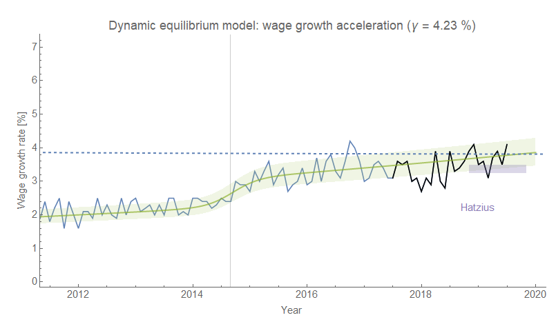
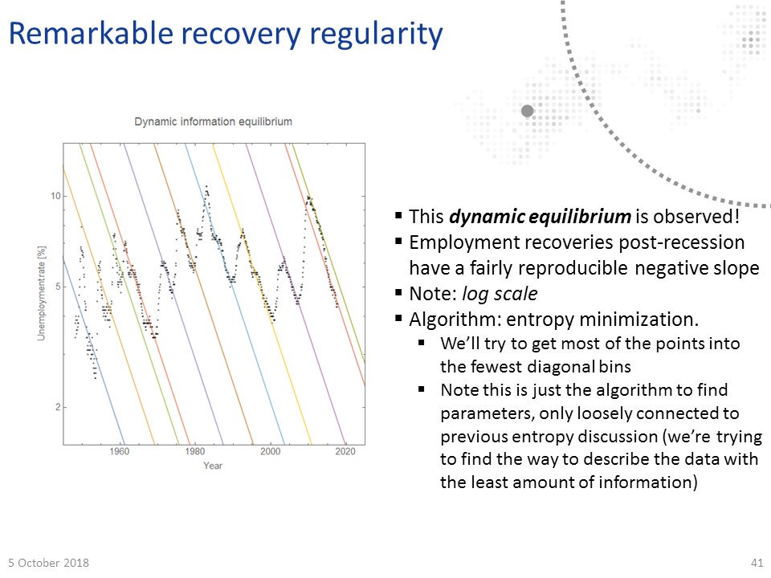

> _I admit I'm a little puzzled by a what a trend in wage \*growth\* is supposed to represent. What's the story about the economy in which raises increase a little bit faster each year?_

That was [J. W. Mason on Twitter](https://twitter.com/JWMason1/status/1157428482126671873) in response to [Ernie Tedeschi showing](https://twitter.com/ernietedeschi/status/1157416501865058304) a linear trend in wage growth in a graph. Of course, Ernie is correct about it's existence meaning this is a **_theoretical_** problem. In fact there's a (log-)linear trend interrupted by recessions as well as the [2014 "mini-boom"](https://informationtransfereconomics.blogspot.com/2018/10/extended-jolts-hires-series-and-2014.html) since the 80s:

Identifying that structure is essentially the core of the [dynamic information equilibrium model of wage growth](https://informationtransfereconomics.blogspot.com/2018/02/dynamic-equilibrium-in-wage-growth.html) (DIEM, [paper on SSRN here](https://papers.ssrn.com/sol3/papers.cfm?abstract_id=3094757)) that I've used to [successfully forecast wage growth](https://informationtransfereconomics.blogspot.com/2019/07/wage-growth-inflation-interest-rates.html) since February of 2018:

My [suggestion on Twitter](https://twitter.com/infotranecon/status/1157433111405142016) for a potential avenue to make sense of this trend was to look at a place where a similar mechanism appears to be at work over the same period of time — [housing prices](https://informationtransfereconomics.blogspot.com/2018/12/imagine-theres-no-bubble.html) (and [here](https://informationtransfereconomics.blogspot.com/2019/03/two-phases-of-2008-housing-crisis.html)):

[In my book](https://www.amazon.com/dp/B07T8T9G93/ref=as_li_ss_tl?ie=UTF8&linkCode=ll1&tag=arandomphysic-20&linkId=60275cbfd4559cb40aaf373097633fec&language=en_US), I suggest that this is a result of a nexus between housing prices, wage growth, _de facto_ segregation, and [nimbyism](https://en.wikipedia.org/wiki/NIMBY) that results in white people essentially pricing non-white people out of their neighborhoods — which ends up pricing **_themselves_** out of their neighborhoods (and subsequently gentrifying others). What if restrictions on employment — prior experience, degrees, non-competes, etc — were acting on wages in the same way that social segregation and restrictions on building affordable housing (or even housing in general) on housing prices?

It's a plausible hypothesis — companies artificially (or _socially_) creating a shortage of ("acceptable") labor would make labor markets tighter for the individuals who met the restrictive qualifications in the same way the artificial (or _social_) restrictions on where people can live make housing markets tighter. "Desirable" jobs become like "desirable" neighborhoods with accelerating prices.

I'm not 100% behind this hypothesis, however. For one, the pattern is largely the same across income quartiles (available in the same [Atlanta Fed data set](https://www.frbatlanta.org/chcs/wage-growth-tracker.aspx?panel=1), and that I looked at thanks to [a question on Twitter from Patrick](https://twitter.com/MelanistOnca/status/1157439078087835650?s=20)) — if it's happening, all wage levels are being impacted by labor market "nimbyism" (click to enlarge) \[1\]:

If we turn back to the housing price analogy, this would be like San Francisco, CA and Peoria, IL both having the same level of  "nimbyism" and accelerating prices — in fact, it would be like Peoria having a **_stronger_** acceleration since it's the 1st quartile that shows the effect most strongly.

But for me, the stronger evidence is that wage growth shows [the same structure as JOLTS hires and the unemployment rate](https://informationtransfereconomics.blogspot.com/2018/10/building-models.html) — implying [it's part of the deeper structure of the labor market](https://informationtransfereconomics.blogspot.com/2019/07/the-phillips-curve-overview.html). In fact, it's precisely analogous to the regular, steady rate of decline in the unemployment rate that seemed to surprise at least a couple of people in the audience at [my talk at the UW econ department](https://informationtransfereconomics.blogspot.com/2018/10/outside-box-workshop.html):

That change in perspective is directly behind the success of the unemployment rate DIEM in the face of the competition (and related to the success of the wage growth model at the top of this post):

This is to say that J. W. Mason's confusion about the reason behind accelerating wage growth is a result of the same static equilibrium picture of the economy behind models of unemployment that build in a "flattening out" despite it almost never happening in the historical data. I discuss this "steady state" (per Moretensen-Pissarides 1994) thinking more in [this post](https://informationtransfereconomics.blogspot.com/2017/09/search-and-matching-ii-theory.html) in the context of matching theory. [Mason appears to share mainstream consensus](https://jwmason.org/slackwire/good-news-on-the-economy-bad-news-on-economic-policy/) that the labor market conditions were different when unemployment was above 5% several years ago compared to today's levels — his main difference is in his estimation that the "full employment" rate is lower than currently observed. 

I'm not singling out Mason because he's particularly wrong — I'm singling him out because I'm trying to emphasize this is a general view held by the broader economic consensus that goes deeper than left-right, socialist-neoliberal, or even mainstream-heterodox divides.

Aside from a brief "mini economic boom" in 2014 \[2\], the US labor market was (and continues to be) in the same _**dynamic**_ equilibrium from roughly 2010 to the present day. This dynamic equilibrium appears in the unemployment rate data, JOLTS data, and, as we started out with here, wage growth data. Aside from that mini-boom, nothing of macroeconomic significance has happened in the US labor market since the Great Recession \[3\].

Of course, "wage growth climbs because that's what we observe" is not really an explanation. But it's also not a "puzzle" specifically in the recent data. However, I don't think anyone has come up with an explanation — I think it's an unresolved problem in economics. I have been working on understanding these dynamic equilibria [in terms of maximum entropy distributions of growth states](https://informationtransfereconomics.blogspot.com/2016/09/the-economic-state-space-mini-seminar.html). I call them _k_\-states in reference to the information transfer index I typically represent with the letter _k_. These are effectively growth states (i.e. the growth rate of some observable is _k r_ where _r_ is some fundamental rate like population growth), and stable distributions of them appear to pop up in e.g. [stock markets](https://informationtransfereconomics.blogspot.com/2016/12/stocks-and-k-states.html) or [profit rates](https://informationtransfereconomics.blogspot.com/2016/07/a-statistical-equilibrium-approach-to.html). Stable distributions of _k_\-states give rise to stable ensemble averages 〈_k_〉, which are observed as these "dynamic equilibria". There's a lot more mathematical detail [in my SSRN paper](https://papers.ssrn.com/sol3/papers.cfm?abstract_id=3094757), but you can also [check this blog post](https://informationtransfereconomics.blogspot.com/2017/06/self-similarity-of-macro-and-micro.html). But again — I think this is an unresolved problem in economics.

...

**Update**

I did want to note that in the housing prices case, the structural similarity to wage growth [begins in the 70s](https://informationtransfereconomics.blogspot.com/2019/07/continuing-decline-in-median-house-price.html), whereas e.g. the unemployment rate has the same structure going back as far as we have data ([even including the Great Depression](https://informationtransfereconomics.blogspot.com/2017/07/unemployment-1929-1968-dynamic.html)).

...

**Footnotes:**

\[1\] The main differences lie in the overall rate of wage growth acceleration as well as the structure of the non-equilibrium shocks. The 2nd and 3rd quartiles have what looks like [a step response](https://informationtransfereconomics.blogspot.com/2017/11/unemployment-rate-step-response-over.html) (which can take the form of two simultaneous shocks in opposite directions), but the 1st quartile's rebound is so delayed that it's difficult to consider it anything other than an additional shock. That delayed shock lines up with positive shocks that look like part of the [2014 mini-boom](https://informationtransfereconomics.blogspot.com/2018/10/extended-jolts-hires-series-and-2014.html) in the 2nd and 4th quartiles — in fact, it would appear that the 1st quartile is responsible for most of the 2014 mini-boom signal in the aggregate data. You might squint and see a bit of the 2014 mini-boom in the 3rd quartile, but overall it's too uncertain to posit a shock.

What's interesting is that in the data by quartiles there appears to be a negative shock in mid-to-late 2017 in at least three of the series. In the aggregate data, the 1st quartile positive shock is much larger so we end up not seeing the smaller negative shock in the aggregate data with any certainty. I imagine it was [what I was seeing in this post](https://informationtransfereconomics.blogspot.com/2018/06/wage-growth-showing-signs-of-downward.html).

\[2\] [Note that this boom appears to have happened in the EU as well](https://informationtransfereconomics.blogspot.com/2019/07/getting-one-wrong-eu-unemployment-plus.html), but about **_2 years_** later. So it could in principle have been caused by US-specific policy that led to a world-wide economic boom (the US is a sizable fraction of the world economy) — but I think there could be an as-yet-unidentified common factor behind it. 

\[3\] In the EU, there was a double dip recession — a second rise in the unemployment rate (see \[2\]).
