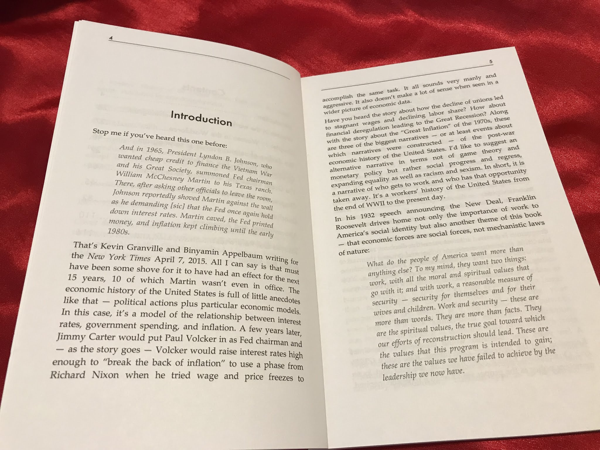

Illustrious Harvard economics Professor N. Gregory Mankiw [wrote something](https://www.nytimes.com/2019/08/09/business/trade-inflation-unemployment-phillips.html) in the _New York Times_ about the Phillips curve a couple days ago. I wish he had written it a couple _months_ ago because I would have used it in [my book](http://www.arandomphysicist.com/2019/06/a-workers-history-of-united-states-1948.html) as a wonderfully distilled example of the dominant — yet largely unfounded — narrative about inflation. It's the just-so story many economists and pundits tell about the 20th century. Instead, I started off with a different quote with a different story (click to enlarge):

I did think that Lyndon Johnson shoving the Fed chair and causing inflation was a nice encapsulation of both the just-so story and the focus on macho men distracting from the actual cause being women (more later). But here's Mankiw, explicitly mentioning Milton Friedman and adding the “oil shocks” (chef's kiss) to the Vietnam spending narrative:

> _Soon after the Phillips curve entered the debate, economists started to realize that this trade-off was not stable. In 1968, Milton Friedman, the economist and author, suggested that expectations of inflation could shift the Phillips curve. Once people became accustomed to high inflation, wages and prices would keep rising, even without low unemployment. Soon after Mr. Friedman hypothesized a shifting Phillips curve, his prediction came to pass, as spending on the Vietnam War stoked inflationary pressures._ 

> _In the mid-1970s, the Phillips curve shifted again, this time in response to large increases in world oil prices engineered by the Organization of the Petroleum Exporting Countries — an example of a “supply shock” in economists’ parlance._

So much **_[derp](http://noahpinionblog.blogspot.com/2013/06/what-is-derp-answer-is-technical.html)_**!

Here's a (color!) version of the [economic seismogram](https://informationtransfereconomics.blogspot.com/2018/02/economic-seismographs-labor-and.html) (a more conservative and visual [representation of Granger causality](https://informationtransfereconomics.blogspot.com/2018/11/i-dont-trust-granger-causality.html)) I used in the first chapter of my book to explain how the causality just doesn't match up. The bands indicate positive and negative shocks to equilibrium growth or decline in the various measures (their width indicated the duration of the shock much like the standard deviation indicates the width of a normal distribution). But now, I've added the Vietnam war deployed troop strength ([source](https://millercenter.org/the-presidency/educational-resources/americanization)) at the top ... (click to enlarge)

Yes, the Vietnam war not only precedes the long (and [fluctuating](https://informationtransfereconomics.blogspot.com/2018/05/labor-force-participation-and-gravity.html) “cyclical” component, denoted with “cyc”) shocks to CPI and PCE measures of the price level, but women's labor force participation (CLF W and EPOP W) — the major component of my hypothesis that labor force size is behind inflation. However, Vietnam precedes the center of the price level shock by almost 10 years. That's a long time between cause and effect. It's possible Vietnam might have had something to do with the cyclical rise around 1970, but what about all the others continuing through the 90s?

The oil price story also looks plausible — until you get to the larger oil price shocks in the 90s and 00s that are not causally associated with bursts of inflation (the 90s one comes late, and there's no 00s one at all). Additionally, the exact same pattern appears in both CPI (which includes energy) and core PCE (which doesn't). In fact, the business cycle fluctuations are almost identical in magnitude [in the two measures](https://fred.stlouisfed.org/graph/?g=oBpP).

So we already have two just-so stories to explain the first three “cyclical” shocks to inflation in the 60s and 70s. It's weird that Mankiw includes the monetary flex:

> _For centuries, economists have understood that inflation is ultimately a monetary phenomenon._

Sure you have! That's why macro forecasting works so well. [Oh, wait](https://informationtransfereconomics.blogspot.com/2016/02/thought-experiment.html). But then shocks to the monetary base **_follow_** the shocks to inflation, and the unprecedented rounds of QE result in “lowflation”. Guess we need another just-so story! And that can't be about inflation expectations, because the empirical data we have (e.g. the Michigan survey) appears to be entirely backward-looking — surges in expectations follow surges in actual inflation. [Time for some time travel](https://informationtransfereconomics.blogspot.com/2016/04/neo-fisherism-and-causality.html)!

The most convincing evidence for me is that people (particularly women) entering the workforce in the 60s and 70s through the 80s and 90s explains several different parts of this story in the diagram above:

-   Inflation reaches its peak about 3.5 years after CLF growth does, and when CLF declines in the Great Recession, inflation reaches its nadir (“lowflation”) about 3.5 years later in 2013.
-   Those two changes are of comparable magnitude — the smaller CLF decline in the Great Recession results in a commensurately smaller decline in the price level.
-   The “Phillips curve” is strong when women's labor force participation is rising from the 60s until the 90s. You can see “cyclic” CPI and PCE inflation surging during the latter half of periods of growth between recessions and flagging when unemployment spikes in a recession.
-   The “Phillips curve” is weak to non-existent after women's employment population ratio [stops increasing and becomes strongly correlated](https://fred.stlouisfed.org/graph/?g=oBpR) with men's starting in the 90s.
-   The curve in Phillips (1958) is based on data from the UK during a period including WWI and WWII where soldiers re-enter the workforce en masse. [I've seen a similar Phillips curve effect](https://informationtransfereconomics.blogspot.com/2018/05/labor-force-participation-and-gravity.html) during the immediate post WWII period in the US.
-   This picture doesn't require a “just so” story about Vietnam war spending and oil shocks.
-   The same mechanisms appear to be at work in more than just the US — [including Japan](https://informationtransfereconomics.blogspot.com/2018/05/inflation-and-labor-force-in-japan.html).
-   Monetary base shocks _follow_ inflation shocks. We could still have monetary “hyperinflation” because the data shows [a definite break in the behavior between inflation below about 10% and above 10%](https://informationtransfereconomics.blogspot.com/2017/03/belarus-and-effective-theories.html).

Mankiw also give us an example of the quick elision between the empirically well-founded piece of the Phillips curve that was in Phillips original paper — the relationship between _wage inflation_ and employment — and the completely speculative macro-relevant piece — the relationship between _price level inflation_ and employment.

> _But when unemployment is low, employers have trouble attracting workers, so they raise wages faster. Inflation in wages soon turns into inflation in the prices of goods and services._

The "soon" is doing a lot of work here in that second sentence. And the empirical relationship, while tight in the 60s, 70s, and 80s, hasn't manifested in CPI or PCE inflation for decades. This is the vanishing macro-relevant Phillips curve. I have a lot more about both versions of the “Phillips curve” in [my overview post from last month](https://informationtransfereconomics.blogspot.com/2019/07/the-phillips-curve-overview.html).

As I mentioned at the top of this post, the first chapter of my book is about pointing out the inconsistencies in the dominant “narrative” and proposing that the real reason was the surge of women entering the workforce (to a lesser extent, the baby boom contributed a small increase [noticeable in men's labor force size](https://fred.stlouisfed.org/graph/?g=oBqf) but dwarfed by women's increasing participation). But that's just one “narrative” that's widely shared without a lot of evidence. I go after two more “narratives” in my book: 1) the fall of unionization is the reason behind the decline in labor share of income and slow wage growth, and 2) the housing bubble was brought about by financialization and deregulation. I argue that these are incorrect and in fact: 1) unions appear to only have an effect on inequality, not wages (which are slow growing because that surge of women entering the workforce has ended), and 2) the housing bubble wasn't so much of a bubble but rather a structural unaffordability baked in by “the little xenophobia” of Nimbyism and _de facto_ segregation through housing prices.

If you're interested, check it out!

...

**Update 12 August 2019**

There's more in this post, in particular two graphics on the Phillips curve that show a different way to visualize the changes. The first one illustrates where the correlation with men's EPOP as well as the strength (i.e. slope) of the Phillips curve:

The second shows the dynamic information equilibrium model (DIEM) for the cyclical fluctuations PCE inflation alongside the DIEM for the unemployment rate. It makes the inverse relationship very clear in the 70s and 80s and shows how it faded away ...

