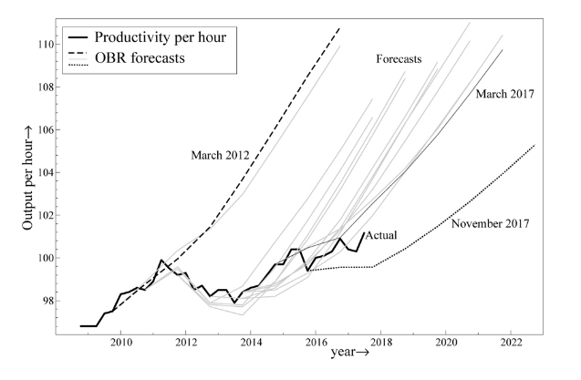

I'm in the process of reading _Forecasting_ (2019) by Jennifer Castle, Michael Clements and David Hendry in part due to [a review by Diane Coyle](http://www.enlightenmenteconomics.com/blog/index.php/2019/07/better-economic-forecasting/). It's actually due to a line Coyle wrote in the review that I disagree with:

> _It explains the inherent difficulties in trying to forecast the future of a complex non- linear, non-stationary system in which behaviour can be affected by forecasts themselves, all from a limited amount of past data._

I don't disagree with the inherent difficulties in macro forecasting, but rather the characterization of macro as a "complex, non- linear, non- stationary system" — we don't really know that. I'd rewrite it like this:

> _It explains the inherent difficulties in trying to forecast the future of a system we don't yet \[fully\] understand in which behaviour can be affected by forecasts themselves, all from a limited amount of past data._

You can take or leave the _fully_ in there. But it was due to that characterization that I thought it would be great for me to read a book about forecasting written by forecasters to potentially understand the unwritten assumptions and frameworks.

And so far, it's quite good as an introduction to forecasting for a non-technical audience. One of the things they point out early on is the apparent divergence from the log-linear growth in labor productivity in the UK and later the "hedgehog" graphs that miss the mark (from the book):

[I wrote a post](https://informationtransfereconomics.blogspot.com/2018/05/uk-productivity-and-data-interpretation.html) about interpreting UK productivity growth a year ago — and how the log-linear extrapolation leads you astray. But reading the book made me look up the [long run data sets](https://www.bankofengland.co.uk/statistics/research-datasets) and check out what the [dynamic information equilibrium model](https://papers.ssrn.com/sol3/papers.cfm?abstract_id=3094757) (DIEM) says ...

It's a simple model with one shock — the 20th century demographic shock associated with women entering the workforce (data from [here](https://ourworldindata.org/female-labor-force-participation-key-facts)) ...

... as well as the spike in inflation and various other macro measures.

But one thing it's important to point out is that this view of the data sees UK productivity growth in the 2000s as largely a "bubble" that evaporated in the Great Recession with the recent data being the "new normal". Or a better way to put it — a return to equilibrium after the growth of the 20th century.

It looks roughly the same for the US — with the recent data being the "new normal" (though [there might be some uncertainty](https://informationtransfereconomics.blogspot.com/2018/11/ambiguous-histories-productivity.html)).

...

**Update**

Edited an awkward sentence in the paragraph beginning "You can take or leave ..." to be slightly less awkward. But only slightly.
