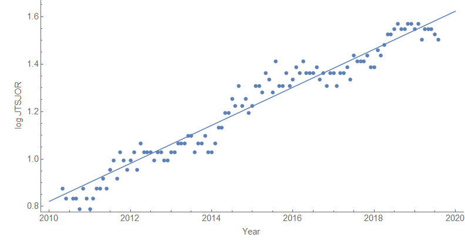
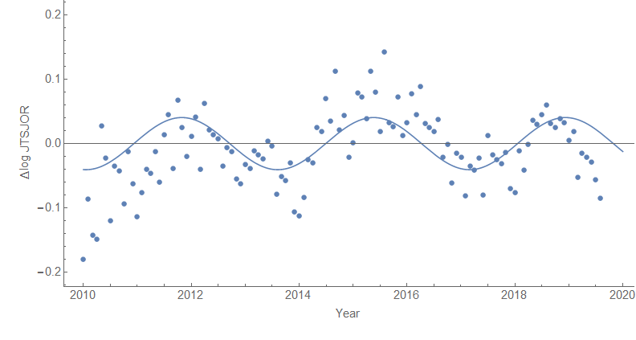

Something I noticed in the JOLTS data was that if you subtracted out a "[dynamic equilibrium](https://papers.ssrn.com/sol3/papers.cfm?abstract_id=3094757)" (log-linear path) \[1\], the residual data was almost sinusoidal (click to enlarge):

I wouldn't expect this sinusoidal fluctuation with a constant frequency to continue simply because there aren't a lot of true waves in economics — the sine wave is more of a curiosity \[_ETA: the period is about 3.5 years_\].

But then I noticed that this pattern matched the same residual S&P 500 fairly well, but with a lag of about a year (meaning the S&P predicts the fluctuation):

In fact, all of the other JOLTS data series appear to show this correlation as well (separations = TSR, hires = HIR, quits = QUR):

Even the unemployment rate shows the same fluctuation — _but with a **lead** of about 16 months_:

That is to say this would indicate the fluctuations in the unemployment rate _predict_ the S&P 500. As the unemployment data goes back farther, I can look at whether the correlation holds up over time. Eyeballing the data, it actually looks more correlated at zero lag/lead. The run-up in the market before the 1987 crash (might be interesting viewed in the context of the post-80s recession [step response](https://informationtransfereconomics.blogspot.com/2017/11/unemployment-rate-step-response-over.html)), the dip in the mid-90s, and the dip in the 2002-2003 time period line up with fluctuations of the unemployment rate data away from a local log-linear fit. It's also just much noisier in general. 

In any case, I will look more closely at this as well as "help wanted" index data from Barnichon (2010) (see e.g. [here](https://informationtransfereconomics.blogspot.com/2018/06/measuring-labor-demand.html)).

**Update 14 September 2019**

**Footnote:**

\[1\] Take the data series [JTSJOR](https://fred.stlouisfed.org/series/JTSJOR) (job openings on FRED) take the log and fit a line _y_ \= _a t_ + b to the log data and subtract log _JTSJOR_ − (_a t_ + _b_) ≡ Δlog _JTSJOR._
