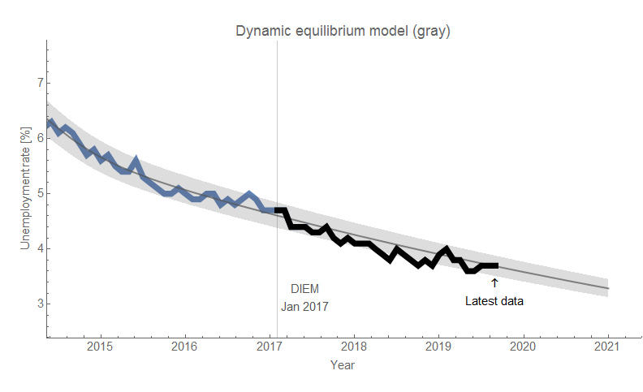
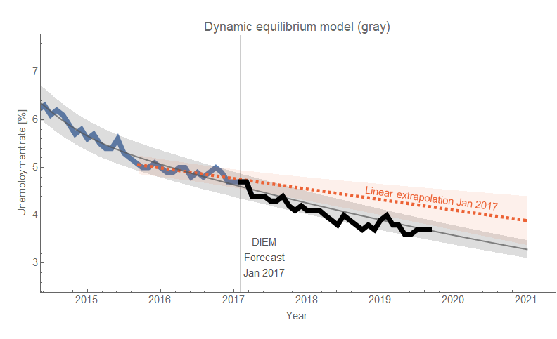
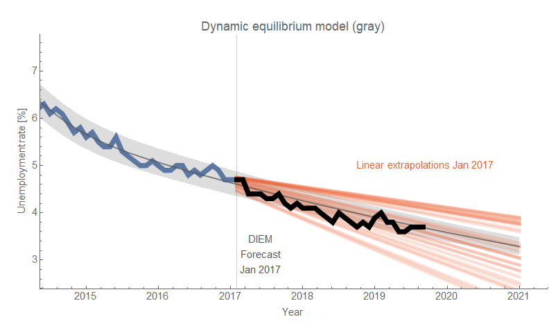

I been really busy these past few weeks, so haven't made many updates to the blog — mostly posting half-thoughts and forecast tracking on twitter. One thing [I did post about](https://informationtransfereconomics.blogspot.com/2019/09/market-correlated-fluctuations-in.html) was a fluctuation in the JOLTS data around the dynamic equilibrium appeared correlated with the S&P 500. I updated it today to emphasize that this is a 2nd order effect — on the order of a few percent deviation from a dynamic equilibrium. I did try out [a scheduled tweet](https://twitter.com/infotranecon/status/1169925710699540480?s=20) that came out just before the unemployment data was released at 8am ET on Friday 6 September 2019 (click to enlarge):

The [DIEM forecast](https://papers.ssrn.com/sol3/papers.cfm?abstract_id=3094757) got the data exactly right. I also noted in the thread that the DIEM forecast outperforms linear extrapolation — even if you try to choose the domain of data you extrapolate from (the different lines in the second graph show all the different starting points for the extrapolation):

This means that the DIEM is conveying real information about the system.

CPI data came out this week and the DIEM continues to do well there too (continuously compounded and year over year inflation):

One thing to note is that the DIEM model is extremely close to a fit to the pre-forecast and post-forecast data (black dashed) and the non-linearity in the DIEM model (red) actually improves the relative performance:

This means that for a function that is this smooth over time, no other model could be anything more than a marginal improvement. The only possibility of doing better is if the fluctuations around the DIEM path are not noise — and in fact the "cyclic" fluctuations around the DIEM path might be related to [the fluctuations around the JOLTS log-linear path](https://informationtransfereconomics.blogspot.com/2019/09/market-correlated-fluctuations-in.html):

If you squint, the inflation fluctuations might be in sync with the JOLTS fluctuations:

In addition to looking at macro time series, I also took a look at some demographic data about childhood mortality using [a new data set](https://ourworldindata.org/parents-losing-their-child). We can see the effect of sanitation in the UK, as well as a potential effect of the more general legalization of abortion:

The data for Japan doesn't go back as far, but shows data consistent with a similar "sanitation transition" (when extrapolated) as well as the effect of WWII:

The US data doesn't go back far enough to make any conclusions (and the shocks are somewhat ambiguous):

