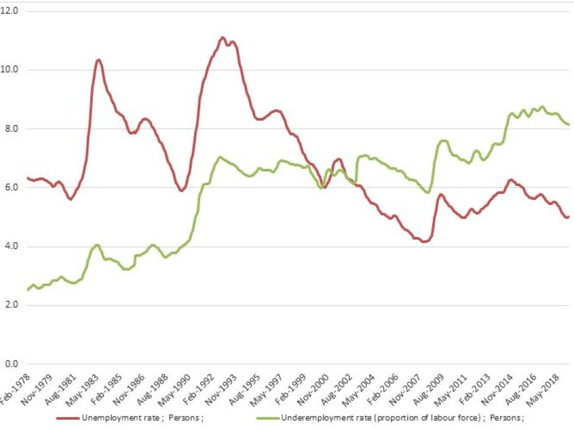
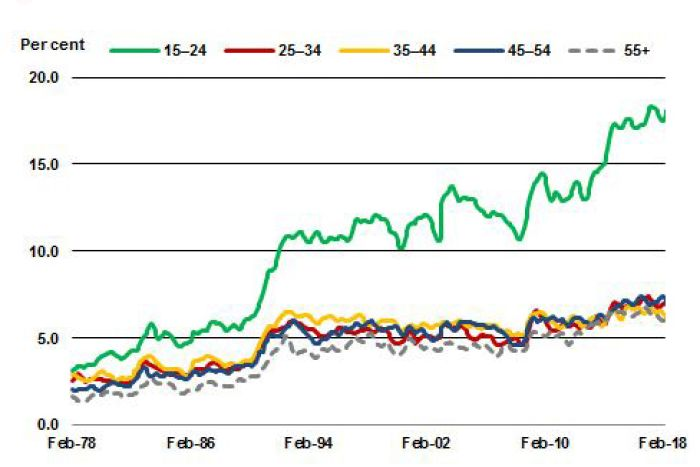

_Happy labor day (in the US)!_

John Quiggin [was surprised](https://johnquiggin.com/2019/09/02/underemployment-in-australia/) at the [steady increase](https://www.abc.net.au/news/2019-05-02/underemployment-in-australia-rising-while-unemployed-rate-drops/11057794) in Australian under-employment \[1\] — I was, too. In the US, most of these labor metrics all follow the unemployment rate ... it's as if there's a prototype labor market time series and all the other metrics are just minor log-linear transformations. And that's true for US under-employment (employed part time for economic reasons) as well:

There was either a change in the way the data was recorded, or a major policy success in January 1994 (I'll look into it more, and would be grateful for anyone who might have any suggestions). In any case, it's not continuously rising, but rising in recessions and falling in their aftermath like most other labor market metrics in the US.

The article Quiggin discusses also talks about youth unemployment (ages 15-24), which in the US shows exactly the expected behavior — following the US unemployment rate:

The youth employment rate also shows the same basic structure:

As a side note, the [previously observed dip in the youth employment rate](https://informationtransfereconomics.blogspot.com/2019/03/declining-employment-rate-for-15-24.html) appears to have faded (link shows both employment and unemployment).

The one major difference in behavior is in the fraction of long term unemployed ("long term" is 27 weeks or longer), which in the US [seems to have undergone a change since the 1990s](https://informationtransfereconomics.blogspot.com/2018/08/something-has-changed-in-long-term.html):

The basic structure is again similar to the US unemployment rate, but each subsequent recession since the 90s has increased the fraction of long term unemployed without a commensurate drop in the recovery. This results in an increasing fraction of long term unemployed over time relative to the unemployment rate.

Australia on the other hand has just seen a relatively steady increase (about 2.5% per 25 years, or 0.1% per year) in under-employment since the late 70s with only a big surge in the (last) Australian recession in the 90s. Note: no major surge occurs with the 80s recession in Australia ... only a tiny blip. This is primarily driven by people aged 15-24 \[2\].

At this rate, 10% of the population will be under-employed in 15 years — whereas the US will, in the absence of a recession, get down below 2%.

...

**Footnotes:**

\[1\] The nut "graph" in the article on Australia (click to enlarge):

\[2\] Here's the breakdown by age showing it's driven by youth under-employment (click to enlarge):

