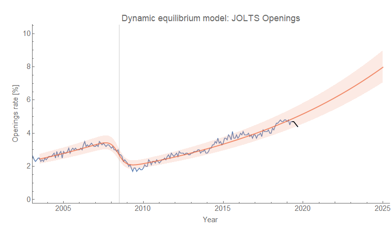
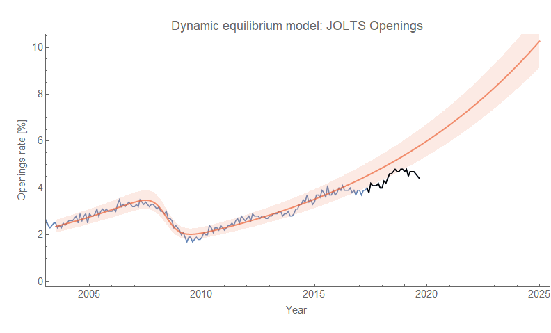
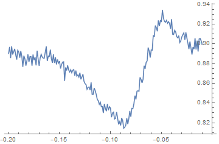
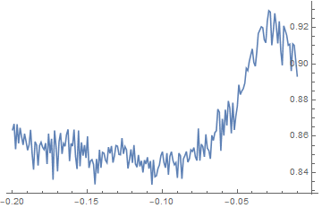
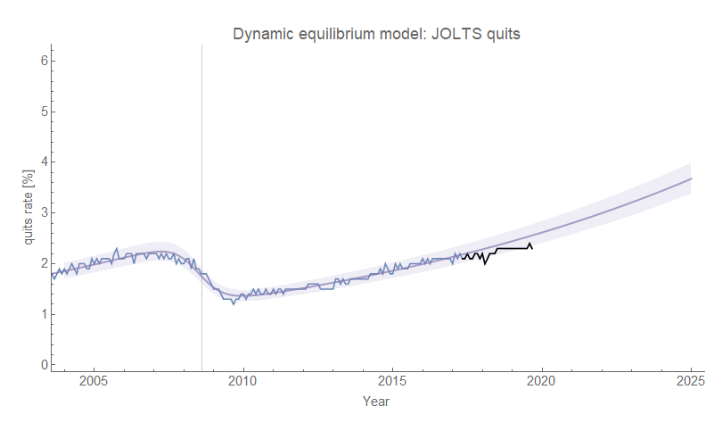

[A little over a year ago](https://informationtransfereconomics.blogspot.com/2018/06/jolts-data-and-2019-recession.html), I said that the JOLTS Job Openings Rate (JOR) data was indicating a possible recession in the 2019-2020 time frame based on the [dynamic information equilibrium model (DIEM)](https://papers.ssrn.com/sol3/papers.cfm?abstract_id=3094757). It appears that even if there is a recession in 2020, this "forecast" will not have been accurate. This post is a "post mortem" for that failed forecast looking at various factors that I think provides some interesting insights.

**Data revisions**

As noted in the forecast itself, there was always the possibility of data revisions — especially in the March data release around the Fed March meeting. [The March 2019 revision was actually massive](https://informationtransfereconomics.blogspot.com/2019/03/massive-revisions-to-jolts-series.html), and affected every single data point in the JOLTS time series ... in particular JOR. It made the previous dip around the time the forecast was made largely vanish.

**Leading indicators?**

The original reason to look to JOLTS data as a leading indicator was based on the fact that the JOLTS measures [seemed to precede the unemployment rate](https://informationtransfereconomics.blogspot.com/2017/07/jolts-leading-indicators.html) in terms of the non-equilibrium shock locations. In 2008, the hires rate (HIR) seemed to lead with JOR closely following. Closer analysis shows that [HIR falls early](https://informationtransfereconomics.blogspot.com/2018/11/construction-hiring-great-recession-and.html) in part due to construction in the housing bust (which also affected JOR). Now I speculated at the time that the ordering probably changed depending on the details of the recession. In the more recent data, it looks like the quits rate (QUR) [might be the actual leader](https://informationtransfereconomics.blogspot.com/2019/07/wage-growth-inflation-interest-rates.html). This would make more sense in terms of a demand driven and uncertainty-based recession where people cut back on spending or future investments (or [having children](https://informationtransfereconomics.blogspot.com/2018/03/dynamic-equilibrium-model-fertility-as.html)) and so seeing a rough patch ahead might be less inclined to quit a job.

**Second order effects!**

Recently I noticed [a correlation in the fluctuations](https://informationtransfereconomics.blogspot.com/2019/09/market-correlated-fluctuations-in.html) around the dynamic equilibrium for JOR and the S&P 500. A rising market seems to causes a rise in JOR about a year later. When the forecast was made in 2018, the market rise of 2017 had yet to manifest itself in the JOR data. The "[mini-boom](https://informationtransfereconomics.blogspot.com/2018/10/extended-jolts-hires-series-and-2014.html)" of 2014 along with the precipitous drop of 2016 made it look more like a negative shock was underway.

I should note that these fluctuations are on the order of 10% relative to the original model (i.e. less than a percentage point in estimating the rate), so represent a 10% effect on top of the dynamic equilibrium.

**Mis-estimating the dynamic equilibrium**

These various factors combined into a bad estimate of the JOR dynamic equilibrium that was much larger (i.e. higher rate) than it appears today. The rate was estimated to be about 25% higher (10.7% versus 8.7%), which meant a persistent fall in JOR relative to the forecast:

I should also note that the entropy minimization procedure (described [here](https://informationtransfereconomics.blogspot.com/2016/06/unemployment-equilibrium.html) as well as in [my talk at UW econ](https://informationtransfereconomics.blogspot.com/2018/10/outside-box-workshop.html)) has a much better result (i.e. well-defined minimum) with the additional data:

This did not affect the other JOLTS measures as strongly — and in fact the HIR data has shown little evidence of a "recession", especially since I discovered [the longer HIR data series](https://informationtransfereconomics.blogspot.com/2018/10/extended-jolts-hires-series-and-2014.html) a couple months after the original forecast. The quits data has only recently been showing the beginnings of a deviation from [the original 2017 forecast](http://informationtransfereconomics.blogspot.com/2017/06/jolts-and-narratives.html):

While all this is bad for my 2018 recession prediction, it actually means the dynamic equilibrium model was really good at forecasting the data over the past two years.
