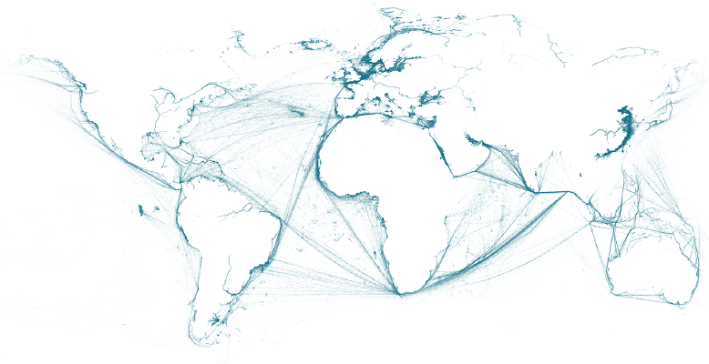
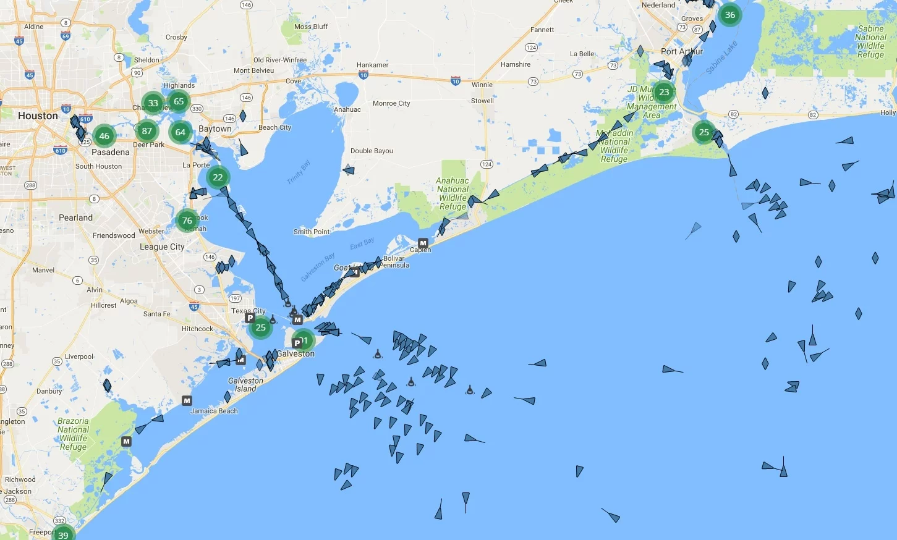
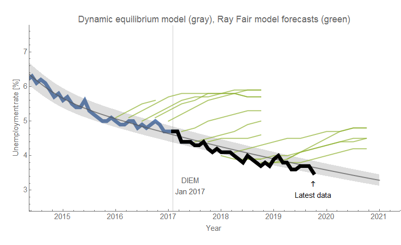

I was asked a question [on Twitter](https://twitter.com/infotranecon/status/1187799434223972352?s=20) that I think does help us understand how the information equilibrium framework views prices and money. Of course, it being Twitter, this wasn't exactly asked as a question but rather offered as a condescending retort:

> _"That guy \[Jason Smith\] is just confused. He doesn't even acknowledge that the price has to be paid. In his model, there is no difference between a price that has to be paid and one that doesn't have to be paid. → there is no concept of truthful revelation."_

I do appreciate the fact that he must have read the material because he came away with a conclusion that is in fact true. The implied question is how do I reconcile using information equilibrium to describe not just prices, but also things that have nothing to do with prices as we traditionally think of them.

What follows is an edited and expanded version of my response on Twitter with links.

The issue is that there is absolutely no way, mathematically speaking, for that "truthful revelation" message of paying a price in a single transaction to be communicated through the network. The set of prices simply [does not contain the "bandwidth" to carry that information](https://informationtransfereconomics.blogspot.com/2015/03/the-price-system-as-communication.html). In mathematical terms, the dimension of the space of price messages is so much smaller than the dimension of the space of information about the transaction. So therefore, neither that "truthful revelation" information nor paying the price could be critical to the functioning of a market. More likely (but still speculative), the price mechanism is destroying huge quantities of irrelevant information via what is called an "[information bottleneck](https://informationtransfereconomics.blogspot.com/2018/04/are-prices-transmitting-or-destroying.html)" in machine learning.

In fact, what's more important is when a transaction cannot happen. That non-transaction carries so much more information about macro constraints (buyers cannot afford it, do not want it, have a substitution, sellers do not have enough, or it cost more than the current price to manufacture) — mapping out the opportunity set. (Again, maybe the information bottleneck is singling out the lower-dimensional subset of transactions that map the opportunity set, focusing on the elements that map the coastlines rather than the bulk.)

A good analogy of what those abstract "tokens" we call money are doing is that it's the same thing ships do in the ocean — they both mediate a transaction and explore an abstract space. In the picture below, we have a bunch of AIS data from ships near the port of Galveston/Houston Ship Canal. Ships generally try to take the shortest, most efficient path between their origin and destinations, but can also travel anywhere the water is deep enough. Sometimes they have to avoid storms, and sometimes they have to follow specific paths — like the well-defined Houston Ship Canal in Galveston Bay.

No one journey maps the world, but a collection of their paths creates an (albeit incomplete) picture of the world. That's the graphic at the top of the post — it's AIS data alone, yet it develops a strikingly good map of the continents. The ships exploring the "opportunity set" of the ocean **_collectively_** map out the complex set defined by macro constraints (i.e. continents). That's what money is doing, except it's a more abstract space we can't see.

Or at least that's what money is doing if the information equilibrium picture of economics is correct! Information equilibrium follows [from agents fully exploring (i.e. MaxEnt) the the available opportunity set](https://informationtransfereconomics.blogspot.com/2016/11/how-do-maximum-entropy-and-information.html) — or as I sometimes put it "state space". Random agents do that, but to a good approximation so do complex intelligent agents where you don't necessarily understand how they make their decisions — the limit of algorithmic complexity is algorithmic randomness. Often people will say that I treat people like mindless atoms, but that's just a useful approximation — and humility! I don't pretend to know how people make complex decisions, so I effectively treat them as so complex as to be random.

We can see that the AIS picture of the continents is incomplete. That's what the framework calls "non-ideal information transfer". It's non-ideal information transfer from the information defining the shape of the continents to the information in the AIS tracking data. I talk about that in more detail in [my Evonomics article](https://evonomics.com/hayek-meets-information-theory-fails/) (which brought me into that Twitter thread) as well as in [my talk at UW econ](https://informationtransfereconomics.blogspot.com/2018/10/outside-box-workshop.html). The key takeaway is that the information transfer framework (which is both information equilibrium and non-ideal information transfer) assumes markets are not necessarily ideal — that the AIS map of the continents is imperfect.

In addition to non-ideal information transfer, there are also non-equilibrium shocks. In the AIS picture, that would be things like embargoes against certain countries or major storms that disrupt shipping. The [dynamic information equilibrium model](https://papers.ssrn.com/sol3/papers.cfm?abstract_id=3094757) (DIEM) — information equilibrium plus a model of non-equilibrium shocks — is one way to try and model these effects that's remarkably successful in describing e.g. the unemployment rate ([tracking it for over two years, and outperforming several other models](https://informationtransfereconomics.blogspot.com/2019/09/odds-and-ends-from-first-half-of.html)):

Speaking of the unemployment rate and getting back to the original "question" at the top of the post, what's interesting to me is that the process of exploring the opportunity set is what happens in every "market" even if there aren't "prices" in the usual sense. Or at least where "prices" aren't always the observable data. An example is the job market. The observable "prices" in that case are hires or unemployment — salaries are often not as easily measured as stock market prices. Human agents explore the abstract space of employment opportunities that are in aggregate bounded by macro constraints — even if you can manage to talk your way into an employer hiring you against their initial objections (i.e. influence the local shape of the opportunity set) there are still constraints in the aggregate.

That's why it's more useful to think of prices more abstractly — they represent a transaction where an some amount of _A_ is exchanged for some amount of _B_. That _A_ can be a job, money, blueberries, or your free time. Mapping the abstract constrained opportunity set with transactions is about information and doesn't care what's doing the mapping or the content of the message — the key insight of information theory. When those things matter, we're back to non-ideal information transfer \[1\].

That's why "there is no difference between a price that has to be paid and one that doesn't have to be paid" — if an observable represents information about a change in the information content of an opportunity set (a hire, a market price change), then there's economics happening there. Information is flowing — from person to person at the individual level — but the price (even an abstract one like the unemployment rate) is really only seeing changes in information flow.

**Update 1 Feb 2022**

I wanted to add that the price having to be paid does help motivate people to explore that state space (either providing things to exchange for money, or using that money to purchase things). But that motivation exists as an underlying factor for most economic observables. Employment is motivated by needing money, and therefore a job, to live, while employers need employees to make money. Therefore the unemployment rate acting like a measurement of a different kind of price level is not that wild of an idea.

**Footnotes:**

\[1\] There's a neat mathematical illustration of this using the chain rule — in fact, we can think of money (or ships!) as a real-world manifestation of a chain rule for an economic derivative. If we exchange _A_ for _B_, we have an exchange rate "small amount of _A_" ($dA$) to "small amount of _B_" ($dB$) or:

... a derivative in calculus. Of course you could exchange _A_ for a small amount of money ($dM$) and money for _B_:

That's just the chain rule in calculus. As long as we maintain information equilibrium between _A_, _B_ and _M_, then [money doesn't really matter](https://informationtransfereconomics.blogspot.com/2018/01/money-is-aether-of-macroeconomics.html).

As a side note: ships are an example of tokens that go with the flow of the transaction, as opposed to money going in the opposite direction. It's interesting as the direction of exchange for money is basically a sign convention in information equilibrium as I mention in a footnote [here](https://informationtransfereconomics.blogspot.com/2018/04/an-agnostic-equilibrium.html) that also gets into the discussion of the direction of information flow [that came up in some of my earliest posts](https://informationtransfereconomics.blogspot.com/2014/09/which-way-does-information-flow.html).

As another side note, this is where you end up with [if you were to write an introductory chapter in an economics book from this viewpoint](https://informationtransfereconomics.blogspot.com/2017/09/my-introductory-chapter-on-economics.html).
