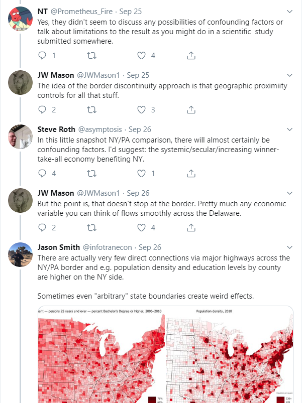
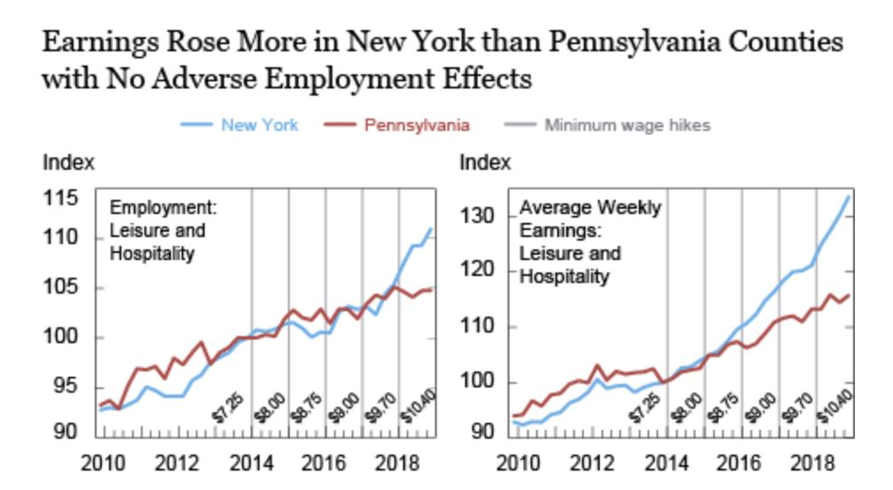
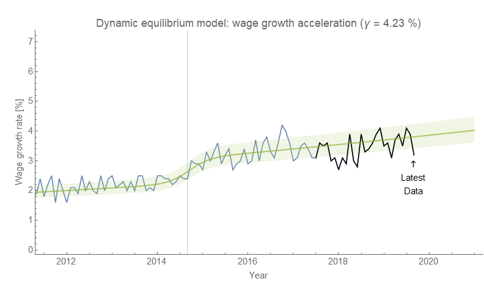
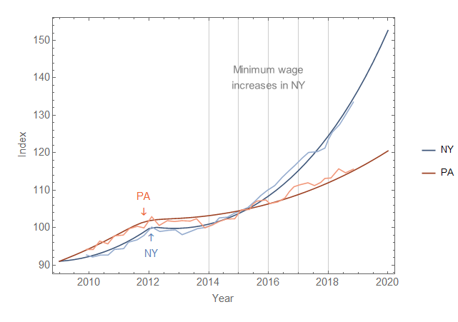
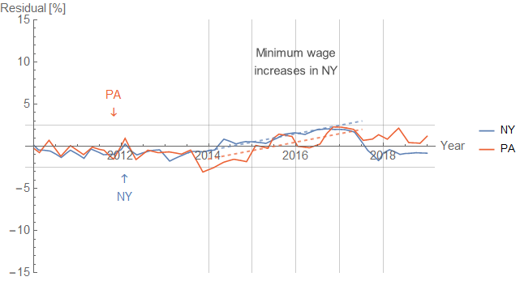

Without meaning to start an argument, [I concurred](https://twitter.com/infotranecon/status/1177395315730595840) with Steve Roth and @Promethus\_Fire that [a minimum wage study by the NY Fed](https://libertystreeteconomics.newyorkfed.org/2019/09/minimum-wage-impacts-along-the-new-york-pennsylvania-border.html) might not have taken into account factors that may have confounded the study in contradiction to J. W. Mason's assertions without evidence that a) border discontinuity automatically controls for them (it does not), and b) economic data is continuous across the NY-PA border (it is not, and I provide several examples that by inspection should give us pause in making that assumption).

Even otherwise arbitrary political boundaries that you might think were transparent to the people living there create weird effects. One example I remember vividly on my many drives between UT Austin and the suburbs of Houston (where I grew up) on US 290 while I was a student was the border between Washington county and Waller county whereupon crossing the Brazos river the road suddenly became terrible. There's no particular reason for this in terms of demographics or geography, but the political boundary meant some completely different funding formula or crony capitalist network at the county level. Something similar happens at the NY-PA border:

On the NY side we have shoulder markings and shoulders that vanish right when you cross the border into PA. It's a tiny difference, but it means more materials and hundreds more labor hours of public spending on the NY side of what is basically the same road. And it's not like people travel into PA never to be heard from again — on this stretch of road traffic is likely balanced in either direction and most certainly isn't discontinuous at this specific point.

Anyway, that was the point I was trying to make. Other things like level of education also vary across this border as well as the PA side being much more likely to have an old-fashioned male breadwinner model of household income. My most recent piece of evidence was that the rate of foreign born residents was higher on the NY side (which looks like New England) than the PA side (which looks like West Virginia).

But then J. W. Mason expressed incredulity at my claim that the wage growth data was relatively smooth. This led me down a rabbit hole where I put together a [dynamic information equilibrium model (DIEM)](https://papers.ssrn.com/sol3/papers.cfm?abstract_id=3094757) of wage growth on both sides of the border based on the NY Fed data. This data was restricted to leisure and hospitality sectors, but it turns out to be interesting nonetheless. Here's the NY Fed's graphic:

Now I put together [the wage growth model at the national level about two years ago](https://informationtransfereconomics.blogspot.com/2018/02/dynamic-equilibrium-in-wage-growth.html). And one of the reasons I went down this rabbit hole was that the Atlanta Fed just released data for September [in their wage growth tracker](https://www.frbatlanta.org/chcs/wage-growth-tracker.aspx?panel=1) today and I had just compared that data with the forecast:

Pretty good! And it's definitely better than any other forecast of wage growth in the US that's available. If we use this model to describe the NY and PA data, we get a pretty good fit:

There's a single non-equilibrium shock that slows growth that comes right at the beginning of 2012 — coincidentally right when [the ARRA deficit spending dries up](https://fred.stlouisfed.org/series/TOTEXPQ027SBEA). There are no other effects and the rest of the path — including all the data through the NY minimum wage increases — is a single smooth growth equilibrium.

How smooth? The smooth model fits the data to within about 2%. It's **_quantitative_** evidence J. W. Mason's incredulity was completely unfounded. If we look at these residuals (that are less than 2%), there is a noticeable correlated deviation right during the NY minimum wage increases:

However, this correlated deviation is mirrored in the PA data which means that PA and NY saw _the same_ deviation from smooth growth. There's no meaningful difference between the two that's correlated with the NY minimum wage increases: both saw the same correlated deviation, but more importantly both saw basically wages grow as expected with the deviation from trend growth being less than about 2%. If you forecast in 2010 that average wages would be 10 dollars per hour in 2016, they'd be 10 dollars ± 20 cents.

\[_Update 13 November 2019_\] Additionally, that correlated deviation in wage growth matches up the the _national_ level surge in wage growth in 2014-2015 (two figures above). \[_End update_\]

It's important to emphasize the part about the lack of differences correlated with the minimum wage hikes — over the entire period, wage growth is not just higher but it increases faster on the NY side. But that's a difference between the NY and PA sides of the border that's persistent through the period 2010-2019.

Does this mean minimum wages are bad? No! In fact, since wages are largely a good proxy for economic output, it means that this shows minimum wages likely have no effect on economic growth. Unlike the naysayers who say minimum wage hikes slow growth or cause unemployment, this aggregate data shows they have no real effect.

Wait, no effect? How can that be good?

Because it's no effect at the _aggregate level_. At the _individual level_, earning more money for an hour of minimum wage work is a great benefit since one earns the money faster while allocating a given amount of one's limited time to work. If you don't see any aggregate effects, it basically means minimum wage workers effectively have more free time since they're ostensibly producing the same output for the same total compensation (which they arrive at faster because of the higher wage) — otherwise, there'd be aggregate effects!

If your car gets a boost and now travels 100 mph instead of 70 mph, but you still get from Seattle to Portland in three hours, you must have had spent more time stopped at a rest stop or eating at a restaurant — increased leisure time.

Of course, this is assuming the data is measured properly and these conclusions are correct about no aggregate effects — some studies see net gains from minimum wage increases (i.e. we get from Seattle to Portland in two and a half hours).
