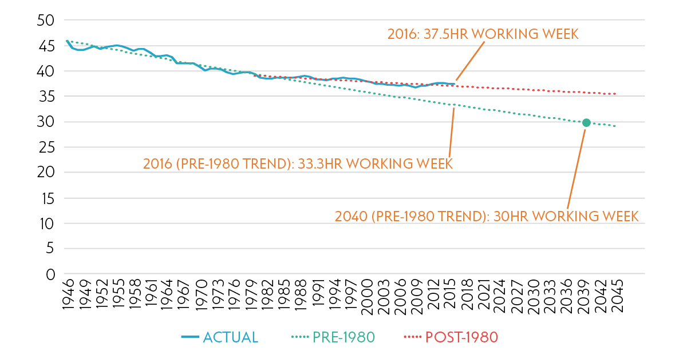

I came across this chart (via a [re-tweet from Ian Wright](https://twitter.com/4Day_Week/status/1200089587789508609?s=20)) where [Alfie Sterling extrapolated](https://neweconomics.org/2019/09/increases-in-leisure-time-have-decoupled-from-productivity-increases) the 1946-1980 trend in average hours worked in the UK alongside an extrapolation from data post-1980:

There seems to be an entire industry in the UK built out of extrapolations like this ([here's productivity](https://informationtransfereconomics.blogspot.com/2018/05/uk-productivity-and-data-interpretation.html)). I've reproduced a version of this — it uses data for all employees, not just full time employees, so the level is a bit higher \[click to enlarge\]:

But the story is roughly the same — the trend was a steeper decline before 1980 and shallower after. However, plotting the graph on this scale (as well as cutting off the data at 1946) obscures some of the issues with extrapolating linearly willy-nilly. Zooming in a bit and taking that linear fit back to 1900 shows the 1946-1980 trend is unique to the period 1946-1980:

In fact, [as I looked at a couple of years ago](https://informationtransfereconomics.blogspot.com/2017/09/the-long-trend-in-labor-hours.html), this data is pretty well described by a [dynamic information equilibrium model](https://papers.ssrn.com/sol3/papers.cfm?abstract_id=3094757) (DIEM):

The trend from World War II (WWII) to 1980 is almost certainly part of the demographic shift of women into the workforce in Anglophone countries [that seems to govern so many things](https://informationtransfereconomics.blogspot.com/2019/08/the-phillips-curve-and-narrative.html). The other major effects seem to be WWI and WWII ending in 1918 and 1945, respectively. Aside from those three events, average weekly hours is on a steady decline of 0.13% (consistent with what I [found earlier for US data](https://informationtransfereconomics.blogspot.com/2017/09/the-long-trend-in-labor-hours.html) \[1\]).

This perspective is a lot less policy (or productivity, or wage) dependent, depending more on major social changes (war, women entering the workforce) — [a recurring theme in my book](https://www.amazon.com/dp/B07T8T9G93/). The trends differ across countries (with e.g. France and Germany's annual labor hours [falling at closer to a 1% rate](https://voxeu.org/article/how-much-we-work-past-present-and-future)) implying that they may be set more by social norms.

**Footnotes:**

\[1\] Here's the figure showing the -0.13% trend and the same 60s-70s demographic shock:

