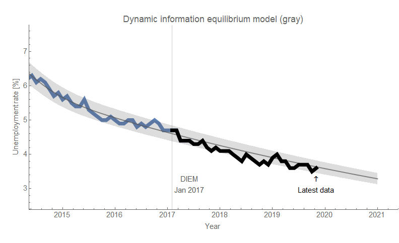
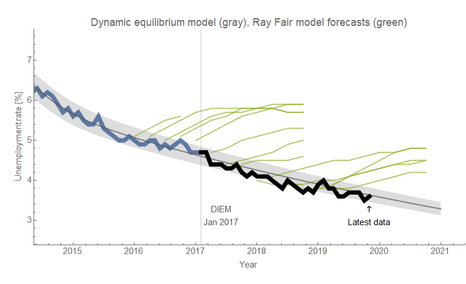
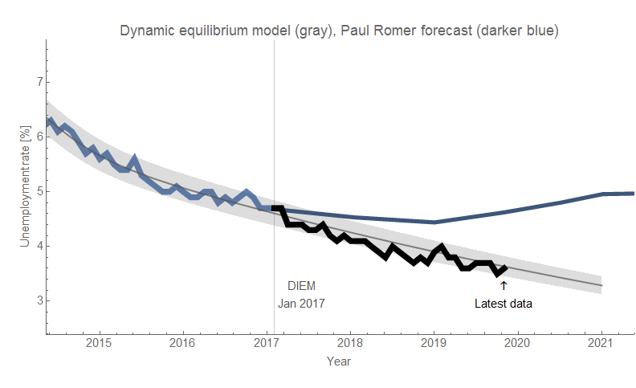
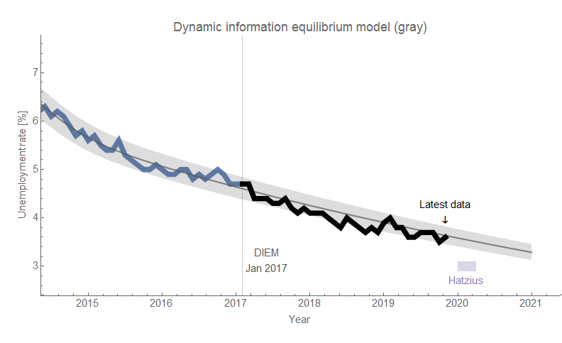
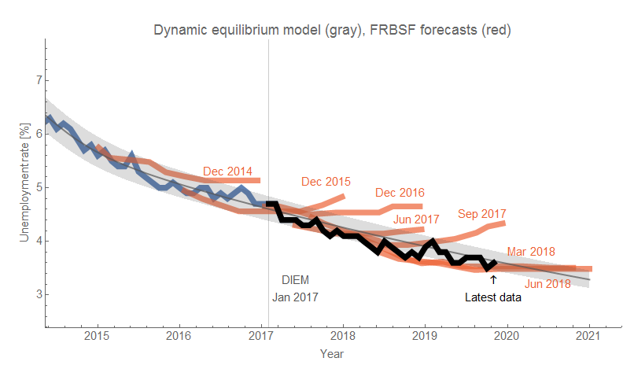

The Employment Situation data from BLS was released on [FRED](https://fred.stlouisfed.org/release?rid=50) today (a.k.a. "Jobs Day") which includes the latest  unemployment rate and the "prime age" (25-54) labor force participation rate data among many other measures. I've emphasized those two particular measures since I've been tracking the performance of the [Dynamic Information Equilibrium Model](https://papers.ssrn.com/sol3/papers.cfm?abstract_id=3094757) forecast [since 2017](https://informationtransfereconomics.blogspot.com/2017/01/dynamic-equilibrium-unemployment-rate.html). And now, almost three years later, they're as accurate as ever (black is the post-forecast data):

For a bit of context, here's a rogues' gallery of forecasts from the [Federal Reserve Board of San Francisco](https://www.frbsf.org/economic-research/publications/fedviews/) (FRBSF), [Ray Fair](https://fairmodel.econ.yale.edu/mmm1.htm), [Nobel laureate Paul Romer](https://informationtransfereconomics.blogspot.com/2017/12/another-unemployment-rate-forecast.html) (a prediction from 2017 \[1\]), and [Jan Hatzius](https://informationtransfereconomics.blogspot.com/2018/11/ill-say-similar-things-for-half-salary.html) (Goldman-Sachs) \[click to enlarge\]:

Additionally, PCE inflation data came out yesterday — it was also in line with the (very boring) DIEM forecast:

**Footnotes:**

\[1\] Also in [the tweet with the unemployment prediction](https://twitter.com/paulmromer/status/940075895393460225) is a horribly wrong labor force participation forecast (the DIEM model of [CIVPART](https://fred.stlouisfed.org/series/CIVPART) was based on the dynamic equilibrium for the prime age participation rate forecast above). Click to enlarge:

