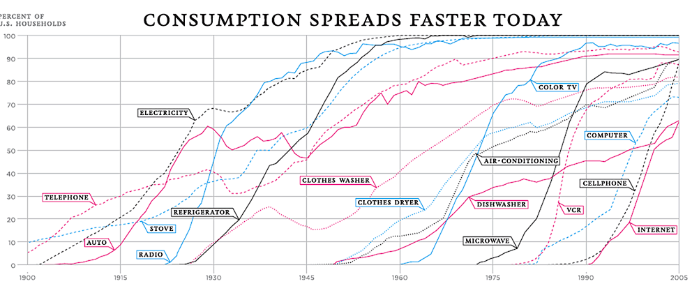

John Quiggin has an entertaining [article up at The Conversation](https://theconversation.com/please-no-more-projections-what-we-need-are-predictions-and-theyre-harder-126734) that looks at the persistently undershooting IEA "projections" of renewable energy production as a case study in the lack of accountability for statements about the future. This particular case comes up every two years because the IEA updates their "projections" every two years (Quiggin cites [a 2017 critique](https://www.quora.com/q/xwpxpfefwalgifkr/A-modest-proposal-to-the-International-Energy-Authority) from Paul Mainwood and David Roberts talked about it at Vox [two years prior in 2015](https://www.vox.com/2015/10/12/9510879/iea-underestimate-renewables)). It's 2019, so time for another look!

I personally have a soft spot in my heart for these ["hedgehog" graphs](https://informationtransfereconomics.blogspot.com/2019/08/uk-productivity-back-to-1800s-and-new.html) where the future lines keep missing the data — I keep a gallery of macroeconomic "projections" (predictions? forecasts?) [here](https://informationtransfereconomics.blogspot.com/2016/02/thought-experiment.html). Often, the [dynamic information equilibrium model](https://papers.ssrn.com/sol3/papers.cfm?abstract_id=3094757) (DIEM) is a much better model (such as for the unemployment rate), so I wanted to try it on this data.

Why should the DIEM be an appropriate model? Well, for one thing we can view the generation and consumption of electricity as a matching model — a megawatt-hour of production is matched with a megawatt-hour of consumption. Renewable energy is then like a manufacturing sector job or a retail sector job (... or an unemployment sector job a.k.a. being unemployed). But a more visually compelling reason is that technology adoption tends to follow (sums of) logistic curves per Dave Roberts' article at Vox:

These are the same logistic curves the DIEM's non-equilibrium component is built from. Logistic curves are also seriously problematic for "center predictions" — you really need to understand the error bands. The initial take-off is exponential, resulting in enormous error bands. The center is approximately linear, and only once you have reached that point do the error bands begin to calm down (see [here](https://informationtransfereconomics.blogspot.com/2018/09/forecasting-great-recession.html) for an explicit example of the unemployment rate during the Great Recession).

One issue was that I had the hardest time finding corroborating data that went back further than the "actual" data in Mainwood's graph. I eventually found [this](https://ourworldindata.org/renewable-energy) which is claimed to come from the IEA (via the World Bank). It largely matches up except for a single point in the 90s, allowing for error in digitizing the data from the plot. (Be careful about production versus consumption and world versus OECD if you try to find some data yourself.) That point in the 90s is inexplicably near zero in Mainwood's "actual" data. It's possible there are some definition issues (it's non-hydro renewables, which may or may not include biomass). But as this isn't a formal paper, the recent data seems fine, and the details of the fit aren't the main focus here we can just proceed.

I ran the DIEM model for the IEA data from 1971 to 2015, and this was the result:

Overall, the DIEM forecast is highly uncertain, but encompasses the 2012 and 2016 IEA forecasts for the near future. Mainwood's "corrected" forecast (not shown here) is well above any of these — it represents a typical problem with forecasts of logistic processes where people first see a lot of under-estimation, over-correct, and seriously over-estimate the result.

The best way to see the DIEM forecast is on a log scale:

There are three major events in this data — one centered in the early 80s (possibly to due to oil shocks and changes in energy policy such as the Carter administration), a sharp change in the late 80s, and then finally the current renewable revolution with wind and solar power generation due to a combination of policy and technology. The equilibrium growth rate (the "dynamic equilibrium") is consistent with zero — i.e. without policy or technology changes, renewables don't grow very fast if at all.

You can also see that it's likely we have seen the turnaround point in the data around 2010 — but it is also possible the global recession affected the data (causing renewables to fall as a fraction of global energy production). The global recession may be making it _look like_ the turnaround has passed.

Quiggin's larger point, however, is something I've never really even considered. Do people really see projections as different from predictions or forecasts? If someone tried to hide and say their lines going into the future were "projections" and therefore not meant to be "predictions", I would just laugh. Does this really fool anyone?

I cannot come up with a serious rational argument that projections are different from predictions. We sometimes call predictions forecasts because that seems to move a step away from oracles and goat entrails. But **_any_** statement about the value of a variable in the future is a prediction. Sure, you can say "this line is just linear extrapolation" (a particular model of expected future data) and that it most certainly won't be right (a particular confidence interval). But it's still a prediction.

That's why the error bands (or fan charts, or whatever) are important! If you draw a line and say that we shouldn't take it seriously when we discover it's wrong, that just means the _ex ante_ error bands were effectively infinite (or at least the range of the dependent variable). As such, there's literally zero information in the "projection" compared to a maximally uninformative prior — i.e. a uniform distribution over the range of the data. You can show that with information theory. Any claim that a projection that shouldn't be compared to future data yet has some kind of value is an informational paradox. It represents information and yet it doesn't!

Is this why a lot of economic and public policy forecasts leave off error bands? Is somehow not explicitly putting the bands down believed to keep the confidence in some kind of unmeasured quantum state such that it can't be wrong?

But as Quiggin mentions, this has ramifications for accountability. People year after year cite the IEA "projections" that continue to be wrong year after year. And year after year (or at least every two years) some rando on the internet takes them to task for getting it wrong, and the cycle begins again.

The thing is that it's not that difficult to explain why the IEA projections are wrong. Forecasting the course of a non-equilibrium shock (in the DIEM picture) is nigh impossible without accepting a great deal of uncertainty. Even if you don't believe the DIEM, a logistic picture of technology adoption is sufficient to understand the data. The only problem is that they'd have to show those enormous error bands.

...

PS I am almost certain those error bands exist in their models; they just don't make it into the reports or executive summaries.

PPS The existence and form of "executive summaries" should be all the evidence we need that CEOs and other "executives" aren't super-genius _Übermenschen_.
