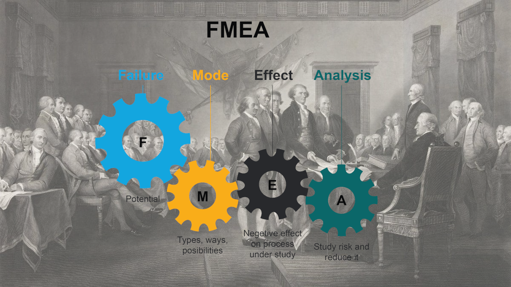

I don't write about process as much these days — in part because I'm no longer working my previous project that had me effectively commuting across the country every month to the middle of nowhere, and in part because I'm now working a much bigger project that barely leaves me enough time to update even the existing [dynamic information equilibrium model](https://papers.ssrn.com/sol3/papers.cfm?abstract_id=3094757) forecasts. But recently there seems to be an upswing in calls for civility, declarations of incivility, and long sighs about about how to criticize the "correct" way. I saw George Mason economist Peter Boettke tweet out [this](https://www.brainpickings.org/2014/03/28/daniel-dennett-rapoport-rules-criticism/) the other day that includes a list of "rules" for how to criticize:

> _How to compose a successful critical commentary:_
>
> 1.  _You should attempt to re-express your target’s position so clearly, vividly, and fairly that your target says, "Thanks, I wish I’d thought of putting it that way."_
> 2.  _You should list any points of agreement (especially if they are not matters of general or widespread agreement)._
> 3.  _You should mention anything you have learned from your target._
> 4.  _Only then are you permitted to say so much as a word of rebuttal or criticism._

It seems fitting that Boettke would tweet this out given his defense of the racist economist/public choice theorist James Buchanan. It's pure "Enlightenment" rationalism — the same Enlightenment that gave us many advances in science, but also [racism and eugenics](https://slate.com/news-and-politics/2018/06/taking-the-enlightenment-seriously-requires-talking-about-race.html). These rules are in general a great way to go about criticism — but if and only if certain norms are maintained. If these norms aren't maintained, these rules inculcate us with a vulnerability to what I've called [viruses of the Enlightenment](https://informationtransfereconomics.blogspot.com/2017/03/academic-norms-and-charles-murray.html). To put in the terms of my job: this process has not been subjected to failure mode effect analysis (FMEA) and risk management.

This isn't intended to be a historical analysis of what the "Enlightenment" was, how it came to be, or its purpose, but rather how the rational argument process aspect is used — and misused — in discourse today. I've identified a few failure modes — the vulnerabilities of "Enlightenment" values.

**Failure mode 1: Morally repugnant positions**

I'm under the impression that like bioethics, medical ethics, or scientific ethics, someone needs to convene an interdisciplinary ethics of rational thought. There are still occasions when science seems to think the pursuit of knowledge is an aim higher than any human ethics, and failures run the gamut from the recent protests to building another telescope on Mauna Kea ([part of a longer series of protests](https://en.wikipedia.org/wiki/Thirty_Meter_Telescope_protests)) to unethical human experiments.

Rationalism seems to continue to hold this view — that anything should be up for discussion. But we've long since discovered that science can't just experiment on people without considering the ethics, so why should we believe rationalism can just say whatever it wants?

Unfortunately, since we are humans and not rational robots, the discussion of some ideas themselves might spread or exacerbate morally repugnant beliefs. This is contrary to the stated purpose of "Enlightenment values" — open discussion that leads to the "best" ideas winning out in the "marketplace of ideas". And if that direct causality breaks (open discussion → better ideas), the rationale for open discussion is weakened \[0\]. Simply repeating a lie or conspiracy theory i[s known to strengthen the belief in it](https://www.wired.com/2017/02/dont-believe-lies-just-people-repeat/) — in part from [familiarity heuristic](https://en.wikipedia.org/wiki/Familiarity_heuristic). And we know that simply changing the framing of a question on polls can change people's agreement or disagreement. Right wing publications try to launder their ideas by simply getting mainstream publications to acknowledge them, pulling them out the "conservative ecosystem" — as Steve Bannon has specifically talked about (see [here](https://www.washingtonpost.com/opinions/2020/10/15/trumps-fake-new-biden-scandal-has-deeper-purpose-bannon-revealed-it/)).

Rule #1 fails to acknowledge our humanity. Simply repeating a morally repugnant idea can help spread it, and in the very least requires the critic to carry water for a morally repugnant idea. I cannot be required to restate someone's position that's favorable racism because that requires giving racism my voice, and immorally helping the cause of racism.

For example, Boettke's defense of Buchanan requires him to carry water for Buchanan. If we consider the possibility that Nancy MacLean's claims of a right-wing conspiracy to undermine democracy and promote segregation are true (I am not saying they are, and people I respect — e.g. [Henry Farrell](http://crookedtimber.org/2018/09/18/my-last-word-on-nancy-maclean/) — strongly disagree with that interpretation of the evidence), then carrying that water should be held to a level of ethical scrutiny a bit higher than, say, discussing the differences between Bayesian and frequentist interpretations of probability.

This is not to say we shouldn't talk about Buchanan or racism. It's not like we don't experiment with human subjects (e.g. clinical trials). It's just that when we do, there are various ethical questions that need to be formally addressed from informed consent to what we plan to learn from that experiment. A human experiment where we ask the question about whether humans feel pain from being punched in the face is not ethical **_even if we have consent from the subjects_** because the likelihood of learning something from it is almost zero. "I'm just asking questions" here is not a persuasive ethical argument.

This is in part why I think shutting down racists from speaking on college campuses isn't problematic in any way. Would we authorize a human experiment where we engage in a campaign of intimidation of minorities just to measure the effects? We already know about racist thought — it's not like these are new ideas. They're already widely discussed — **_that's how students on campuses know what to protest._** And in terms of ethical controls, we might well consider that the moral risk managed solution consistent with intellectual discourse is to have these “speakers” write their “ideas” down, have the forum led by someone who is not a famous racist, or possibly is even opposed to the “ideas” \[3\].

**Failure mode 2: Over-representation of the elite**

I criticized [Roger Farmer's acceptance](https://twitter.com/farmerrf/status/989503121876434944) of Hayek's interpretation that prices contain information on Twitter a year or so ago (for more detail on my take, you can check out [my _Evonomics_ article](https://evonomics.com/hayek-meets-information-theory-fails/)). Farmer subsequently unfollowed me on Twitter which likely decreases the engagement I get through Twitter’s algorithms.

Now my point here is not that one is obligated to listen to every crackpot (such as myself) and engage with their “ideas”. It’s that we cannot feasibly exist in a world where all expression is heard and responded to — regardless of how misguided or uninformed. And who would want that?

But it does mean participation via the (purportedly) egalitarian Enlightenment ideals of “free speech” and “free expression” in the marketplace of ideas is already limited. And the presumption of “equals” engaging in mutual criticism behind Bottke's “rules” artificially limits the bounds of criticism _further_. Already elites pick and choose the criticism they engage with — giving them an additional power of “permission” distorts the power balance even more.

Unfortunately public speech and public attention ends up being rationed the same way most scarce resources are rationed — by money. The elite gatekeepers at major publications push the opinions and findings of their elite comrades through the soda straw of public attention. We hear the opinions of millionaires and billionaires as well as people who find themselves in circles where they occasionally encounter billionaires far more often than is academically efficient. [Bloomberg](https://www.bloomberg.com/opinion/articles/2019-09-15/free-speech-on-campus-democracy-requires-discomfort) and [Pinker](https://www.insidehighered.com/news/2019/07/17/steven-pinkers-aid-jeffrey-epsteins-legal-defense-renews-criticism-increasingly) talking about free speech. [MMT](https://en.m.wikipedia.org/wiki/Warren_Mosler). [Charles Murray](https://www.salon.com/2017/04/20/discrimination-101-how-koch-devos-families-fund-hate-speech-on-u-s-college-campuses_partner/).

Bloomberg writing at bloomberg.com is a particularly egregious example of breaking the egalitarian norm. Bloomberg's undergraduate education is in electrical engineering from the 1960s and he has a business degree from the same era. He has no particular qualifications to judge the quality of discourse, the merits of the freedom of speech, or who should be forced to tolerate right wing intimidation on college campuses. He is in the position he is in because he made a great deal of money which enabled him to take a chance on running for office and becoming mayor of New York.

That said, I don't have particular expertise in this area — but then I don't get to write at bloomberg.com.

As such, “cancelling” the speech of these members of the elite mitigates this bias almost regardless of the actual reason for the cancellation simply because they’re over-represented.

More market-oriented people might say having billions of dollars must mean you’ve done at least something right and therefore could result in being over-represented in the marketplace of ideas. That's an opinion you can argue — in the marketplace of ideas — not implement by fiat. Now this is just my own opinion, but I think having too much money seems to make people less intelligent. Maybe life gets too easy. Maybe you lose people around you that disagree with you because they're dependent on your largess. Lack of intellectual challenge seems to turn your brain to mush in the same way lack of physical activity turns your body to mush. You might have started out pretty sharp, but — whatever the reason — once the cash piles up it seems to take a toll. I mean, have you listened to Elon Musk lately? However, even if you believe having billions of dollars means you have something worthwhile to say, that is **_not_** the Enlightenment's egalitarian ethos. King George III had a lot more money than any of the founders of the United States, but it's not like they felt compelled to invite him or his representatives to speak at the signing of the Declaration of Independence.

While everyone has a right to say what they want, that right that does not grant everyone a platform. The “illiberal suppression” of speech can be a practical prioritization of speech. "Cancelling" can mitigate systemic biases, enabling a less biased, more genuine discourse. Why should we have to listen to the same garbage arguments over and over again? Even if they aren’t garbage, why the repetition? And even if the repetition is valid, _why must we have the same people doing the repeating?_ \[1\] An objective function optimized for academic discussion should prioritize novel ideas, not the same people rehashing racism, sexism, or even “enlightenment” values for 30 years.

It's true that novelty for novelty's sake creates its own bias in academia — journals are biased towards novel results rather than confirmation of last year's ideas creating a whole new set of problems. In addition to novel ideas, verifiability and empirically accuracy would also be good heuristics. Expertise or credentials in a particular subject is often a good heuristic for priority, but like the other heuristics it is just that — a heuristic. Knowing when to break with a heuristic is just as valuable as the heuristic itself.

In any case, just assuming elites and experts should be free from criticism unless it meets particular forms of "civility" or that their "ideas" should be granted a platform free from being "cancelled" do not further the _spirit_ of the Enlightenment values that most of us agree on — that what's true or optimal ought to win out in the marketplace of ideas.

**Failure mode 3: Rational thought and academic research is not free speech**

Something obvious in the norms in Boettke's list is that he appears to recognize rational argument differs from free speech. "Free speech" does not require you to speak in some proscribed manner — that would _ipso facto_ fail to be free speech. 

However, the ordinary process by which old ideas die off through rational argument seems to be conflated with suppressing free speech these days. Having your paper on race and IQ rejected for publication because it rehashes the old mistakes and poor data sets is normal rational progress, not the suppression of free speech. "Just asking questions" needs to come to grips with the fact that lots of those questions have been asked before and have lots of answers. Just as we don't need to continuously rehash 19th century aether theory, we don't need to continuously rehash 19th century race science \[2\].

When shouts of "free speech" are used as a cudgel to force academic discussion of degenerative research programs in Lakatos' sense, it represents a failure mode of "Enlightenment" values and science in general. In order for science and the academy to function, it needs to rid itself these degenerative research programs regardless of whether rural white people in the United States continue to support them. If these research programs turn out to not be degenerative — well, there's a pretty direct avenue back into being discussed via those new results showing exactly that. Assuming they follow ethical research practices, of course.

**Failure mode 4: People don't follow the spirit of the rules**

Failure to follow the spirit of these rules tends to be rampant in any "school of thought" that claims to challenge orthodoxy from race science to Austrian economics. Feynman's famous "[cargo cult science](https://www.blogger.com/blog/post/edit/6837159629100463303/4690142661662230519#)" commencement address is a paean to the spirit of the rules of science (and "Enlightenment" values generally), but unlike Boettke's rules for others Feynman asks fledgling scientists to direct the rules inward — "The first principle is that you must not fool yourself — and you are the easiest person to fool."

This failure mode is far less intense than discussing racism, unethical human experiments or plutocracy, but is far more common. Certainly, the "straw man" application of Rule #1 falls into this. But one of the most frustrating is the one many of us feel when engaging with e.g. MMT acolytes — never acknowledging that you have "re-express\[ed\] your target’s position ... clearly, vividly, and fairly."

Randall Wray or William Mitchell (e.g.) simply never acknowledge any criticism is valid or accurate. Criticism is [dismissed](http://neweconomicperspectives.org/2019/02/response-to-doug-henwoods-trolling-in-jacobin.html) as _ad hominem_ attacks instead of being acknowledged. If "successful" critical commentary (per the "rules") requires the subjects to grant you permission, any criticism can be shut down by a claim that the critic doesn't know what they are talking about.

This failure to follow the spirit of the rules appears in numerous ways, from claims that simply expressing a counterargument isn't civil discourse to the failure of someone espousing racist views to admit that those views are actually racist \[4\] to general hypocrisy. However, the end effect is that failure to follow the spirit of the rules is an attempt to enable the speaker with the ability to grant permission to which facts or counterarguments are allowed and which aren't. That's not really how "Enlightenment values" are supposed to work.

Being granted permission by the subject of criticism is also generally unnecessary to actual progress. Humans — especially established public figures — rarely listen to criticism. Upton Sinclair, Bertrand Russell, and Max Planck captured different dimensions of this (a rationale, a mechanism, and a real course of progress) in pithy quotes (respectively):

> _It is difficult to get a man to understand something, when his salary depends upon his not understanding it!_ 

> _If a man is offered a fact which goes against his instincts, he will scrutinize it closely, and unless the evidence is overwhelming, he will refuse to believe it. If, on the other hand, he is offered something which affords a reason for acting in accordance to his instincts, he will accept it even on the slightest evidence._ 

> _A new scientific truth does not triumph by convincing its opponents and making them see the light, but rather because its opponents eventually die, and a new generation grows up that is familiar with it._

This is how the world has always been. Your audience for your criticism is never the subjects of the criticism, but rather the next generation. Explaining your subject's position before criticizing it is done as part of Feynman's "[leaning over backward](https://en.wikipedia.org/wiki/Cargo_cult_science)" — for yourself — not legitimacy.

**Other failure modes**

I wanted to collect my thoughts on free speech, "cancelling", and the terrible state of "the discourse" in one essay. This list is not meant to be exhaustive, and I may expand it in the future when I have new examples that don't fit in the previous four categories. For example, you might think that academic journals are a form of intellectual gatekeeping — and I'd agree — but I believe that falls under failure mode 2: the over-representation of the elite, not a separate category. There are also genuine workarounds in that case that everyone uses (arXiv, SSRN). You may also disagree with the particular choice of basis — and I'm certain another orthonormal set of failure modes could span the same failure effect space.

Also, because I talk about MMT along with Public Choice and racism, it doesn't mean I equate them. There are similarities (both get a leg up through the support of billionaires), but I am trying to find examples from across a broad spectrum of politics and political economy. There are major failures and minor. However, I think the examples I've chosen most clearly illustrate these failure modes.

I have been sitting on this essay for nearly a year. I was motivated to action by [a tweet](https://twitter.com/infotranecon/status/1317870747424096258) from Martin Kulldorff, a professor at the Harvard Medical School about how Scott Atlas was "censored" \[5\] for spreading misinformation about the efficacy of various coronavirus mitigations (from masks to lockdowns). Atlas is on the current administration's "Coronavirus Task Force" and a fellow at the Hoover institution — a front for right wing views funded by billionaires. There is literally no universe in which this is a true egalitarian "Enlightenment" discussion — from the elite over-representation with Harvard and the billionaires at Hoover to the lack of disclosure of conflicts of interest (failure modes 2 and 4, respectively). That far too many people think Atlas being "censored" is against the spirit of the Enlightenment is exactly how it can fail.

**Footnotes:**

\[0\] This is similar to [the argument against markets as mechanisms for knowledge discovery](https://informationtransfereconomics.blogspot.com/2015/01/is-market-intelligent.html) — information leakage in the causal mechanism breaks it.

\[1\] More on this [here](https://informationtransfereconomics.blogspot.com/2017/03/academic-norms-and-charles-murray.html). Why do we have to hear **_specifically_** Charles Murray talk about race and IQ? (TL;DR because it's not about ideas, but rather signalling and authority.)

\[2\] Personally, I think IQ tests should include a true/false question that asks if you think there's nothing wrong with believing the racial or ethnic group to which you belong has on average a higher IQ than others. Answering "true" would indicate you're probably bad at understanding self-bias that is critical to scientific inquiry and should reduce your score by at least 1/2.  As George Bernard Shaw said, “Patriotism is your conviction that this country is superior to all other countries because you were born in it.” Racism is at its heart your conviction that your race is superior to all other races because you were born into it — the rest is confirmation bias.

\[3\] In _Star Trek: The Next Generation_ "Measure of a Man" (S:2 E:9), Commander Riker is tasked with prosecuting the idea that the android Lt. Commander Data is not a person, but rather Federation property — something with which Riker personally disagrees.

\[4\] I have never really understood this. Unless you're hopelessly obtuse, you must know if you have racist views. Why would you be upset about other people identifying them as such? The typical argument being supported by racist views is that racism is correct and right! A racist (who happens to be white by pure coincidence) who believes that other non-white people have lower IQs through some genetic effect is trying to support racism. I have so much more respect for racists, like a pudgy white British man who appears in the beginning of _The Filth and the Fury_ (2000) who openly admits he is racist. That's the Enlightenment!

\[5\] In no way is this censorship and calling it that is risible idiocy. The tweets were removed on Twitter, a private company, not by the US government. And Atlas still has access to multiple platforms — including amplification by elite Harvard professors, which is what is actually happening.
