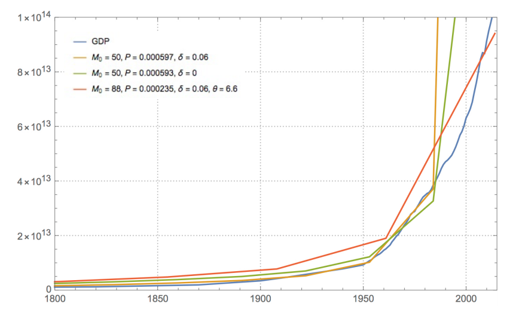

In my travels on the internet, I came across [this paper](https://arxiv.org/abs/1811.04502) (Koppl _et al_ \[1\]) from almost exactly a year ago. It has the silliest model of the world economy I've ever seen. Here's the abstract:

> _We use a simple combinatorial model of technological change to explain the Industrial Revolution. The Industrial Revolution was a sudden large improvement in technology, which resulted in significant increases in human wealth and life spans. In our model, technological change is combining or modifying earlier goods to produce new goods. The underlying process, which has been the same for at least 200,000 years, was sure to produce a very long period of relatively slow change followed with probability one by a combinatorial explosion and sudden takeoff. Thus, in our model, after many millennia of relative quiescence in wealth and technology, a combinatorial explosion created the sudden takeoff of the Industrial Revolution._

Caveats about extrapolating that far back notwithstanding, the problem isn’t so much what is written in the abstract but rather that the model cannot support any of the statements in it. Overall, it’s a good lesson (cautionary tale?) in how to go about mathematical modeling.

Just so there are no complaints that I "didn't understand the model", I went and reproduced the results. There's something they kind of gloss over in their paper that I'll come back to later that accounts for the small discrepancies.

First, the population data is basically exactly their graph (I have two different sources that largely match up):

The black dashed line at the end will come back later. Constructing their recursive _M_ function (that represents the combinatorial explosion) and putting it together with the Solow model/Cobb-Douglas production function in the paper allows us to reproduce their graph of world output (GDP in Geary–Khamis international dollars) since the dawn of the Common Era (CE):

Like the population graph above and the _M_\-function graph below, it is also graphed on a linear axis for some reason. They zoom in to 1800-2000 because they want to talk about the Industrial Revolution:

We reproduce this down to the segmented lines drawn between points in the time steps. Although you can't really see it in this graph, this is really part of a continuous curve in the model that goes back to at least the 1600s — it's not the Industrial Revolution (for more on take-off growth, see [here](https://informationtransfereconomics.blogspot.com/2018/04/sustained-growth.html) or [here](https://informationtransfereconomics.blogspot.com/2019/08/a-solow-paradox-for-industrial.html)). A log-log graph helps illustrate it a bit better:

The authors then show their output points alongside a measure of GDP in international dollars. For some reason it’s now points instead of line segments. But at least we’re on a log scale!

I didn’t use the exact same time series for comparison; instead, I used GDP estimates from [Brad Delong here](https://delong.typepad.com/print/20061012_LRWGDP.pdf) \[pdf\] that I had on hand. However, they're reasonably close to the data they present in their paper. In fact, it’s a bit better fit! I'm doing my best to be charitable. There is an almost exact factor of 4 difference in the level of their data and Delong's, which I think is accounting for “seasonally adjusted annual rate” for quarterly data. Koppl _et al_ actually have two other model fits in their paper with different parameters. I just reproduced the yellow one that was closest to the data  (see the others at the end of this post).

The one graph I’m not reproducing exactly here is their _M_ function. I think they just plotted a version with different parameters than for their yellow model result. As I didn’t care **_that_** much, I just did the _M_ function from the yellow model result since that’ll be most germane to our discussion. Like most combinatorial functions, it goes along fairly flat (in linear space) and then jumps up suddenly (again, in linear space):

It starts at _M₀_, which is 50 in the parameters for their yellow result. The last several numbers in the series are 117.1, 125.3, 136.1, 151.0, 173.7, 213.2, 303.1, 668.8, 9323.4, 326360625.7. The next number is 4.9 × 10^26. Five hundred octillion.

What is supposedly happening in this model is that a current inventory of products (stick, flint, feathers) are at random brought together to produce a new product (an [arrow](https://minecraft.gamepedia.com/Arrow#Crafting) for a bow) with some probability. That new inventory then has elements brought together to craft a new output good. It's basically a _[Minecraft](https://minecraft.gamepedia.com/Minecraft)_ crafting economy with the number of products you discover increasing combinatorially (roughly on the order of e.g. the [gamma function](https://en.wikipedia.org/wiki/Gamma_function) or [factorial](https://en.wikipedia.org/wiki/Factorial)). The factorials enter through a binomial coefficient.

Combinatorial explosion is building all along, but it really doesn't explain the Industrial Revolution. In fact, you can’t really say this “starts” anywhere with any kind of objective criteria. It starts at _M₀_, if anything, which is assigned to “year 1” (_t_ = 0) — the beginning of the CE. The location of the super-exponential “take off” point (viewed on a linear scale) is then 60 or so time steps from year 1. But what is a time step? That’s what the authors gloss over. The time is just “scaled” so that the combinatorial series fits in the period from about “year 1” to about the present year.

The time steps turn out to be about 31 years (at least that's what I used), which is remarkably close to a “generation”. But this time scale is a fundamental parameter of their model — telling us where and when the combinatorial explosion occurs. If it had instead been on the order of a quarter, we could go from subsistence to the modern age in about 16 years. Instead whatever combination of current output goods that produces a new product with some probability happens only once every 30 years. You could of course adjust the probability to compensate a change in the time scale — making the probability parameters smaller increases the number of time steps it takes to cover the dynamic range of GDP values. However, since none of these parameters are estimated from some underlying data, the exact location and span of the model result in time is _completely_ arbitrary.

I will pause to note that leaving out time scales like this is a _general_ failing in economics (see [here](http://informationtransfereconomics.blogspot.com/2015/11/if-model-result-is-silly-question-scope.html) or [here](https://informationtransfereconomics.blogspot.com/2015/11/on-limits.html)), making it impossible to understand the scope of their theoretical models.

The real  problem is when you go to the next time steps (I've also started adding graph labels to the graphs themselves). Combinatorial explosion doesn’t stop once you’ve explained as much of the data you want to explain. It keeps going, and going, and going, and going ...

Of course the GDP data ends so we can't see just how realistic this model is. Remember — their _M_ function is heading towards 10^26 when it's about 600 around the year 2000.

This made me want to use the  the dynamic equilibrium model to extrapolate the data a bit further. In it, we have general exponential growth interrupted by periods of much higher (or lower) growth (“shocks”).

I [wrote about population growth](https://informationtransfereconomics.blogspot.com/2017/11/dynamic-information-equilibrium-world.html) and how you might go about modeling it with the dynamic equilibrium model about two years ago [with a follow up](https://informationtransfereconomics.blogspot.com/2018/05/limits-to-knowledge-of-growth.html) referencing the well-known 1970s report titled _Limits To Growth_. The general result there is that the recent population data is consistent with a saturation level of about 12-13 billion people by 2300. That most recent surge in population growth is associated with the advent of modern medicine (others seem to be associated with e.g. the Neolithic revolution in farming or sanitation). Maybe that’s right, maybe that’s wrong. But at least it’s a realistic extrapolation based on a slow decline in world population growth.

I used the world GDP data and population data to create a GDP per capita measure. I then extrapolated that data using another dynamic equilibrium model — one that’s remarkably consistent with the widespread phenomenon of women entering the workforce in larger numbers in the 1950s, 60s and 70s in the world’s largest economies. Again, it’s possible GDP per capita will continue to expand at its current rate for much longer than the next 25 to 50 years, but with growth slowing in most Western countries and even China, it’s entirely possible we’ll see a decline to a rate of growth more consistent with the 1800s than the 1900s.

We can combine our extrapolation of GDP per capita with population to form an extrapolation of world GDP over the next hundred years. The new picture of the longer term output growth shows how silly the combinatorial model is unless we arbitrarily restrict it to the most recent 2000 years.

In 2077 \[2\], world GDP by this extrapolation is about 513 trillion 1990 Geary–Khamis international dollars instead of the combinatorial version which gives 8.2 duodecillion (10^39) international dollars. We can compare this to world GDP in 2000 which was about 96 trillion international dollars in this data.

An increase by a factor of 5 from the year 2000 is not entirely unreasonable given slowing global growth, but an increase by a factor of a duodecillion (which [I had to look up](https://en.wikipedia.org/wiki/Names_of_large_numbers#Standard_dictionary_numbers)) \[3\] seems ... um, improbable.

US real GDP grew by a factor of about 10 over 70 years from 1950 to today, but that also includes the period in the middle of the last century where growth was much higher. Plus, the data in the GDP extrapolation also grows by a factor of about 10 over 70 years from 1950 to 2020.

The main take away is that this combinatorial model is both arbitrary in its timing — it's set up to have growth explode after the industrial revolution — but also its scope, being limited to the period from about 1 CE to about 2000 CE \[4\]. Going a single time step too far gives not just unrealistic but absolutely _**silly**_ results. The model seems very much like someone (maybe Koppl) had this combinatorial idea (maybe after someone mentioned _Minecraft_ to him) and it was given to a bunch of grad students to figure out how to make it fit the data. Odd parameters, large time steps that result in segmented data graphs, arbitrarily setting terms in sums to zero — it's not a natural evolution of a model towards the data. I saw this in their figure 4 and laughed:

Of course, the default color scheme for _Mathematica_ is instantly recognizable to me (and in part why I tried to reproduce the figures exactly down to the dotted grid lines). But these line segments are all supposed to be aiming for that blue line. None of them are remotely close to even _qualitatively_ explaining the data.

It's not an _a priori_ bad insight for a model — it makes sense! It's kind of a [Gary Becker irrational agents](https://informationtransfereconomics.blogspot.com/2015/10/gary-beckers-emergent-rational-agents.html) meets a _Minecraft_ opportunity set. But combinatorial explosion is just too big to explain GDP, which is much more in the realm of the exponential with varying growth rates. So instead of mathematical modeling, you start building a Rube Goldberg device to make the model output kind of look like the data ... if you squint ... from across the room.

And yet instead of languishing on a grad student's file share or hard drive where it should be, this model ended up LaTeX'd up on the arXiv.

**Footnotes**

\[1\] It should be noted that Roger Koppl, the lead author, is associated with Mercatus and George Mason University (like one of the other co-authors) with lots of references to Hayek and Austrian economic in any description. Additionally, the paper came up on [Marginal Revolution](https://marginalrevolution.com/marginalrevolution/2019/11/monday-assorted-links-228.html) this past week. It should be a huge grain of salt, and in fact this paper is pretty typical of the quality of the work product from GMU-related activities \[5\].

\[2\] Chosen due to the time step scale.

\[3\] This made me think of [Graham's number](https://en.wikipedia.org/wiki/Graham%27s_number) — for a time the largest number that has ever been used for anything practical (in this case it's an upper bound for a graph coloring problem). In part because the Koppl _et al_ GDP is so high itself, but also because like the suspicion of mathematicians that the real answer for Graham's number is about 20, a more realistic estimate of GDP is much, much lower.

\[4\] There are other choices, such as limiting ourselves to only about 4 items in the combinations that I believe was more a computational limit (my computer has overflow problems if you increase that number or add too many time steps), that basically turn this "model" into a ~10 parameter fit.

\[5\] The paper goes on a tangent about "grabbing" which is basically a right wing rant:

> _Our explanation might seem to neglect the important fact of predation, whereby some persons seize (perhaps violently) goods made by others without offering anything in exchange for them. Such “grabbing,” as we may call it, discourages technological change._ 

The model put forward has absolutely nothing to do with this and can't explain technological change well enough to warrant speculation about secondary effects like this.

In addition, this is completely ahistorical. Violently seizing others' goods is in fact a major driver of innovation in history — a huge amount of innovation comes in the form of weapons. The silicon chips you're using right now to read this? Needed to make the computations fast enough to accurately guide a nuclear weapon to its target. The basics of computers with vacuum tubes were built to better aim artillery — even physics itself came from this.
