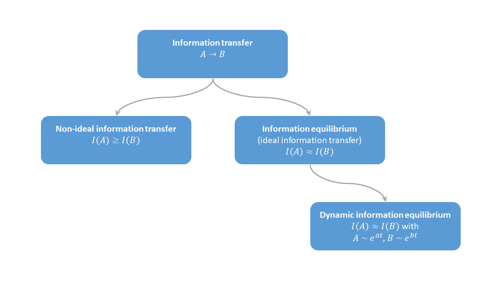

It's the _Information Transfer Economics_ Year in Review for 2019!

It's my annual meta-post where I try in vain to understand exactly how social media works. But most of all, it's a way to say thank you to everyone for reading. Perhaps there's a post that you missed. Personally, I'd forgotten that one of the top five below was written this year.

As the years go by (now well into the 7th year of the blog), the blog's name seems to be more and more of a relic. I do find it a helpful reminder of where I started each time I open up an editor or do a site search. Nowadays, I seem to talk much more about "dynamic information equilibrium" than "information transfer". In the general context, the former is a kind of subset of the latter:

All of the aspects have applications, it's just that the DIEM for the labor market measures a) gives different results from traditional econ, b) outperforms traditional econ models, and c) has been remarkably accurate for nearly the past three years.

Thanks to your help, I made it to [1000 followers on Twitter this year](https://twitter.com/infotranecon/status/1195448215841071104?s=20)! It seems the days of RSS feeds are behind us (I for one am sad about this) and the way most people see the blog is through links on Twitter or Facebook. Speaking of which, the most shared article on social media (per Feedly) was this one:

**Most shared**

> [_**Market-correlated fluctuations in employment data**_](http://informationtransfereconomics.blogspot.com/2019/09/market-correlated-fluctuations-in.html)

> _The post notes an interesting empirical correlation between the fluctuations in the JOLTS job openings rate (and even other JOLTS measures) around the dynamic equilibrium (i.e. mean log-linear path) with the fluctuations in the S&P 500 around the dynamic equilibrium. It's a kind of 2nd order effect beyond the 1st order DIEM description._

Feedly's algorithm for determining shares is strange, however. I'm not sure what counts as a share (since it's not tweets/retweets). Adding to the confusion as to what a share means, it didn't make the top 5 in terms of page views (per Blogger). Like most years, the top posts are mostly criticism. Those were:

**Top 5 posts of the year**

> _**#1: [MMT = Keynes + Monetary kookiness](https://informationtransfereconomics.blogspot.com/2019/03/mmt-keynes-monetary-kookiness.html)**_ 

> I wrote this soon after [Doug Henwood's Jacobin piece](https://www.jacobinmag.com/2019/02/modern-monetary-theory-isnt-helping) that [Noah Smith recently re-tweeted](https://twitter.com/Noahpinion/status/1197595359343603712?s=20). For me, the whole "MMT" thing is not really theory because it doesn't produce any models with any kind of empirical accuracy. I actually have [a long thread I'm still building](https://twitter.com/infotranecon/status/1183111965343805440?s=20) where I'm reading the first few chapters of Mitchell and Wray's MMT macro textbook. Their entire approach to empirical science is misguided — it'd pretty much have to be because otherwise the MMT would've been discarded long ago. It's also **_politically_** misguided in the sense that it does not understand US politics. And as Doug Henwood points out, the US is probably the only country that meets MMT's criteria of being a sovereign nation issuing it's own currency because of the role of the US dollar in the world. But this blog post points out another way MMT bothers me: **_it's just weird_**. MMT acolytes talk about national accounting identities like how socially stunted gamers talk about their _[waifu](https://en.wiktionary.org/wiki/waifu)_.

> _**#2:**_ **_[Resolving the Cambridge capital controversy with MaxEnt](https://informationtransfereconomics.blogspot.com/2019/06/resolving-cambridge-capital-controversy.html)_** 

> This started out as a tongue in cheek sequel to my earlier post "[Resolving the Cambridge capital controversy with abstract algebra](https://informationtransfereconomics.blogspot.com/2015/05/resolving-cambridge-capital-controvery.html)". Here I showed that the re-switching argument that eventually convinced Paul Samuleson that Joan Robinson was right turns out to have a giant hole in it if your economy is bigger than, say, two firms. This sucked me into a massive argument on Twitter about Cobb-Douglas production functions where people brought up Anwar Shaikh's "Humbug" production function — which I found to be a serious case of academic dishonesty.

> _**#3:**_ **_[JOLTS day: January 2019](https://informationtransfereconomics.blogspot.com/2019/01/jolts-day-january-2019.html)_** 

> No idea why this became so popular, but it was an update of the JOLTS data. It turns out the "prediction" was likely wrong (and even if it turns out there is a recession in the next year, it would still be right for the wrong reasons). I go into detail about what I learned from that failed prediction [in this post](https://informationtransfereconomics.blogspot.com/2019/10/calling-recession-too-early-and.html).  

> _**#4:**_ **_[Milton Friedman's Thermostat, redux](https://informationtransfereconomics.blogspot.com/2019/08/milton-friedmans-thermostat-redux.html)_** 

> This is one of my fun (as in fun to write) "Socratic dialogs" where I try to explain why Milton Friedman's thermostat argument is actually just question begging. 

> _**#5:**_ **_[Market updates, Fair's model, and Sahm's rule](https://informationtransfereconomics.blogspot.com/2019/06/market-updates-fairs-model-and-sahms.html)_** 

> This is another post that consists mostly of updates (including the inaccurate model from Ray Fair, who is possibly more well known for his inaccurate models of US presidential elections). But it's also where I talk about Claudia Sahm's "rule" that was designed to be a way for automatic stabilizers to kick in in a more timely fashion based on the unemployment rate. There's a direct connection between her economic implementation of a [CFAR detector](https://en.wikipedia.org/wiki/Constant_false_alarm_rate) (a threshold above a local average) and my (simpler) [dynamic equilibrium threshold recession detector](https://informationtransfereconomics.blogspot.com/2017/04/determining-recessions-with-algorithm.html).

The top 3 of 2019 made it into the top 10 of all time, which had been relatively stable for the past couple years. Overall, I'm posting less (I've been exceedingly busy at my real job this past year), but it seems that ones I do post are having more of an impact. Nothing will likely ever dislodge [my 2016 post comparing "stock-flow consistency" to Kirchhoff's laws](https://informationtransfereconomics.blogspot.com/2016/12/stock-flow-consistency-is-tangential-to.html) (in the sense that both are relatively contentless without additional models) with tens of thousands of pageviews for reasons that are still baffling to me.

**New book!**

I also wrote [my second short book](https://informationtransfereconomics.blogspot.com/2019/06/a-workers-history-of-united-states-1948.html) and released it in June — _A Workers' History of the United States 1948-2020_. As you can tell from the title, it's a direct response to Friedman and Schwartz's _Monetary History_ and essentially says the popular narratives of the US post-war economy are basically all wrong. Inflation, unionization, and the housing bubble are manifestations of social phenomena — but especially sexism and racism. [Check it out if you haven't already](https://www.amazon.com/dp/B07T8T9G93).

**Thank you!**

Thank you again to everyone for your interest in my decidedly non-mainstream approach to economics. Thank you for reading, commenting, and tweeting. I think the ideas have started to gain some recognition — a little bit more each year.

(Here are the [2018](https://informationtransfereconomics.blogspot.com/2018/12/information-transfer-economics-year-in.html), [2017](https://informationtransfereconomics.blogspot.com/2017/12/information-transfer-economics-year-in.html), and [2016](https://informationtransfereconomics.blogspot.com/2016/12/information-transfer-economics-year-in.html) years in review.)
