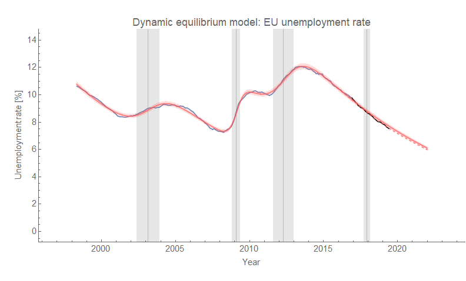

I thought I'd look in to the unemployment rate in France using [dynamic information equilibrium](https://papers.ssrn.com/sol3/papers.cfm?abstract_id=3094757) after seeing a tweet from [Manu Saadia](https://twitter.com/trekonomics/status/1203475935015534592?s=20). Originally, this appeared as a twitter thread, but I've expanded it into a blog post. Manu tells the story ...

> _The main economic problem of France is endemic, mass unemployment. It has been going on since I was born, in the early 70s. Left and Right governments have come and gone, reformed this and reformed that but mass unemployment has remained._

And that story is pretty much what the data says:

We have a series of non-equilibrium shocks that could easily be considered one long continuous shock from the late 60s until the 80s. Politically, this was under French Presidents de Gaulle, Pompidou, and Giscard — coming to an end under Mitterand. This set the stage for the persistently high unemployment rate.

The unemployment rate does not come down as fast as in France as it does in the US — the dynamic equilibrium is about _d/dt_ log _U_ \= −0.05/y in France versus −0.08/y in the US, −0.09/y in Japan, or −0.07/y in Australia. A 10% unemployment rate will come down nearly a full percentage point in the US or Japan in a year on average in equilibrium, but only half a point in France. 

France also experienced the double dip that the entire EU experienced in the global financial crisis. Without that double-dip, unemployment in France would be closer to 5% today (assuming the dynamic equilibrium model is correct, of course). Adding a shock in 2000 in France didn't improve the metrics much. It's likely a genuine shock (like in the broader EU), but it seems a borderline case in the data.

Well, that double dip was not exactly experienced by the **_entire_** EU ...

Germany doesn't really experience the global financial crisis except as a bit of "overshooting" in a recession that starts in the early 2000s and additionally has no subsequent 2012 recession.

Germany turns out to be a counterexample to claims about that −0.05/y is representative of a structural problem unique to France made by [Lars Christensen](https://twitter.com/MaMoMVPY/status/1203553552343404544?s=20):

> _And there you have the answer: THERE is a major STRUCTURAL problem in France - otherwise wages would adjust faster to shocks. This combined with the lack of a proper monetary policy is the cause of France's unemployment problem._

Germany has a similarly [low 'matching' dynamic equilibrium rate](https://informationtransfereconomics.blogspot.com/2018/10/unemployment-continues-to-decline-why.html) on the order of −0.05/y. France is actually a bit better at  −0.054/y compared to Germany at −0.049/y however we should be careful of reading too much into what is likely unrealistic precision. And Spain's matching rate appears to be closer to −0.12/y making it the "best" managed country of the three on this metric.

The main policy failure — if there is one — is to be found in the shocks (or single big shock) to the French economy in the 70s that raised unemployment to the higher level. This is similar to the "path dependence" in the unemployment rate for black people in the US compared to white. The shocks and matching rate/dynamic equilibrium are almost identical — [it's just that the black unemployment rate was at a higher level sometime before the 1970s](https://informationtransfereconomics.blogspot.com/2017/07/racial-disparities-in-unemployment-rate.html) (Jim Crow & general racism) and so experiencing the same shocks to the same economy remained higher ever since.

Germany experienced a lesser version of those shocks to unemployment in the 60s and 70s as well as that lack of a second shock in 2012 in the global financial crisis putting it in a slightly better position today. 

It's a possibility that Christensen may be right about France's lack of an independent monetary policy with Eurozone policy set just right for Germany but too tight for France leading to a "double dip" and 2.5 percentage points higher unemployment. But like with Spain having the best labor market when judging by the dynamic equilibrium, it becomes pretty weird pretty quickly to make this "double dip" story work.

In addition to Germany, monetary policy must have been just right for Estonia, Greece, and Ireland by this "lack of a double dip" metric. In addition to France, monetary policy was also too tight for the Netherlands, Spain, Italy, Portugal, Finland, Slovenia, Luxembourg, and Austria. Again, that's if we use this "double dip" metric. Turkey and Australia also experience a negative shock at the same time despite not being on the Euro.

A more likely explanation is much simpler — a huge surge in the price for oil in 2011 (in part due to the Arab Spring uprisings):

In fact, the oil shocks of the 70s are blamed for the economic malaise in France and the end of the _[Trente glorieuses](https://en.wikipedia.org/wiki/Trente_Glorieuses)_. Not every country has the same exposure to commodities prices — for example, unemployment in the US continued on its downward path unabated.

A country's unemployment history could also be caused by the oldest factor on record — just a bit of bad luck. For example, the US could have been in a similar state [in at least one of these Monte Carlo unemployment rate histories](https://informationtransfereconomics.blogspot.com/2017/02/randomly-generated-economies-work-in.html):

