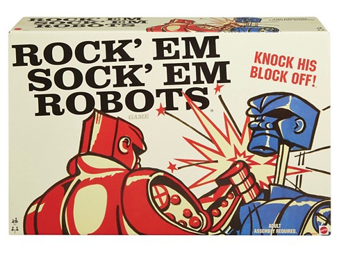
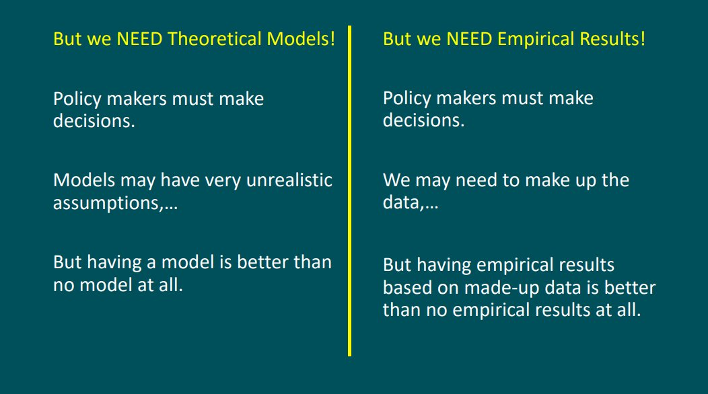

I came across this old gem on Twitter ([here](https://twitter.com/Noahpinion/status/1212459702388289536?s=20)), and Jo Michell sums it up pretty well in the thread:

> _It takes a model to beat a model has to be one of the stupider things, in a pretty crowded field, to come out of economics. ... I don’t get it. If a model is demonstrably wrong, that should surely be sufficient for rejection. I’m thinking of bridge engineers: ‘look I know they keep falling down but I’m gonna keep building em like this until you come up with a better way, OK?’_

There are so many failure modes of the maxim "it takes a model to beat a model":

**Formally rejecting a model with data.** Enough said.

**Premature declaration of "a model".** It seems that various bits of math in econ are declared "models" before they have been shown to be empirically accurate more often than is optimal. Now empirical accuracy doesn't necessarily mean getting variables right within 2% (although [it can](https://informationtransfereconomics.blogspot.com/2019/10/wage-growth-in-ny-and-pa.html)) — it can mean 10% or even just getting the qualitative form of the data correct. I have two extended discussions on the failure to do this [here](https://informationtransfereconomics.blogspot.com/2018/07/dsge-battle-royale-christiano-v-stiglitz.html) (DSGE) and [here](https://informationtransfereconomics.blogspot.com/2017/02/qualitative-economics-done-right-part-2.html) (Keen). The failure mode here is that something (e.g. DSGE) is declared a model using a lower bar than is applied to, say, cursory inspection of data or linear fits.

**Rejecting a model as useless even without formal rejection.** I wrote about this more extensively [here](https://informationtransfereconomics.blogspot.com/2016/07/ceteris-paribus-and-method-of-nascent.html), but the basic idea is that a model a) can be way too complex for the data it's trying to explain (this inherently makes a model hard to reject because you need as a good heuristic ~ 20 or so data points per parameter to make a definitive call so you can always add parameters and say "we'll wait for more data"), or b) can give the same results as another model that is entirely different (either use Occam's razor, or just give one of these  ¯\\\_(ツ)\_/¯ to **_both_** models). The latter case can be seen as _a tie goes to no one_. Essentially — heuristic rejection.

**Rejecting a model with functional fits.** Another one I've written more extensively about [elsewhere](https://informationtransfereconomics.blogspot.com/2017/01/curve-fitting-and-relevant-complexity.html), but if you have a complicated model that has more parameters than a functional fit that more accurately represents the data, you can likely reject that more complicated model. One of the great uses of functional fits is to reduce the relevant complexity (relevant dimension) of your data set. Without any foreknowledge, the dimension _d_ of a data set is on the order of the number _n_ of data points (_d_ ~ _n_) — worst case is that you describe every data point with a parameter. However, if you can fit that data (within some error) to a function with _k_ parameters with _k_ < _d_, then any model that describes the same data set with _p_ parameters (within the same error) where _k_ < _p_ < _d_, then you can (informally) reject that model as likely too complex. That functional fit doesn't even have to come from anywhere! (Note, this is effectively how Quantum Mechanics got its first leg up from Planck — lots of people were fitting the blackbody spectrum with fewer and fewer parameters until Planck gave us his one-parameter fit with Planck's constant.)

**Failing to accept a model as rejected.** One of the most maddening ways the "it takes a model to beat a model" maxim is deployed is by people who just don't accept that a model has been rejected or that another model outperforms it. This is more a failure mode of "enlightenment rationality" which assumes good faith argument from knowledgeable participants \[1\].

I make no particular argument that these represent an [orthogonal](https://en.wikipedia.org/wiki/Orthogonality) [spanning set](https://en.wikipedia.org/wiki/Linear_span) (in fact, the 4th has non-zero projection along the 3rd). However, it's pretty clear that the maxim is generally false. In fact, it's pretty much the converse \[2\] of a true statement — if you have a better model, then you can reject a model — and as we all learned in logic the converse is not always true.

...

**Update 14 January 2020**

Somewhat related, there is also the idea that "there's always a least bad model" — to use Michell's analogy, there's always a least bad bridge. But there isn't. Sometimes there's just a shallow bit to ford.

Paul Pfleiderer takes on the compulsion to have something that gets called a "model" in his presentation [here](https://www.gsb.stanford.edu/faculty-research/working-papers/chameleons-misuse-theoretical-models-finance-economics):

Making a model that isn't empirically accurate using unrealistic assumptions to make a theoretical argument is basically the same thing as making up data to make an empirical one.

My impression is that this compulsion is deeply related to "[male answer syndrome](https://en.wiktionary.org/wiki/male_answer_syndrome)" in the male-dominated field of economics.

...

**Footnotes:**

\[1\] Note that this is not necessarily a failure mode of science, which is a social process, but rather the application of that macro-scale social process to individual agents. Science does not require any agent to change their mind, only that on average at the aggregate level more accurate descriptions of reality survive over less accurate ones (e.g. Planck's maxim — people holding onto older ideas die and a younger generation grows up accepting the new ideas). The "enlightenment rationality" interpretation of this is that individuals change their minds when confronted with rational argument and evidence, but there is little evidence this occurs in practice (sure, it sometimes does).

\[2\] In logical if-then form "it takes a model to beat a model" is _if you reject a model, then you have a better model_.
