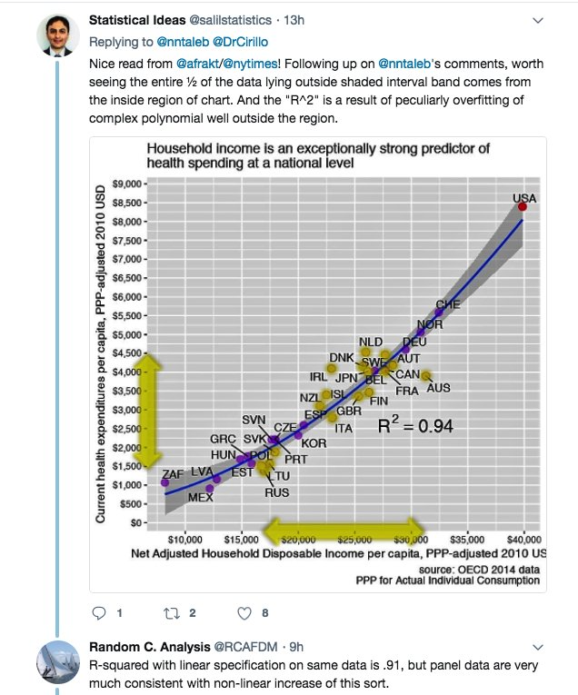
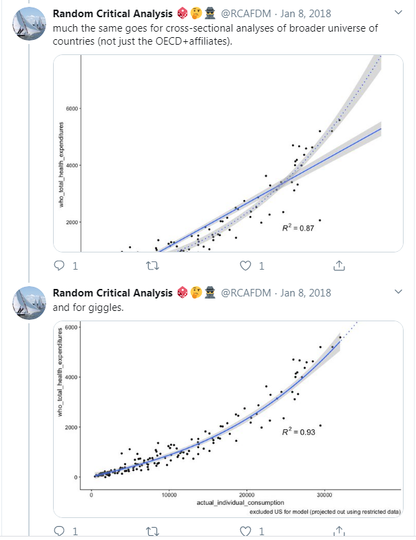

So I have [this to look forward to](https://twitter.com/RCAFDM/status/1231303125434294277?s=20):

> _I'll be addressing the sole constructive, objective argument you made in that blog post within the next few days.  I'll try to be respectful and fair, even though you seem to be unable or unwilling to reciprocate._

That's regarding [my previous post](https://informationtransfereconomics.blogspot.com/2020/02/leaning-over-backwards-health-care.html). There were quite a lot of right wing, conservative, and libertarian Twitter accounts (amazingly, groups that don't like government health care) who seemed to think that I was being a jerk, disrespectful, or making _ad hominem_ arguments — and that somehow reflected on what I was saying. I pause to note that saying I'm being a jerk and using that to somehow dismiss what I was saying is itself _argumentum ad hominem_. That aside, no one is owed someone else's respect. 

I was pointing out that we should not assume RCA is competent — hard to imagine that ever coming across as respectful to RCA! And it's true that is _ad hominem_! But expertise in stats as well as using software to run regressions was very much at issue. He is making arguments (and mistakes!) that are unsupportable for reasons that have to do with the details of how regressions work.

There are also additional reasons to believe RCA is entirely biased (he called me a [socialist](https://twitter.com/RCAFDM/status/1231065867338878976?s=20), lol), and his first response was that I was attacking his analysis [because he disagreed with my politics](https://twitter.com/RCAFDM/status/1230998733325729793?s=20). Overall, since he didn't disclose who he is or his politics — and that we can gather from his statements that his politics agree with the finding that health care spending in the US is perfectly normal — he really needs to do a lot more "leaning over backwards" **_because_** of that bias and failure to disclose.

I'm sorry to say models and statistics can be manipulated in multiple ways. And people have a way of finding out how to present results that agree with their preconceived ideas. People have a tendency to believe that regressions don't lie, but just like photographs and film editing there are lots of things you can do to present something that is not completely honest (even if it's superficially correct) — and that's especially effective on people who aren't well versed in stats (just like people who don't work with Photoshop aren't as good at spotting alterations in pictures).

If we find some paper out there touting the benefits of free market economics from the [Cato Institute](https://en.wikipedia.org/wiki/Cato_Institute) or [Mercatus Center](https://en.wikipedia.org/wiki/Mercatus_Center), we all have reason to be suspect. I'm not saying it's something they can't overcome — I've actually cited a Mercatus fellow in my book. But it requires some extra leaning over backward (e.g. a Mercatus fellow writing in their paper "I know you're reading this and thinking _of course someone at Mercatus found this_, _but ..._" and going on to explain). We don't even know who RCA is which obscures our ability to do this kind of due diligence.

With that out of the way, what did he think the "sole constructive, objective argument" was?

[A tweet](https://twitter.com/RCAFDM/status/1231190745815638018?s=20):

> _The presumably substantive part of his argument is little more than a quibble over choice of model.  Even if he were objectively correct in this, which he isn’t, it leaves the vast majority of my arguments intact.  He just makes himself look like an asshole._

[Another tweet](https://twitter.com/RCAFDM/status/1231298128235704322?s=20):

> _Someone preferring a different model than you is not a priori evidence of bad faith.  You're coming into this w/ the presumption that you know the one true way to do this, ignoring that this approach is quite common, and without having the perspective of the rest of the evidence._

Apparently, he's a double space after a period person. Ugh. Unfortunately, this is incorrect in multiple ways.

First, I was to write a basic math book but started it off with a whole table of incorrect addition facts, like 2 + 2 = 5, you have no reason to continue. This doesn't leave the rest of the book "intact". There is just no reason to continue past the first point because it's fundamentally flawed, and the rest can be presumed to be as flawed.

Second, while "this approach is quite common", it is **_not_** used to extrapolate a nonlinear coefficient that far outside the range of the data (see the [2/22 update, part II of my blog post](https://informationtransfereconomics.blogspot.com/2020/02/leaning-over-backwards-health-care.html) for more details). The difference of logs ceases to be a percentage for more than ~ 10% differences, and while you might extrapolate an elasticity in economics you don't do it for a factor of 2 difference from the data you used to estimate it.

Third, I do not think the linear model is a better model and never said that \[1\] — I said it was _indistinguishable_ from the nonlinear one he uses over the non-US data and results in a different conclusion in terms of the US being an outlier. If I have two models that are equally valid and one implies one conclusion and one implies another, it's really a toss-up. You don't draw **_either conclusion_**. At least if  you're being scientific. Leaning over backwards requires you support both conclusions or neither.

It's selecting one or the other without saying both are equally good that's evidence of bad faith. The reason RCA claims the nonlinear fit is better is because it makes it such that the US not an outlier — _which is the conclusion he is trying to find_. That is to say he has to assume the US is not an outlier in order to select his nonlinear specification. I think this point is lost on a lot of people rising to RCA's defense \[2\].

But I discovered something else about why he chose the nonlinear model that goes to RCA's incompetence here. He appears to have selected that nonlinear model because of the better _R²_ relative to the _R²_ of the linear model. This is hilariously wrong. [RCA was apparently complaining](https://twitter.com/RCAFDM/status/950728292851646464?s=20) about being blocked by a statistics professor who complained about the exact same thing I am complaining about \[3\]:

[These](https://twitter.com/RCAFDM/status/950592629636521985?s=20)

_R²_ is not really a valid metric for nonlinear models aside from polynomials. [This is a great simple explanation](https://statisticsbyjim.com/regression/r-squared-invalid-nonlinear-regression/) from [a statistics consultant and author](https://statisticsbyjim.com/jim_frost/). I'm not sure if RCA is using a polynomial here or a nonlinear model (such as a log regression as in graph under discussion [in my previous post](https://informationtransfereconomics.blogspot.com/2020/02/leaning-over-backwards-health-care.html)). He's used polynomials in the past, and _R²_ makes sense for those. But the thing is that _R²_ is a monotonically increasing function of the number of variables, so comparing a linear model and a second order polynomial, the latter will always win. That's what the stats professor ("Statistical Ideas") is saying — it's understandable why he'd block someone who obviously doesn't understand what he's talking about.

But here RCA is also _comparing R²_ for a linear and either a nonlinear model or a polynomial model which is either meaningless because a) linear and 2+ order polynomial are not commensurate, or b) a nonlinear model _R²_ is not valid.

I'm not optimistic about RCA actually responding to my criticisms. I imagine he'll do something like the graphs above — comparing a nonlinear _R²_ to a linear one — which will just demonstrate his incompetence further. Such is the problem with the [Dunning-Kruger effect](https://en.wikipedia.org/wiki/Dunning%E2%80%93Kruger_effect).

...

**Update 29 February 2020**

Here's an illustration of the fact that _R²_ increases monotonically with additional orders in a polynomial fit alongside another thing I've mentioned in passing that I'll discuss first — RCA's measure of AIC he uses for the x-axis _includes health care_. That is to say he is graphing _y_ versus _x_ \= _y_ \+ _z_. If you do that with random data, you can easily get what looks like a linear correlation:

This is why Lyman Stone's and Karl Smith's belief (discussed in \[2\] below) that any proportional relationship validates the claims is completely wrong. It can arise purely because health care is a component of AIC.

And if we fit progressively higher order polynomials to this data, we get the (well known) result that R² increases monotonically with the order of the polynomial:

...

**Footnotes:**

\[1\] I did say it was better in terms of absolute error, but that's just a single metric. Otherwise I said "Over the non-US data, the linear fit (brownish dashed line) is **basically as good as** the nonlinear fit ... And over the entire range, the nonlinear fit **falls inside the 90% confidence limits** of the linear model" (emphasis added)

\[2\] Another weird defense was that finding _any_ proportional relationship, linear or not, proves that health care expenses rise with income. The thing is the data set includes a lot of developing countries. I could see health care expenses rising with income for Mexico or Latvia.

And if that was the case, why stand up for RCA's specific proportional relationship — not one person who made the claim that any proportional relationship proved the point also said that RCA's analysis was garbage. It was more of  a rhetorical tack than a logical one. We're Karl Smith and Lyman Stone agreeing that RCA's analysis was garbage?

"So what if this analysis is garbage, anyone who says it's proportional proves the underlying point of the garbage analysis!" 

If I had a study that said that minimum wages reduced employment and you came along with a critique that said my analysis made major errors and should have resulted in a much smaller effect if the math was right, I don't get to come back and say "See, there's still an effect!"

\[3\] RCA has a habit of [basically ignoring other people's expertise](https://twitter.com/infotranecon/status/1231060086434385920?s=20) when it disagrees with him.
