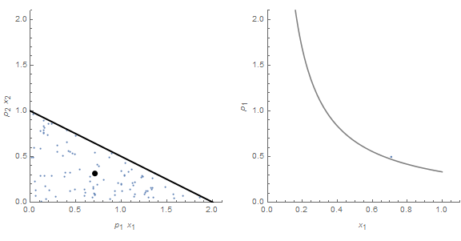

A common objection to the information equilibrium approach I've run into over the years is that economics at the micro level is about incentives or at the macro level how people react to policy changes in the economy. My snarky response to exactly that objection earlier today on Twitter [was this](https://twitter.com/infotranecon/status/1226564420072964096?s=20):

> _The approach can be thought of as assuming people are too (algorithmically) complex for us to know how they respond to incentives, as opposed to \[the\] typical \[economics\] approach where you not only assume you know how individuals think but write down simplistic equations for it._

Let me expand on what this means in a (slightly) less snarky way. We'll set up a simple scenario where people are given 7 choices (the "opportunity set") and must select one.

**The typical approach in economics**

In economics, one would set up a utility function _u(x)_ that represents your best guess at what a typical person thinks — how much "utility" (worth or value) they derive from each option. Let's say it looks like this:

You've thought about what people think (maybe using your own experience or various thought experiments) and you assign a value _u(x)_ for each choice _x_. While I've made the above function overly simplistic, it's still assigning a value to each choice.

You would then set up an optimization problem over the choices, derive the first order conditions (which are basically the derivatives in the various dimensions you are considering), and find the maximum (i.e. the location of the zero of the derivatives, or a point on the boundary of your opportunity set).

That's the utility maximizing point and you find out your (often sole "representative") agent selects choice 5. Often, 100% of agents in your model (or 100% of a single representative agent) will select that choice. Everyone is the same. Sometimes you can have heterogeneous agents, and while each _type_ of agent will make different selections each agent _of each type_ will make the same selection.

Of course we can allow error, and there are [random utility discrete choice models](https://scholar.harvard.edu/files/tomasz/files/lisbon32-post.pdf) \[pdf\] that effectively allow random choices among the various utility options such that in the end we have e.g. most people choosing 5 with a few 4's or 6's (for 1000 agents):

But basically the approach assumes that when confronted with a choice you are able to construct a really good model — a _u(x)_ — of how a person will respond.

This of course sets up a problem called "[Lucas critique](https://en.wikipedia.org/wiki/Lucas_critique)": if you make changes to policy to try and exploit something you learned this way, people can adapt to make your original model — your original utility function — moot. For example, if you make option 5 illegal, the model as is says people will start choosing 4 or 6 in roughly equal numbers. But maybe agents will adapt and choose 2 instead?

The response to the Lucas critique is generally to get ever deeper inside people's heads — to understand not just their utility functions but how their utility functions will change in response to policy, to get at the so-called deep parameters also known as [microfoundations](https://en.wikipedia.org/wiki/Microfoundations).

**The approach in information equilibrium**

In the information equilibrium approach, when asked what a person will choose out of 7 options, you furrow your brow, look up to sky, and then give one of these:

‾\\\_(ツ)\_/‾

One agent will choose option 4 (with ex post probability 1):

Why? We don't know. Maybe they had medical bills between the choices. Maybe that first agent really loves Bernie Sanders and Bernie said to choose option 4. Again:

‾\\\_(ツ)\_/‾

If we have millions of people in an economy (here, only 1000), then you're going to get a distribution over the choices. And if you have no prior information about that choice (i.e. ‾\\\_(ツ)\_/‾), then you're going to get a uniform distribution (with probability ~ 1/7 for 7 choices — about 14%):

In this case, economics becomes more about the space of choices, the opportunity set — not about what individual people are thinking about. And that size of the opportunity set can be measured with information theory, hence information equilibrium (where we equate different spaces of choices). It turns out there is a direct formal mathematical relationship to the utility approach above, except instead of utility being about what individuals value it's about the size of that space of options.

In the information equilibrium approach, we depend on two assumptions that set up the basis of equilibrium:

1.  The distribution (and it doesn't have to be uniform) is stable except for a sparse subset of times.
2.  Agents fully map (i.e. select) the available choices (again, except for a sparse subset of times).

The "sparse subset" is just the statement that we aren't in disequilibrium all the time. If we are, we never see the macroeconomic state associated with that uniform distribution and we can't get measurements about it. We have to see the uniform distribution for long enough to identify it. Agents also have to select the available choices, otherwise we'll miss information about the size of the opportunity set.

But information equilibrium also allows for non-equilibrium. Since we aren't making assumptions about how they think, people could suddenly all make the same choice, or be forced into the same choice. These "sparse non-equilibrium information events", or more simply "economic shocks" cause observables to deviate from their equilibrium values. The [dynamic information equilibrium model](https://papers.ssrn.com/sol3/papers.cfm?abstract_id=3094757) (DIEM) makes some assumptions about what these sparse shocks look like (e.g. the have a finite duration and amplitude), and it gives us a pretty good model of the unemployment rate \[1\]:

Those 7 choices above are translated into this toy model as jobs in various sectors (with one "sector" being unemployment).

This approach also gives us supply and demand (this is the connection to Gary Becker's 1962 paper _[Irrational Behavior in Economic Theory](http://newconsensus.org/MarxInAmerica/wp-content/uploads/2013/10/G-Becker-Irrational-Behavior-and-Economic-Theory.pdf)_ \[pdf\], see also [here](http://bactra.org/weblog/1155.html)). We don't have 7 discrete choices here, but rather a 2-dimensional continuum between two different goods (say, blueberries and raspberries) bounded by a budget constraint (black line). The average is given by the black dot. As the price of one good goes up, on average people consume less of it.

And again, people might "bunch up" (i.e. make similar choices and not fully map the opportunity set) in that opportunity set and that gives us non-equilibrium cases where supply and demand fails:

In both of these "failures" of equilibrium (recessions, bunching up in the opportunity set), I am under the impression that sociology and psychology will be more important drivers than what we traditionally think of as economics \[2\].

But what about that "algorithmically" in parentheses in my original tweet? That's a reference to [algorithmic complexity](https://en.wikipedia.org/wiki/Algorithmic_information_theory). The agents in the utility approach are not very algorithmically complex — they choose 5 either all the time or at least almost all the time:

{5, 5, 5, 5, 5, 5, 5, 4, 6, 5, 5, 5, 5, 5, 5, 5, 5, 5, 5, 5}

This could be approximated by a computer program that outputs 5 all the time. The agents in the information equilibrium approach are **_far_** more complex:

{4, 7, 3, 4, 1, 6, 6, 5, 4, 2, 3, 1, 1, 3, 6, 3, 4, 2, 2, 6}

As you make this string of numbers longer and longer, the only way a computer program can reproduce it is to effectively incorporate the string of numbers itself. That's the peak of algorithmic complexity — [algorithmic randomness](https://en.wikipedia.org/wiki/Algorithmic_information_theory#Precise_definitions). That's what I mean when I say I treat humans as so complex they're random. No computer program could capture a set of choices a real human made except a list of all those choices.

In a sense, you can think of the two approaches, utility and information equilibrium, as starting from two limits of human complexity — so simple you can capture what they think with a function versus so complex that you can't do it at all. I imagine the truth is somewhere in between, but given the empirical failure of macroeconomics (I call getting beaten by an AR process a failure) it's probably closer to the complex side than the simple side.

And that approach turns economics on its head — instead of being about figuring out what choices people will make, it's about measuring the set of choices made by people.

**Footnotes:**

\[1\] That's been pretty accurate at forecasting the unemployment rate [for three years now](https://informationtransfereconomics.blogspot.com/2017/01/dynamic-equilibrium-unemployment-rate.html) (click to enlarge, black is post-forecast data):

\[2\] In fact, [I wrote a book](https://www.amazon.com/dp/B07T8T9G93) about how the post-war evolution of the US economy seems to be more about social changes than monetary and fiscal policy. Maybe it's not correct, but it at least gives some perspective of how different macroeconomic analysis can be from the way it is conducted today.
