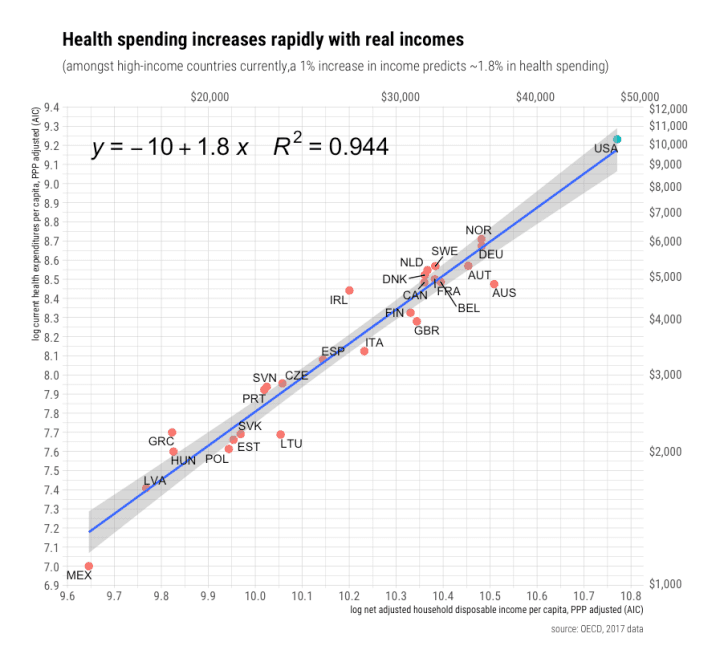
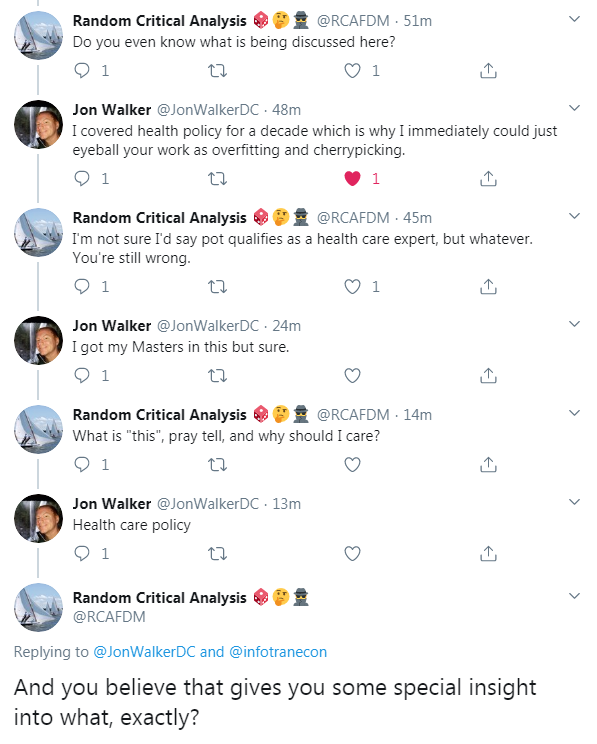

> _It’s a kind of scientific integrity, a principle of scientific thought that corresponds to a kind of utter honesty—a kind of leaning over backwards.  For example, if you’re doing an experiment, you should report everything that you think might make it invalid—not only what you think is right about it: other causes that could possibly explain your results; and things you thought of that you’ve eliminated by some other experiment, and how they worked—to make sure the other fellow can tell they have been eliminated._ 

> _—[Feynman](http://calteches.library.caltech.edu/51/2/CargoCult.htm)_

I need to start off with what should become an obligatory statement noting that while Feynman was pretty good about describing what it means to participate in the process of science, he was also a sexist jerk and a prime example of toxic masculinity.

Anyway, I can't remember how I came across it a year ago (I think via Steve Roth), but the anonymous "random critical analysis" \[RCA\] is [back in the econoblogosphere](https://randomcriticalanalysis.com/why-conventional-wisdom-on-health-care-is-wrong-a-primer/) (it's still around, I swear!) — this time amplified by Alex Tabarrok at Marginal Revolution (not going to link). He's still peddling his wares. He claims:

> _Health spending is overwhelmingly determined by the average real income enjoyed by nations’ **residents** in the long run._

Emphasis in the original. I think it's a good example of how relying on an internet rando \[0\] to do quantitative analysis on major policy issues can lead us astray. It's also a good case study in how to identify the sometimes subtle choices that end up ensuring the conclusions as well as the sometimes even subtler hints that people are overselling their competence.

I have no idea why he emphasized "residents" because the rest of the sentence isn't exactly that precise. You could dig into the PPP adjusted AIC _et cetera_, but I'd first like to focus on the "determined". The next graph in the extended blog post is a log-linear regression that actually has no causal interpretation — health care spending is "determining" income as much as income is "determining" health care spending:

Just because you chose the _x_\-axis to be income and the _y_\-axis to be health care spending and performed a regression does not mean you've found a causal relationship that "determines" things. Certainly, there is likely some relationship! Per capita income of a country seems like a plausible variable in a model of health care expenses. In fact, it's what you'd expect if health care was becoming more and more unaffordable as costs outstrip the ability to pay for them (a mechanism that seems to be at play for housing prices in the US). RCA's big innovation is saying that instead of this being a problem, this is what people want.

RCA makes a big point about using log-log graphs in the opening paragraphs, but one of the problems here is that he shows **_only_** the log-log version of this graph because — as we'll see below — the linear version looks pretty silly. We'll also see that lines on log-log graphs help conceal the choice (and it is a deliberate choice) of a nonlinear function. However, there's also this: 

> _In case you’re not already aware, these slopes \[on log-log plots\] can be readily interpreted in percentage terms. ... For example, the slope in the health expenditure-income plot below implies that a 1% increase in underlying value on the x-axis (income) predicts a 1.8% increase in value on the y-axis (health spending)._

In reading this, I'm pretty sure that RCA doesn't actually understand that the 1.8 in that slope of the log-log graph means the growth rate of health spending is 1.8 **_times_** the growth rate in income. Sure, if incomes rise 1%, then health care will rise 1.8%. But if incomes rise 5%, then health care will rise 9%. Taking the difference in logs, you can substitute a (small) percentage in for _x_ and get a percentage out as _y_, but you can't interpret the slope as a percentage unless that percentage is 180%. It's subtle, but it's the kind of thing you look for when teaching students because it helps you see if they understand the material or are just mechanically reproducing results.

I mean, in case you're not already aware \[1\] ...

Ok, next I have a bit of a nit — but it's kind of a theme of general sloppiness with RCA \[2\]. At that footnote we can learn a bit about orthogonal polynomials, but here we can learn a bit about significant figures. I was able to reproduce the graph above, but the equation in the annotation (like in the case in footnote \[2\]) gives an entirely different result (click to enlarge):

Blue is RCA's curve, gray dashed lines are my nonlinear model lines (either fit myself, or as above, using the equation RCA wrote down or rounding), and red is the data except for the US which is in green matching the original graph.

RCA rounded the two coefficients accurately (albeit to different orders), but it's really obvious we're on logarithmic axes when rounding from 9.88 to 10 moves you entirely off the data. RCA makes the claim that the fit is robust to leaving out the US, and if you look at the equations (especially if rounded by RCA's method) they are pretty close:

_y = − 9.88 + 1.77 x_          with the US

_y = − 9.68 + 1.75 x_          without the US

And that new equation (dashed gray) even looks pretty close on that log plot:

As an aside, this also tells us that RCA decided to do his analysis of the US not being an outlier in healthcare spending by _including the US in the fits_. That's just not how that works. Anyway, transforming back to linear space, we've gone down by 10% at US levels of income:

At 17% of GDP these days, a 10% reduction in health care spending in the US (~ 2% of GDP) would be a significant improvement! However, the US still isn't an outlier in this view — only about as much as Ireland. That's because this view is still effectively "a quadratic fit for no reason" that RCA was on about a year ago. If

_y = a x²_ 

then

log(_y_) = log(_a_) + _2_ log(_x_)

The fits above show ~ 1.8 instead of 2 so we have _x_^1.8 instead of _x_^2, but we're still fitting a nonlinear function to the data. Why? As far as I can tell the only reason is that **_it tells the story the author wants_**.

This is where we get back to Feynman. Leaning over backwards with honesty would force us to ask why we should throw out a simple linear fit. It's not accuracy over range of the data — unless we're already assuming the US is not an outlier and including it in the fits.

Over the non-US data, the linear fit (brownish dashed line) is basically as good as the nonlinear fit — the brown dashed curve and the gray dashed curve fall on top of each other until we get out to the US. And over the entire range, the nonlinear fit falls inside the 90% confidence limits of the linear model \[3\]. In fact, the linear model is actually much better than the nonlinear model in terms of absolute error \[4\]:

RCA's nonlinear model (fit correctly) actually predicts US health care spending will be somewhere between $7000 per capita and $13000 (90% CL) — and $8000, solidly within one sigma, is right in line with the linear model. That means that unless we include the US we do not have **_any_** reason to select the nonlinear model here. Or another way — assuming the US is not an outlier, US is not an outlier.

You may ask why I haven't gone in depth on the rest of the avalanche of graphs that follow. Unlike a novel where an unreliable narrator can be interesting, in science it's anathema. You have to go for more than just the superficial honesty of not deliberately lying, but rather leaning over backwards to show that your biases aren't driving the conclusions. In short, this is an example of [cargo cult science](http://calteches.library.caltech.edu/51/2/CargoCult.htm) — and it tells us more about the person doing it than it does about the world.

But screw it. Let's forget about science. Let's listen to an internet rando. Let's say RCA's claim is true that the US is not an outlier — and that **_globally_** health care spending rises **_twice_** as fast as income. We've apparently traded a US-specific problem for an enormous global problem where health care rises faster than income and becomes more and more unaffordable for everyone on Earth. The US's medical bankruptcies are just the canaries in the coal mines of a growing global problem \[5\]. His laser focus on showing the US is not an outlier at all costs makes him miss the forest for the trees — I'm sure RCA didn't want to imply that global health care spending is on an unsustainable path. He seems to think spending more and more money on health care (despite "diminishing returns" \[6\]) is the epitome of civilization:

> _The typical American household is much better fed today than in prior generations despite spending a much smaller share of their income on groceries and working fewer hours.  I submit this is primarily a direct result of productivity.  We can produce food so much more efficiently that we don’t need to prioritize it as we once did.  The food productivity dividend, as it were, has been and is being spent on higher-order wants and needs like cutting edge healthcare, higher amenity education, and leisure activities._

**Update + 5 hours**

In case you might think I'm being unnecessarily harsh on RCA, please note a) that isn't the first time I've encountered him and b) this from the "discussion" of this blog post this evening (click to enlarge):

**Update 2/22/2020**

I am wondering if this might be a clearer demonstration of what I'm getting at here. I fit another nonlinear function to RCA's data (leaving the US out because we want to see if it's an outlier). It's a logistic function. Using this function here has some basis in economic theory — e.g. [satiation points](https://en.wikipedia.org/wiki/Economic_satiation). At some point consuming health care is more of a hassle than a benefit, right? Only so many angioplasties you can have in a year. Well, at least that's a plausible model. If we drop RCA's data in, we get the brown-ish curve below:

This says the US (green dot) is overspending by about double at a point where it should be reaching satiation. I could write up a whole long blog about this, and since it matches RCA's curve (blue) for every country except the US most of the rest of his analysis would go through. The other countries in the world are on the growing part of the curve — it'd just change the conclusions about the US.

But I can't do this. At least, not in good faith — and definitely not leaning over backwards. I actually believe this picture is almost certainly more accurate. My uncertainty in the saturation level is about where the single prediction bands put it. However, I would be a charlatan if I tried to push this fit to the data and let it be used by others in policy discussions.

Sure, I might put up a blog post and say, _hmm, interesting — let's see how the data looks in the future!_

But I can't draw a conclusion — _US health care spending is an outlier_ — like how RCA has done with his. That's what I mean by the plot being in bad faith.

...

**Update 2/22/2020 part II**

These graphs were made somewhat tongue-in-cheek, but they illustrate a bit of the problem with extrapolating the nonlinear fits as far out as the US — where does it stop? At what point do we stop saying that because a point falls in the gray band, we have to conclude it's not an outlier? (Click to enlarge)

A good summary of my argument is that we can't go as far as that green dot representing the US and claim we're leaning over backwards in being honest.

Additionally, the slope determined in the nonlinear fit are akin to elasticities in economics — the change in e.g. price vs quantity in elasticities of supply and demand (one of [the earliest things I looked at](https://informationtransfereconomics.blogspot.com/2013/04/the-previous-post-with-more-words-and.html) with information equilibrium on this blog). I'd say it's a stretch to actually say slopes in this example are estimates of elasticities (we have aggregate macro data here, not micro data), but lets go with it. The thing is that 1) they are elasticities only where the difference in logs is approximately a percentage, and 2) estimating elasticities and applying that human behavioral result well beyond the data you measured is not scientifically supportable.

Let's look at _x_ compared to a reference value of _x₀_ = 5. The blue line below is 100 × (log _x_ − log _x₀_) aka difference of logs, while the yellow line is 100  × (_x − x₀_)/_x₀_ aka the percent difference. We can see how this approximation breaks down as you move away from a region:

Note that the US is about twice as far out on the graph as the highest point in the data — so in terms of the slope on the log graph representing an elasticity, we're well out of scope of the approximation.

And even if the approximation was still in scope, extrapolating the **_behavioral_** meaning of that elasticity all the way to twice the highest point in the data is even more problematic.

In a more down to earth example, we know that gas prices do not heavily impact consumption in the short run when they fluctuate at the 10-30% level. RCA's analysis is like extrapolating that finding to increases of 100% — if gas prices doubled, consumption would remain constant. That's iffy on its own. However, he takes it a bit further — if some data then showed the US didn't reduce its consumption when gas prices doubled (i.e. it was in line with that extrapolation), RCA's analysis would be claiming that gas consumption is actually [perfectly inelastic](https://en.wikipedia.org/wiki/Elasticity_\(economics\)) (people everywhere don't care about the price of gas at all) instead of possible structural reasons the US didn't reduce supply (e.g. the US built roads and housing that locked in commuting and therefore gas consumption). The former is basically a conclusion derived from a single data point — like RCA's claim the US isn't an outlier.

...

**Update 2/22/2020 part III**

Per commenter rob below, here is that disallowed region (above the blue dashed line) and where RCA's curve intersects it:

I mean, if we're allowed to extrapolate to the green point, why can't we extrapolate all the way out to that intersection?

n.b. This is a [scope condition](https://informationtransfereconomics.blogspot.com/2015/10/we-built-this-theory-on-scope-conditions.html) (a limit of the region of validity of the model).

**Footnotes:**

\[0\] Sure, I'm also an internet rando ([a random physicist](http://www.arandomphysicist.com/) you could say), but I give my real name and you can peruse my grad school papers and thesis [here](http://inspirehep.net/author/profile/J.R.Smith.3) if you'd like. In the interest of leaning over backward, I can also say that I am quite biased towards the left of the political spectrum. However, I don't have really strong feelings about health care policy — I do think it should be free because of basic morality, but that doesn't necessarily mean I think it should be a smaller component of GDP, but maybe a plausible future is one where most of us work in health care instead of retail (the transition appears to be [already happening](https://www.cnn.com/2019/07/23/business/mall-of-america-health-clinic/index.html)). Other people have much better thoughts on health care policy than I do. I wrote [a short book](https://www.amazon.com/dp/B07T8T9G93) on my views of the political economy of the US that doesn't even _mention_ health care except for the possible stimulus effect of the ACA, focusing instead on racism, sexism, and other social forces as drivers of the economy.

\[1\] "In case you're not already aware ..." is also the kind of language Trump uses when he just heard about something for the first time. \[Edit: added + 30 mins.\]

\[2\] [In that Twitter thread](https://twitter.com/infotranecon/status/973704532860399616) from a year ago, I found out the equation RCA printed on the graph did not give the line presented in that graph. RCA [said](https://twitter.com/RCAFDM/status/1108708051924586496?s=20) (a week later) it was about the plotting function label being unable to handle orthogonal polynomials:

> _I used a 3rd order polynomial with an orthogonal transformation -- poly() function in R.  The labeling package isn't smart enough to transform the coefficients.  No big deal._

Although this information did let me figure out what happened on RCA's graph, it's also the kind of word salad you get when a student is trying to confidently answer a question that they don't really understand. I imagine it took him that week to figure it out. Basically, RCA confused R's [poly()](https://www.rdocumentation.org/packages/stats/versions/3.6.2/topics/poly) coefficients with R's [polynomial()](https://www.rdocumentation.org/packages/polynom/versions/1.4-0/topics/polynomial) coefficients. I'll use Hermite polynomials (not 100% sure how R chooses the orthogonal set) to show the difference.

A normal ("raw") regression fits (to third order)

_p(x) = a x³ + b x² + c x + d_

with the fit returning _(a, b, c, d)_ while an orthogonal polynomial regression fits (using [Hermite polynomials](https://en.wikipedia.org/wiki/Hermite_polynomials) which is probably not what R is doing, but still illustrative)

_p(x) = a' (x³_ _− 3 x__) + b' (x² − 1) + c' x + d' · 1_

with the fit returning _(a', b', c', d')_. where _a = a'_, _b = b'_, and _c = c' − 3 a'_. and _d = d' − b'_. It's quite valuable to do the latter, because it can reduce the covariance at each order — for example, Hermite polynomials of different orders are designed to have a zero overlap integral so adding each order doesn't affect the previous orders like it would for adding monomial terms at each order (_x²_ looks a bit like _x_ near _x_ \= 1, while _x² − 1_ doesn't as much near x = 1). But RCA isn't really doing an analysis where he shows increasing or decreasing orders where this process is most valuable — fitting a linear function, then fitting a quadratic and comparing the size of the new coefficients to see if adding the quadratic was warranted. If he had done that (as well as properly testing for the US as an outlier), he would have found that adding a quadratic term was not warranted **_unless_** the US was added.

However, I'm pretty certain RCA did not understand what R was doing until I called him out — at which point he went back to the documentation and tried to figure it out ... but _**still**_ didn't understand it. If he had, he would have written something more like:

> _I used 3rd order orthogonal polynomials  -- poly() function in R.  I accidentally input the orthogonal poly coefficients in as raw poly coefficients.  No big deal._

It's true that it's a simple mistake, but it also sheds light on who RCA is. Note that the common plotting package [is in fact capable](https://stackoverflow.com/questions/11949331/adding-a-3rd-order-polynomial-and-its-equation-to-a-ggplot-in-r) of handling using poly() in the linear model  and printing the correct polynomial. But sure, it's that the package isn't smart enough, not that he made a mistake or didn't understand what he was doing.

\[3\] The error bands RCA is providing seem to be either less than one sigma or (more likely) are mean prediction bands (effectively where the new regression line will shift given a new data point) rather than single prediction bands (where an individual new data point might fall) which I tend give and what a typical person tends to think of when they see error bands.

\[4\] Wanted to keep the axes above consistent, but the single prediction error is pretty broad and can only be appreciated if you zoom out a bit. Click to enlarge.

\[5\] This may be true in a different way than RCA believes — rising US health care costs might be driving up health care costs around the world as we consume all the health care resources ([Twitter thread here](https://twitter.com/infotranecon/status/1230404911231168513?s=20)):

\[6\] To wit:

> _America’s mediocre health outcomes can be explained by rapidly diminishing returns to \[health care\] spending ..._

\[7\] I love this quote:

> _Conversely, when we look at indicators where America skews high, these are precisely the sorts of \[procedures\] high-income, high-spending countries like the United States do relatively more of._ 

You know, things rich people like to do! Like coronary artery bypasses, hip replacements, knee replacements, and coronary angioplasties. Those are a much more fun use of your disposable income than a trip to Spain!
