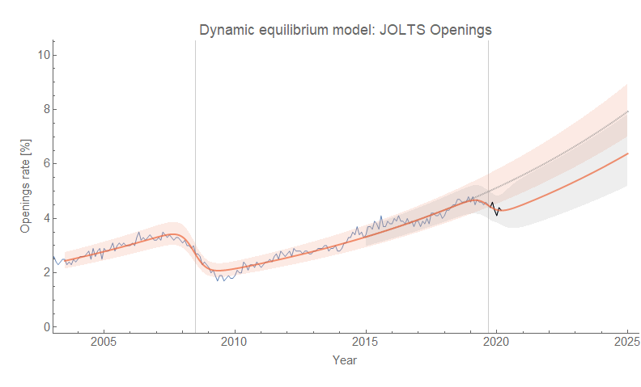
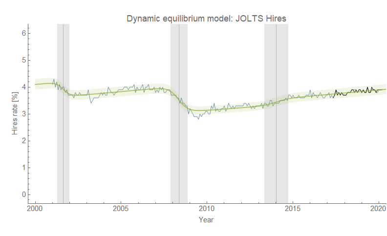
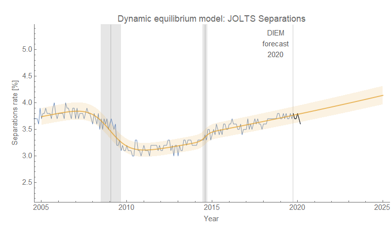
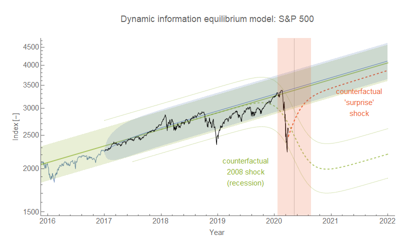
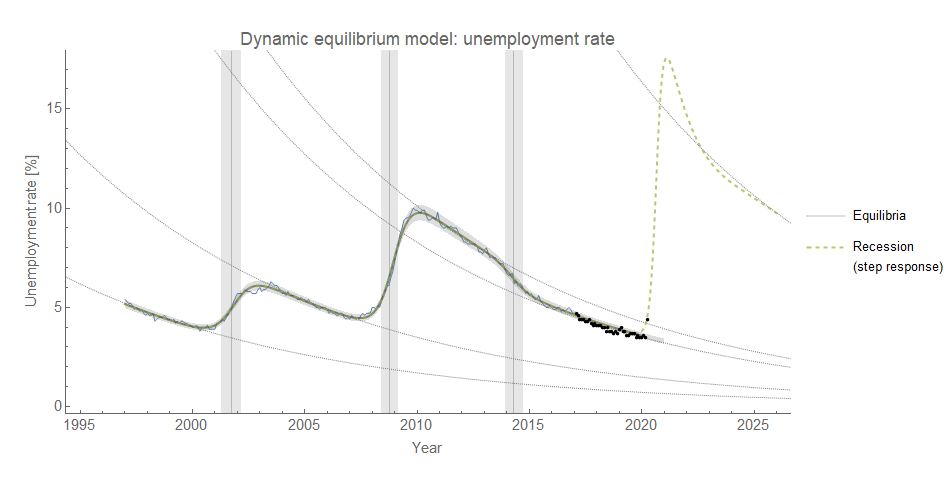

Back from a long hiatus — things were crazy at the real job trying to get set up to work from home for a month or longer. Happy to report my family and I are doing well, and I hope everyone out there is staying healthy.

The drop in the [JOLTS job openings rate](https://fred.stlouisfed.org/series/JTSJOR) I noted in [the previous post](https://informationtransfereconomics.blogspot.com/2020/02/market-updates-for-bad-week.html) (from February) has continued and it appears we're showing a definite deviation:

While you may be thinking "Yes, the COVID-19 shock", I should point out that this data is from February 2020 — _and the deviation starts with data from December 2019_. As I put it [in a tweet](https://twitter.com/infotranecon/status/1239947706975412224?s=20) from last month's data: What if there was a recession brewing and COVID-19 just triggered the market, like the old trope of a tree branch breaking causing an avalanche?

I saw that in the 2008 recession the JOLTS measures were [some of the earlier indicators](http://informationtransfereconomics.blogspot.com/2017/07/jolts-leading-indicators.html) in the labor market with job openings being 4-6 months ahead of the shock to the unemployment rate. That was based on a single shock, but the [hires data averages about 5 months lead](https://informationtransfereconomics.blogspot.com/2018/10/building-models.html) using multiple shocks (in both directions) from the 1990s recession to today.

And last month's unemployment rate showed the first signs of a non-equilibrium shock with March 2020 data by either the Sahm rule or my "[recession detection algorithm](https://informationtransfereconomics.blogspot.com/2017/04/determining-recessions-with-algorithm.html)" threshold:

December 2019 to March 2020 is 4 months — right in line with the previous recession.

Now I understand it seems odd — how could JOLTS data predict a pandemic? Or as I put it in [my twitter thread referenced above](https://twitter.com/infotranecon/status/1239947706975412224?s=20) — how could [the yield curve](https://informationtransfereconomics.blogspot.com/2018/06/yield-curve-inversion-and-future.html) predict a pandemic? Even the "[limits to wage growth](https://informationtransfereconomics.blogspot.com/2018/10/limits-to-wage-growth.html)" \[1\] hypothesis predicts a recession!

But in this view, the pandemic was just a coordinating signal. Often, these coordinating signals come from the Fed — an interest rate hike, lack of a cut, or even [letting a financial institution fail](https://informationtransfereconomics.blogspot.com/2019/03/two-phases-of-2008-housing-crisis.html) — and [coordination causes recessions](https://informationtransfereconomics.blogspot.com/2014/10/coordination-costs-money-causes.html) (we all cut back on spending, we all sell our stocks, etc). Because the pandemic signal was so sudden and so unambiguous, we got a much sharper signal in the unemployment rate than usual and a bit of a compressed period between JOLTS and unemployment. For example, total separations is only barely registering a signal (it's there) while hires shows nothing yet (click to enlarge):

COVID-19 was the twig crack that caused an avalanche that was already building.

I've seen that some people think the recovery will be rapid. I doubt this because we are seeing a shock to the labor market — for example, [initial claims spiked into the millions](https://fred.stlouisfed.org/series/ICSA). A typical ["surprise information shock" that evaporates](https://informationtransfereconomics.blogspot.com/2016/03/the-emh-and-evaporating-information.html) has a distinct pattern:

It would look something like the red dashed line in this graph of S&P 500 data (while I show a non-equilibrium shock the size of the 2008 recession as a counterfactual recession path for reference):

However, unemployment is already rising and it falls at basically the same rate over the entire history of the data. This "[remarkable recovery regularity](https://informationtransfereconomics.blogspot.com/2014/07/remarkable-recovery-regularity-and.html)" became the basis for the [dynamic information equilibrium model](https://papers.ssrn.com/sol3/papers.cfm?abstract_id=3094757) (first [here](http://informationtransfereconomics.blogspot.com/2016/10/dynamic-unemployment-equilibrium-and.html), then [here](https://informationtransfereconomics.blogspot.com/2017/01/dynamic-equilibrium-unemployment-rate.html)). This implies that we are unlikely to see a sudden shift back to low unemployment but rather something more like this:

I added a [step response](https://informationtransfereconomics.blogspot.com/2017/11/unemployment-rate-step-response-over.html) (i.e. "ringing artifacts" or overshooting) to this qualitative non-equilibrium shock because the shock seems pretty sharp, however it is possible it won't happen as the step response [has been gradually disappearing over time in US data](https://informationtransfereconomics.blogspot.com/2017/11/unemployment-rate-step-response-over.html). It's possible it won't be this big — though some people like [James Bullard](https://www.bloomberg.com/news/articles/2020-03-22/fed-s-bullard-says-u-s-jobless-rate-may-soar-to-30-in-2q) are are saying 30% is possible so it might be even bigger. But even the rise to 4.4% already in the data will take **_3 years_** to get back to 3.5% along the dynamic equilibrium path.

It's going to be a long slog.

...

**Footnotes:**

\[1\] In the past several decades, when wage growth exceeds the nominal GDP growth trend, there has generally been a recession.
