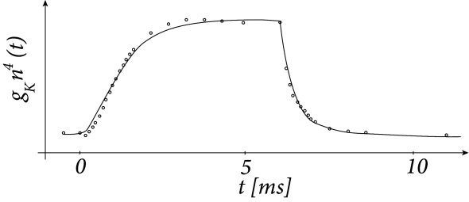
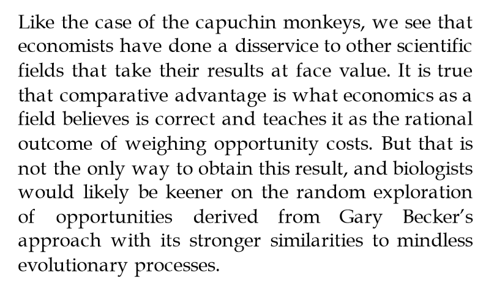

> _That which we call a model by any other name would describe as well ... or not_

I'm in the process of trying to distract myself from obsessively modeling the COVID-19 outbreak, so I thought I'd write a bit about language in technical fields.

David Andolfatto didn't think [this twitter thread](https://twitter.com/dandolfa/status/1242909510525747202?s=20) was very illuminating, but at its heart is something that's a problem in economics in general — and not just macroeconomics. It's certainly a problem in economics communication, but I also believe it's a kind of a professional economics version of "[grade inflation](https://en.wikipedia.org/wiki/Grade_inflation)" where "hypotheses" are inflated into "theorems" and "ideas" \[1\] are inflated into "models".

Now every economist I've ever met or interacted with is super smart, so I don't mean "grade inflation" in the sense that economists aren't actually good enough. I mean it in the sense that I think economics as a field feels that it's made up of smart people so it should have a few "theorems" and "models" in the bag instead of only "hypotheses" and "ideas" — like how students who got into Harvard feel like they deserve A's because they got into Harvard. Economics has been around for centuries, so shouldn't there be some hard won truths worthy of the term "theorem"?

This was triggered by his claim that [Ricardian equivalence](https://en.wikipedia.org/wiki/Ricardian_equivalence) is a theorem (made again [here](https://twitter.com/dandolfa/status/1256381797543395339?s=20)). And I guess it is — in economics. He actually asked what definitions were being used for "model" and "theorem" at one point, and I responded (in the manner of an undergrad starting a philosophy essay \[2\]):

> _the·o·rem_ 

> _a general proposition not self-evident but proved by a chain of reasoning; a truth established **by means of accepted truths**_ 

> _mod·​el_ 

> _a system of postulates, data, and inferences presented as a mathematical description **of an entity or state of affairs**_

I emphasized those last clauses with asterisks in the original tweet (bolded them here) because they are important aspects that economics seems to either leave off or claim very loosely. No other field (as far as I know) uses "model" and "theorem" as loosely as economics does.

The Pythagorean theorem is established from Euclid's axioms (including the [parallels axiom](https://en.wikipedia.org/wiki/Parallel_postulate), which is why it's only valid in Euclidean space) that include things like "all right angles are equal to each other". Ricardian equivalence (per e.g. Barro) instead based on axioms (assumptions) like "people will save in anticipation of a hypothetical future tax increase". This is **_not_** an accepted truth, therefore Ricardian equivalence so proven is **_not_** a theorem. It's a hypothesis.

You might argue that Ricardian equivalence as shown by Barro (1974) is a logical mathematical deduction from a series of axioms — just like the Pythagorean theorem — making it also a theorem. And I might be able to meet you halfway on that if Barro had just written e.g.:

and proceeded to make a bunch of mathematical manipulations and definitions — calling it "an algebraic theorem". But he didn't. He also wrote:

> _Using the letter $c$ to denote consumption, and assuming that consumption and receipt of interest income both occur at the start of the period, the budget equation for a member of generation 1, who is currently old, is \[the equation above\]. The total resources available are the assets held while young, $A_{1}^{y}$, plus the bequest from the previous generation, $A_{0}^{o}$. The total expenditure is consumption while old, $c_{1}^{o}$, plus the bequest provision, $A_{1}^{o}$, which goes to a member of generation 2, less interest earnings at rate $r$ on this asset holding._

It is this mapping from these real world concepts to the variable names that makes this a Ricardian Equivalence _hypothesis_, not a theorem, even if that equation was an accepted truth (it is not).

In the Pythagorean theorem, $a$, $b$, and $c$ aren't just nonspecific variables, but are lengths of the sides of a triangle in Euclidean space. I can't just call them apples, bananas, and cantaloupes and say I've derived a relationship between fruit such that _apples_² + _bananas_² = _cantaloupes_² called the Smith-Pythagoras Fruit Euclidean Metric Theorem.

There are real theorems that exist in the real world in the sense I am making — the [CPT theorem](https://en.wikipedia.org/wiki/CPT_symmetry) comes to mind as well as the [noisy channel coding theorem](https://en.wikipedia.org/wiki/Noisy-channel_coding_theorem). That's what I mean by economists engaging in a little "grade inflation". I seriously doubt **_any_** theorems exist in social sciences at all.

The last clause is also important for the definition of "model" — a model describes the real world in some way. The [Hodgkin-Huxley model](https://en.wikipedia.org/wiki/Hodgkin%E2%80%93Huxley_model) of a neuron firing is an ideal example here. It's not perfect, but it's a) based on a system of postulates (in this case, an approximate electrical circuit equivalent), and b) presented as a mathematical description of a real entity.

The easiest way to do part b) is to compare with data but you can also compare with pseudo-data \[3\] or moments (while its performance is lackluster, a DSGE model meets this low bar of being a real "model" as I talk about [here](https://informationtransfereconomics.blogspot.com/2018/07/dsge-battle-royale-christiano-v-stiglitz.html) and [here](https://informationtransfereconomics.blogspot.com/2017/02/qualitative-economics-done-right-part-1.html)). \*_Ahem_\* — there's also [this](https://papers.ssrn.com/sol3/papers.cfm?abstract_id=3094757).

[Moment matching](https://en.wikipedia.org/wiki/Generalized_method_of_moments) itself gets the benefit of "grade inflation" in macro terminology. I'm not saying it's necessarily wrong or problematic — I'm saying a model that matches a few moments is too often inflated to being called "empirically accurate" when it really just means the model has "qualitatively similar statistics".

One of the problems with a lack of concern with describing a real state of affairs is that you can end up with what Paul Pfleiderer called [chameleon models](https://papers.ssrn.com/sol3/papers.cfm?abstract_id=2414731) — models that are proffered for use in policy, but when someone questions the reality of the assumptions the proponent changes the representation (like a chameleon) to being more of a hypothesis or plausibility argument. You may think using a so-called "model" that isn't ready for prime time can be useful when policy makers need to make decisions, but Pfleiderer put it well [in a chart](https://twitter.com/infotranecon/status/1215088326559981568?s=20):

But what about toy models? Don't we need those? Sure! But I'm going to say something you're probably going to disagree with — [toy models should come **_after_** empirically successful theory](https://informationtransfereconomics.blogspot.com/2017/02/qualitative-economics-done-right-part-2a.html). I am not referring to a model that matches data to 10-50% accuracy or even just gets the direction of effects right as a toy model — that's a qualitative model. A toy model is something different.

I didn't realize it until writing this, but apparently "[toy model](https://en.wikipedia.org/wiki/Toy_model)" on Wikipedia is a physics-only term. The first line is pretty good:

> _In the modeling of physics, a toy model is a deliberately simplistic model with many details removed so that it can be used to explain a mechanism concisely._

In grad school, the first discussion of [renormalization](https://en.wikipedia.org/wiki/Renormalization) in my quantum field theory class used a scalar (spin-0) field. At the time, there were no empirically known "fundamental" scalar fields (the Higgs boson was still theoretical) and the only empirically successful uses of renormalization were [QED](https://en.wikipedia.org/wiki/Quantum_electrodynamics) and [QCD](https://en.wikipedia.org/wiki/Quantum_chromodynamics) — both theories with spin-1 [gauge bosons](https://en.wikipedia.org/wiki/Gauge_boson) (photons or gluons) and spin-½ [fermions](https://en.wikipedia.org/wiki/Fermion) (electrons or quarks). Those details complicate renormalization (e.g. you need [a whole different quantization process](https://en.wikipedia.org/wiki/BRST_quantization) to handle non-Abelian QCD). The scalar field theory was a toy model of renormalization of QED — used in a class to teach renormalization to students about to learn QED _that had already been shown_ to be empirically accurate to 10s of decimal places.

The scalar field theory would be horribly inaccurate if you tried to use it to describe the interactions of electrons and photons.

The problem is not that many economic "toy models" are horribly inaccurate, but rather that they don't derive from even qualitatively accurate non-toy models. Often it seems no one even bothers to compare the models (toy or not) to data. It's like that amazing car your friend has been working on for years but never seems to drive — does it run? Does he even know how to fix it?

At this stage, I'm often subjected to all kinds of defenses — [economics is _social_ science](https://informationtransfereconomics.blogspot.com/2016/03/economics-is-social-science.html), [economics is too complex](https://informationtransfereconomics.blogspot.com/2017/01/complex-systems-versus-complicated.html), there's too much uncertainty. The first and last of those would be arguments against using mathematical models or deriving theorems at all, which _a fortiori_ makes my point that the words "model" and "theorem" are inflated from their common definition in most technical fields.

[David's defense is](https://twitter.com/dandolfa/status/1242896104242511873?s=20) (as many economists have said) that models and theorems "organize \[his\] thinking". In the past, my snarky comment on this has been that economists must have really disorganized minds if they need to be organizing their thinking all the time with models. Zing!

But the thing is we have a word for organized thought — idea \[4\]:

> _i·de·a_ 

> _a formulated thought or opinion_

But what's in a name? Does it matter if economists call Ricardian equivalence a theorem, a hypothesis, or an idea? Yes — because most human's exposure to a "theorem" (if any) is the Pythagorean Theorem. People will think that the same import applies to Ricardian Equivalence, but that is false equivalence.

Ricardian Equivalence is nowhere near as useful as the Pythagorean Theorem, to say nothing about how true it is. Ricardian Equivalence may be true in Barro's model — one that has never been compared to actual data or shown to represent any entity or state of affairs. In contrast, you could right now with a ruler, paper, and pencil draw a right triangle with sides of length 3, 4, and 5 inches \[5\].

I hear the final defense now: _But fields should be allowed their own jargon — and not policed by other fields!_ Who are you fooling? 

Well, it turns out economists are fooling people — scientists who take the pronouncements of economics at face value. I write about this [in my book](https://www.amazon.com/gp/product/B0754X3PYF/) (using two examples of _[E. coli](https://informationtransfereconomics.blogspot.com/2015/08/obviously-e-coli-is-rational-utility.html)_ and [capuchin monkeys](https://informationtransfereconomics.blogspot.com/2015/11/monkeys-and-markets.html)):

We have trusting scientists going along with rational agent descriptions put out there by economists when these rational agent descriptions have little to no empirical evidence in their favor — and even fewer accurate descriptions of a genuine state of affairs. In fact, economics might do well to borrow the evolutionary idea of an ecosystem being [the emergent result of agents randomly exploring the state space](http://informationtransfereconomics.blogspot.com/2016/02/fitness-trade-offs-and-macrofoundations.html).

PS

My "to be fair" items so that I'm not just "calling out economics" are "information" in information theory and "theory" in physics. The former is really unhelpful — I know it's information entropy, but people who know that often shorten it to just information and people who don't think information is like knowledge despite the fact that information entropy is maximized for e.g. random strings.

In physics, any quantum field theory Lagrangian is called a "theory" even if it doesn't describe anything in the real world. It is true that the completely made up ones don't get names like quantum electrodynamics but rather "[φ⁴  theory](https://en.wikipedia.org/wiki/Quartic_interaction)". If it were economics, that scalar field φ would get a name like "savings" or "consumption".

...

**Footnotes:**

\[1\] I had a hard time coming up with the word here — my first choice was actually "scratch work". Also "concepts" or "musings".

\[2\] ... at 2am in a 24 hour coffee shop on [the Drag](https://en.wikipedia.org/wiki/Drag_\(Austin,_Texas\)) in Austin.

\[3\] "[Lattice data](https://en.wikipedia.org/wiki/Lattice_QCD)" (for QCD) or [data generated with VAR models](https://informationtransfereconomics.blogspot.com/2018/07/dsge-battle-royale-christiano-v-stiglitz.html) (in the case of DGSE) are examples of pseudo-data.

\[4\] Per \[1\], this is also why I thought "concept" would work here:

> _con·cept_
>
>
>
> __something conceived in the mind__

\[5\] This is actually how ancient Egyptians used to measure right angles — [by creating 3-4-5 unit triangles](https://www.radford.edu/~wacase/Math%20135%20Pythagorean%20Theorem.pdf) \[pdf\].
