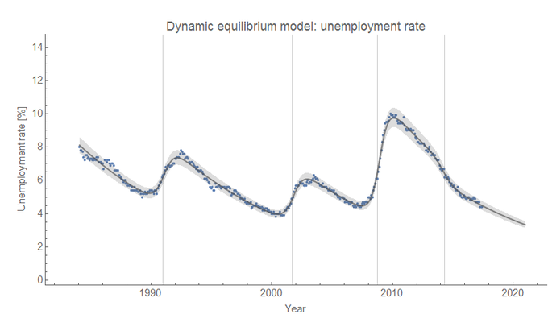
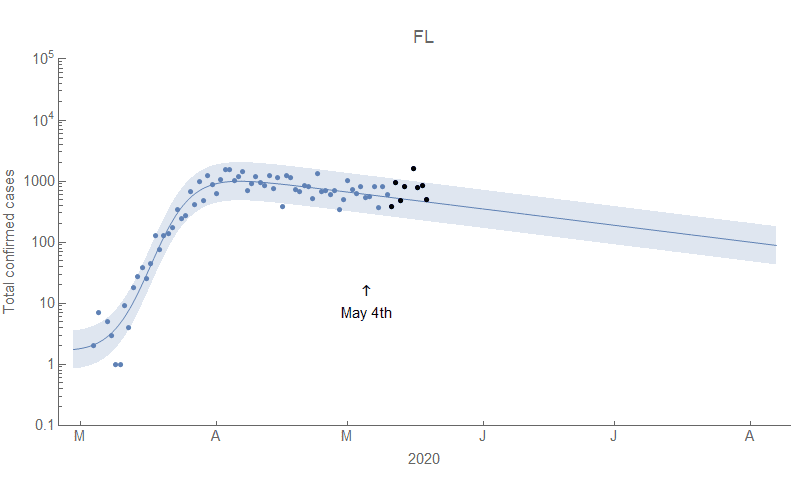
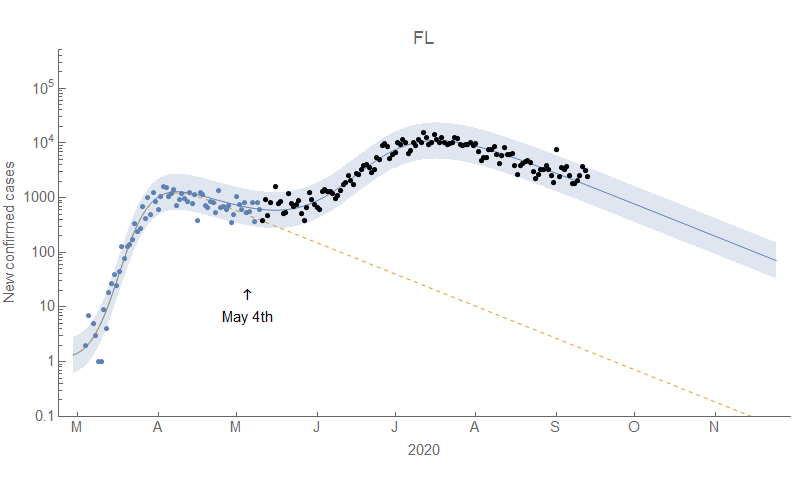

Since I've gotten questions, I thought I'd put together a brief explainer on the Dynamic Information Equilibrium Model (DIEM) and its application to the path of COVID-19.

**Prolog**

I wrote a preprint on the DIEM a couple years ago ([posted at SSRN](https://papers.ssrn.com/sol3/papers.cfm?abstract_id=3094757)), and gave a talk about the approach at the UW economics department ([see here](https://informationtransfereconomics.blogspot.com/2018/10/outside-box-workshop.html)). The primary application was to labor markets, specifically the unemployment rate. However, the model has [many other applications in economics](https://informationtransfereconomics.blogspot.com/2017/05/explore-more-about-information.html) (and the original [information equilibrium](https://arxiv.org/abs/0905.0610) approach has applications to physics). So how did I end up applying this model to COVID-19? It started from laziness.

Back in April, I was looking at the various models of COVID-19 out there, in particular [the IHME model](https://covid19.healthdata.org/united-states-of-america). I wanted to compare the performance to the data, but instead of coding it up myself I took a screenshot and digitized the data. Digitizing adds error and digitizing exponentially falling functions creates all kinds of problems, so I instead fit the IHME forecasts with a DIEM model since I had the code readily available.

It turned out to do a decent job of describing the IHME models, but additionally when there were discrepancies with the observed data it turned out the DIEM worked better. Thinking about the foundations of the DIEM, the reason it worked became clear.

**DIEM**

The DIEM is an application of "information equilibrium" — the idea that one process $A$ can be the source of information for another process $B$ such that it takes the same number of bits of ([information theory](https://en.wikipedia.org/wiki/Information_theory)) information to specify $A$ as it does to specify $B$. In a sense, if $A$ is in information equilibrium with $B$ then the two are informationally equivalent. Information equilibrium constrains what a process that matches e.g. $A$ with $B$ can look like.

That's all very abstract, but in economics we have demand for a good being matched with supply (creating a transaction) or job openings being matched with unemployed people (creating a hire) — in equilibrium. In the case of COVID-19, we have _virus_ + _healthy person_ $\rightarrow$ _sick person_. 

Like any communication channel transferring information, these matches can fail to happen. Voices are garbled on a cell phone call causing a failure of the information specifying the sound waves going into the the speaker's phone being transferred completely to the sound waves coming out of the listener's phone. Information equilibrium is something of an idealized state that can be interrupted by non-equilibrium. It may seem vacuous to say sometimes you have equilibrium and sometimes you have non-equilibrium, but the information theory underlying it gives us some useful handles (e.g. failures to fully sample the underlying space, correlations, or other changes in information entropy).

_Dynamic_ information equilibrium asks what information equilibrium can tell us when the processes $A$ and $B$ are growth processes.

Just because they are "growth" processes, that doesn't mean they are growing — they could be shrinking or $A$ could be growing and $B$ could be shrinking.

If you go to [the paper](https://papers.ssrn.com/sol3/papers.cfm?abstract_id=3094757) you can get the details of the mathematics (including how this generalizes to _ensembles_ of processes), but the key result is that information equilibrium requires

where $k$ measures the relative information content of events in process $A$ versus events in process $B$. What this says is that if you look at the data on a log plot versus time, it will consist mostly of data where the rate of growth of decline of the data will be a straight line (i.e. exponential growth or decay with constant log-linear slope).

Mostly. What makes this DIEM a model and not a theory is that there's an assumption about what happens in non-equilibrium. In the original application of the model to the unemployment rate, there was an assumption that the straight line isn't interrupted by non-equilibrium too much — that non-equilibrium events are sparse in the time series data. If this wasn't true, then it'd be impossible to measure that $\alpha$ and your model of non-equilibrium would be everything. In labor markets, recessions are the sparse non-equilibrium events in the unemployment rate and the recovery is the equilibrium:

Adding in a logistic step function to handle the recessions shocks gives us a description of the unemployment rate (and other economic variables) over time:

**COVID-19**

It turns out that the DIEM is really good model of the data for COVID-19 cases and deaths and the forecast from April for the path of the outbreak in the US was remarkably accurate — at least until the 2nd surge in the most recent data (i.e. a non-equilibrium event):

The model works well for most countries, for example here are Italy and the UK (click to enlarge):

The fact that we can't really see that 2nd surge until it starts is due to the model being too simple to predict non-equilibrium events. It can, however, be used to see when a non-equilibrium event is getting started and then monitor its progress. For example, back on May 20th [I was predicting](https://twitter.com/infotranecon/status/1263163398423863296) the beginning of a 2nd surge in Florida based on the DIEM model of cases there (and I later added a 2nd non-equilibrium shock, which can be handled using e.g. [this algorithm](https://informationtransfereconomics.blogspot.com/2017/04/determining-recessions-with-algorithm.html)):

Another limitation of the model is that it has explicit assumptions that the number of events $n$ you're seeing is large $n \gg 1$. This means the model does not work well when there are just a few cases or deaths and for the initial onset of the outbreak. For example, here is South Korea:

Related to the $n \gg 1$ assumption, we basically start an outbreak at $t_{0}$ in the midst of a non-equilibrium shock with dynamic equilibrium valid for $t \gt t_{0}$. This is effectively treated in the model as if a previous outbreak had recently ended (so that dynamic equilibrium is also valid for $t \lt t_{0}$). The model that would deal with the initial outbreak would almost certainly have to incorporate specifics of the individual virus and the networks it travels in that is beyond the scope of information equilibrium — itself a "shortcut" in describing complex systems.

**Other observations**

One the things the model predicts is that after a 2nd (or 3rd) surge, the data should return to the previous log-linear path unless something has changed. This appears to be happening for several regions — Germany and King County, WA for example:

This remains to be seen if this holds up. In Sweden, the rate of decline after the 2nd surge in cases seems to have improved and is now comparable to Germany's

Previously, Sweden's rate of decline in cases of $\alpha \simeq$ 2% per day was approximately the same as most of the US — about half the rate of 4-5% apparent in most of Europe as well as in NY state (dominated by counts from NYC). Did people in Sweden change behavior in the face of that 2nd surge? It's an open question. \[_See update 25 July 2020 below._\]

Another thing we need to keep in mind that these are **_reported_** cases and deaths. With testing increasing in many countries, more and more cases are discovered. This results in an obvious difference between the rate of decline for cases in the US versus that for deaths:

Other countries have much more similar rates of decline for the two measures. For the US, this means the rate of decline for cases is somewhat lower than would be if testing was widely available. That is to say observed $\alpha_{US} \simeq \alpha_{US}^{\text{cases}} + \alpha_{US}^{\text{testing}}$. It also means the observed rate of decline for cases must decrease at some point in the future (e.g. once testing far outpaces transmission). As it is, the "case fatality rate" (CFR) appears to be heading to zero:

This theoretically should flatten out at some point at the true population CFR (although it's complicated since more deaths can occur during a surge because hospitals are at capacity). Estimated CFRs are in the 0.1% order of magnitude so this point is likely far in the future for the US.

**Summary**

The DIEM is an incredibly simple model. In the senses above — _too simple_. However, it has also proven useful for estimating the long run path of COVID-19 in several regions. In the places it applies, a given pandemic can be seen as an instance of a universal process with its specific parameters aggregating the effects of multiple aspects of society from policy to social networks to details of the specific virus.

Overall, we should keep in mind that the combination of policy, epidemiology, and social behavior is a social system. There might be empirical regularities from time to time, but humans can always change their behavior and thus change outcomes.

...

**Update 21 July 2020**

Minor edits and updated Sweden, Germany and US ratio graphs with more recent data.

...

**Update 25 July 2020**

The assumption of sparseness mentioned above may have failed us in the estimation of the dynamic equilibrium rate for Sweden — the first and second surges were too close together to properly measure it. It would resolve some inconsistencies (i.e. Sweden seeming to have a higher rate than the rest of Europe before the 2nd surge, Sweden oddly shifting to a rate more consistent with the rest of Europe after the 2nd surge). Here is the model using the most recent data (as of 11am PDT) to estimate the dynamic equilibrium $\alpha$ compared to the original fit (click or tap to enlarge):

_Seismograms_

Another way to visualize multiple DIEMs is via what I call "[seismograms](https://informationtransfereconomics.blogspot.com/2018/03/shock-cluster-analysis-and-some-new.html)" which displays the temporal information about the parameters (the shock width and the shock timing) on a timeline like this for several US states (click or tap to enlarge — the blue is only to differentiate the US aggregate, not direction of shock as in other uses):

The translation is fairly straightforward — a longer shock is represented by a wider band placed at the center (in time) of a non-equilibrium shock (above red-ish, below in gray). In the link above, you can add amplitude/magnitude information by scaling the color but this version just emphasizes time. Here's a graphical version of how these translate from [my book](https://informationtransfereconomics.blogspot.com/2019/06/a-workers-history-of-united-states-1948.html):

...

**Update 9 September 2020**

The "return to equilibrium" has turned out to be remarkably accurate for the US:

In Sweden, there is a 3rd surge ending ...

Also, the predicted path of deaths in the US using cases turned out to be fairly accurate with only the lag being uncertain in advance:

The ratio of deaths to cases for the US has returned to the "equilibrium" of a decline due to a likely combination of effects from demographic to increasing testing (the latter seeming like the primary contribution):

...

**Update 2 October 2020**

Another predictive success of the DIEM for COVID-19 — [calling a 3rd surge in Florida on 9/13](https://twitter.com/infotranecon/status/1305316884661690368):

And its subsequent appearance:

...

**Data sources:**

International data from European CDC

[https://www.ecdc.europa.eu/en/geographical-distribution-2019-ncov-cases](https://www.ecdc.europa.eu/en/geographical-distribution-2019-ncov-cases)

US state data from the COVID Tracking Project

[https://covidtracking.com/](https://covidtracking.com/)

Economic data from [FRED](https://fred.stlouisfed.org/) and Atlanta Fed Wage Growth tracker

[https://www.frbatlanta.org/chcs/wage-growth-tracker.aspx?panel=1](https://www.frbatlanta.org/chcs/wage-growth-tracker.aspx?panel=1)
