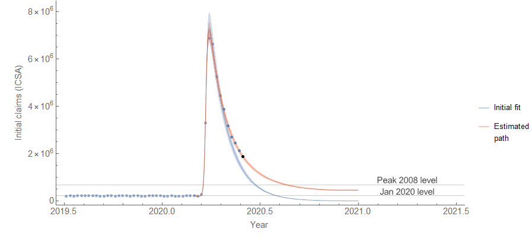
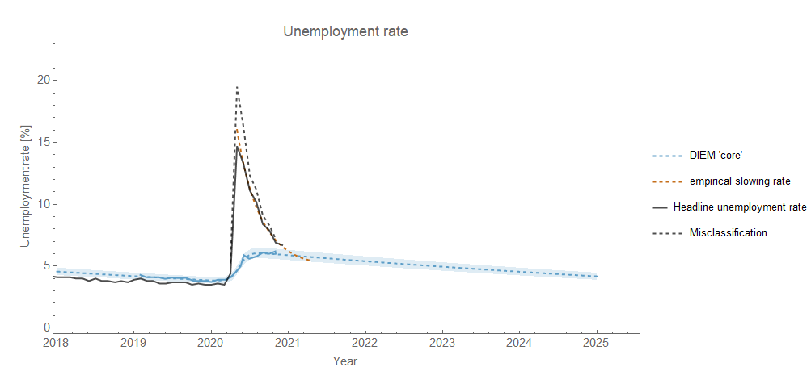

Back in June of 2020, [I posted](https://twitter.com/infotranecon/status/1268610307917660160) an estimate of the future path of [initial claims](https://fred.stlouisfed.org/series/ICSA) \[1\] on Twitter (click to enlarge):

While the rate of improvement was overestimated, it captured the qualitative behavior quite well:

Being able to predict the qualitative behavior of the time series in the future is pretty good confirming evidence for a hypothesis — not the least of which being there's no way you could have had access to data in the future without travelling through time. The underlying concept was that the rate of improvement after the initial spike would gradually fall back to the long term equilibrium (logarithmic rate) of about −0.1/y (which shows up as the line that is almost at zero):

The hypothesis is that while the initial part of the non-equilibrium shock was a sharp spike, there is an underlying component that is a more typical, more gradual, shock. One way to visualize it is in the unemployment rate via "core" unemployment (per [Jed Kolko](https://twitter.com/JedKolko/status/1334855102092308481)):

Here's a cartoon version. In the current recession, we're seeing something that hasn't been that apparent (or at least as rapid) in the data \[2\]. There's the normal recession (solid line) as well as a sharp spike (dashed):

Instead of the usual derivative that's a single (approximately Gaussian) shock (solid line), we have a more complex structure with a smoothly falling return to the usual dynamic equilibrium (here exaggerated to −0.2/y so it looks different from zero):

Zooming in on the box in the previous graph, we get the cartoon version of the data above (dashed curve) that eventually asymptotes to the long run dynamic equilibrium rate:

Since we haven't had a shock of this type before in the available data with mass temporary layoffs, it's at least not _**entirely**_ problematic to suggest an ad hoc model like this one. The underlying "[evaporation](https://informationtransfereconomics.blogspot.com/2016/03/the-emh-and-evaporating-information.html)" of the temporary shock information is based on the entropic shocks that appear in the stock market (including for this exact same COVID-19 event as well as the December 2018 Fed rate hike): 

...

**Footnotes:**

\[1\] This is not what would be the [technically correct model in terms of dynamic equilibrium](https://informationtransfereconomics.blogspot.com/2017/12/dynamic-information-equilibrium-model.html), but over this short time scale the civilian labor force has been roughly constant since June. It doesn't really change the shape except for the initial slope which is lower because it is undersampled using only monthly CLF measurements instead of weekly ICSA measurements:

The "real" model isn't that different:

\[2\] It's possible the "[step response](https://informationtransfereconomics.blogspot.com/2017/11/unemployment-rate-step-response-over.html)" in the unemployment rate in the 1950s and 60s is a similar effect, but nowhere near as rapid.
