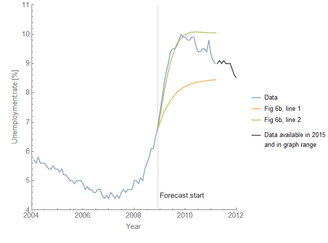
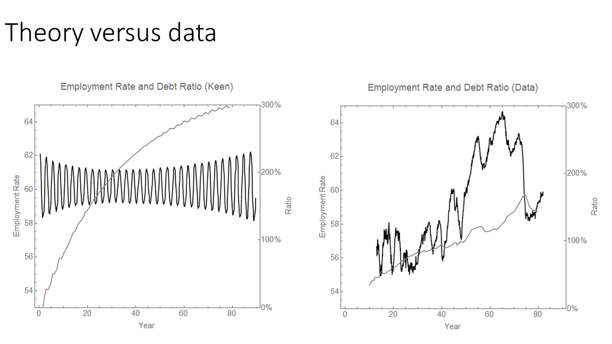

I seem to have involved myself in a Twitter dispute with economist Roger Farmer about what it means to make macro models — or [more broadly](https://twitter.com/infotranecon/status/1335450024650502144) "the nature of the scientific enterprise", as Roger the economist kindly tried to explain to me, a physicist. Unfortunately, due to his prolific use of the quote tweet the argument is likely impossible to follow. You can see the various threads via [this search](https://twitter.com/search?q=from%3A%40infotranecon%20to%3A%40farmerrf&f=live).

**Background**

This started when I noted that Roger Farmer's claims about unemployment — in particular in papers supporting his claims that he cites [here](https://static1.squarespace.com/static/573b5f2bf85082a897b58171/t/5744d8813c44d82d4deb92fe/1464129666308/fa-con-cra.pdf) Farmer (2011) and [here](https://static1.squarespace.com/static/573b5f2bf85082a897b58171/t/57449cf0cf80a18d18ad6c03/1464114417622/stock_market_really.pdf) Farmer (2015) — are inconsistent with the long run qualitative behavior of the unemployment rate data. That is to say the models are not consistent with the empirical fact that the unemployment rate between recessions falls at a logarithmic rate of about −0.09/y in the US (BYDHTTMWFI: [here's a recent NBER paper](https://www.nber.org/papers/w28111)).

Let me say right off that I actually appreciate Roger Farmer's work — he does seem to think outside the box compared to the DSGE approach to macro that has taken over the field.

I am going to structure this summary in a series of claims that I am **_not_** making because it seems many people have confused requiring qualitative agreement with data with [precise measurements of the electron magnetic moment](https://en.wikipedia.org/wiki/G-factor_\(physics\)#Measured_g-factor_values).

Here we go!

**I am not saying models with RMS error ε ≥ _x_ must be rejected.**

The funniest part about this is that [in my figure](https://twitter.com/infotranecon/status/1335712243716038656) that I use to show the Roger's model's lack of qualitative agreement actually shows the DIEM has worse RMS error over the range of the data Roger shows in his graph \[2\].

The thing is it's easy to get low RMS error on past data simply by adding parameters to a fit. This does not necessarily work with projected data, but in general more parameters often yield a better fit to past data and sometimes a better short run projection.

However, [my original claim](https://twitter.com/infotranecon/status/1335101554005745665) that started this off was that his model based on shocks to the stock market in the supporting papers was "disconnected from the long run empirical behavior of the unemployment rate". It's true that if you take the shocks to the unemployment rate and add the dynamic equilibrium of the S&P 500 model, you get a short run correlation that lasts from 1998 to about 2010:

This correlation around the 2008 recession is pointed out in Farmer (2011) Figure 2. However, you only have to go back to the early 90s recession to get a counterexample to the idea that shocks to the S&P 500 match up with shocks to the unemployment rate.

Second, there is also no particular empirical evidence that the unemployment rate will flatten out at any particular level (be it the natural rate in neoclassical models, or in Farmer's models a rate based on asset prices).Third, Farmer's models do not show log-linear decline between recession shocks. 

It is these three basic empirical facts about the unemployment rate that I was referencing when I made my claim in that initial tweet. Even if the RMS error is bad, a model of the unemployment rate is at least qualitatively consistent with the data if 1) the shocks are not entirely dependent on the stock market, 2) the rate does not flatten out at any level except possibly _u_ \= 0, or 3) shows an average log-linear decline of −0.09/y between recessions (a fact that was called out in [a recent NBER paper](https://www.nber.org/papers/w27234), [BYDHTTMWFI](https://twitter.com/hashtag/bydhttmwfi)).

**_What I am saying_** is that Roger's models are not qualitatively consistent with the data — think a model of gravity where things fall up — and should be rejected on those grounds. The unemployment rate literally levitates in his models. Additionally there exist models with lower RMS error and qualitative agreement with the data; the existence of those models should give us pause when considering Roger's models.

**I am not calling for Roger Farmer to stop working on his models.**

It's fine by me if he wants to give talks, write blog posts about his model, or think about improving it in the privacy of his own research notebook. I would prefer that he grapple with the fact that the models are not qualitatively consistent with the data instead of getting defensive and saying that they don't have to pass that low bar. I believe models that are not qualitatively consistent with the data should **_not_** be used for policy, though — [and that is one of Roger's aims](https://twitter.com/farmerrf/status/1335398453627609089).

It's true that a lot of ideas start out kind of wrong — it's unrealistic to expect a model to match the data exactly right out of the gate. And that's fine! I've had a ton of bad ideas myself! But there is no reason we should expect half-baked ideas lacking qualitative agreement with the data to be taken seriously in the larger marketplace of ideas. 

So many comments on the feed were about working towards an insight or the models being just an initial idea that could be improved. Most of us don't get a chance to put even really good ideas in front of a lot of people, so why should we accept something that's apparently not ready for prime time just because it's from a tenured professor? I have a Phd and a lot of garbage models of economic systems that aren't even qualitatively accurate in my Mathematica notebook directory — should we consider all of those? In any case, "it may lead to future progress" is not a reason to say "oh, fine then" to models that aren't qualitatively consistent with empirical data.

**_What I am saying_** is that we should set the bar higher for what we consider useful models in macro than "it might qualitatively agree with data one day". We can leave discussion of those models out of journals and policy recommendations.

**I am not saying we should apply the standards of physics to economics.**

This goes along with people saying I shouldn't be applying "Popperian rejection" to economic models. First off, this misconstrues Popper who was talking about falsifiability as a condition for scientific theories as opposed to pseudoscience. Roger's models are falsifiable — I don't think they are pseudoscience. However, Popper didn't really say much about models being _falsified_ despite the fact that lots of people think he did.

General Relativity is a better model than Newtonian gravity, but both models are falsifiable. We consider Newtonian gravity to be incorrect for strong gravitational fields, precise enough measurements in weak fields, or velocities close to the speed of light. We still use good old Newton all the time — I did just the other day for an orbital dynamics question at work. I fully understand the difference between a model that is an approximation and one that is supposed to be a precise representation of reality.

Popper, however, did not say anything about models that don't qualitatively agree with the data. That's because in most of science, such models are thrown out before they are ever published. Economics, especially macro, operates in a different mode where I guess they consider models that look nothing like the data. _Ok, I know the time series data is an exponentially increasing amplitude sine wave and this model says it's a straight line, but hear me out!_

If the standards for agreement with the data are below qualitative agreement with the data, then there's really no reason to throw out [Steve Keen's models](https://informationtransfereconomics.blogspot.com/2017/02/qualitative-economics-done-right-part-2.html) \[3\]. But that's the problem — there are models that agree with the data! David Andofatto's simple model [matches the data fairly well](https://twitter.com/infotranecon/status/1282078731989684224) qualitatively! (It gets points 1 and 3 above and could be set to _u\*_ = 0 to get 2.) The existence of those models should set the bar for the level of empirical accuracy we should accept in macro models.

**_What I am saying_** is that there are existing models that more precisely match the data — and that is the standard I am using. It's not physics, but rather the performance other economic models. If you have a model that has worse RMS error, but has better qualitative agreement with the data, then that's ok to bring to the table. Overall, there seems to be far too much garbage that is allowed in macro because, well, there apparently wouldn't be any macro papers at all if some basic standards were enforced. When I say these models that aren't even qualitatively consistent with the data should be thrown out, I'm not talking about Popperian rejection, I am talking about _[desk rejection](https://en.wikipedia.org/wiki/Scholarly_peer_review#Procedure)_.

**One last point ... what is the use of a model that doesn't qualitatively agree with data?**

I didn't have a way to phrase this one as something I'm not saying. I literally cannot fathom how you can extract anything useful from a model that does not qualitatively agree with the data. This is lowest bar I can think of.

_Yes this model looks nothing like the data but it's useful because I can use it to understand things based on ..._

That ellipsis is where I cannot complete the sentence. Based on gut feelings? Based on divine revelation? If the model looks nothing like the data, what is anything derived from it derived _from_? The pure mathematical beauty of its construction?

It's like someone saying "Here's my model of a car!" and they show you a cat. _Yes, this cat isn't qualitatively consistent with a car, but it's a useful first step in understanding a car. The cat gives me insights into how the car works. And you really shouldn't be using Popperian rejection of the cat model of a car because automobile engineering is not the same as physics. Making a detailed car model is unnecessary for figuring out how it works — a cat is perfectly acceptable. Eventually, this cat model will be improved and will get to a point where it matches car data well. The cat model also allows me to make repair recommendations for my car. You see the cat has a front and a back end, where the front has two things that match up with the car headlights, and yes the fuel goes in the front of the cat while it goes in the side of a car but that's at least qualitatively similar ..._

...

**Update 7 December 2020**

Also realized Roger has made a [major stats error here](https://twitter.com/farmerrf/status/1335398452218347521):

> _Jason Jason. @infotranecon I really don’t know where to start.  1. The unemployment rate is I(1) to a first approximation. 2. The S&P measured in real units is I(1) to a first approximation. The two series are cointegrated. The S&P Granger causes the unemployment rate._

Here's [Dave Giles](https://davegiles.blogspot.com/2015/10/cointegration-granger-causality.html), econometrician emeritus extraordinaire:

> _If two time series, X and Y, are cointegrated, there must exist Granger causality either from X to Y, or from Y to X, both in both directions._

...

**Footnotes**

\[1\] The title is a reference to [my old series](https://informationtransfereconomics.blogspot.com/2017/02/qualitative-economics-done-right-part-1.html) that led, among other places, to realizing [Wynne Godley has been maligned](https://informationtransfereconomics.blogspot.com/2018/01/qualitative-economics-done-right-part-3.html) by people who ostensibly support him, and that [Dirk Bezemer fabricated quotes](https://informationtransfereconomics.blogspot.com/2018/05/no-one-saw-this-coming-bezemers.html) in his widely cited paper.

\[2\] I do find it problematic that Roger not only cuts off the data early compared to data that was available at the time Farmer (2015) was published, but also cuts of data that was available at the time _that would appear in the domain of his graph_ — data that emphasizes that the model does not qualitatively match the data. He also uses quarterly unemployment data which further reduces the disagreement.

\[3\] I mean c'mon!

