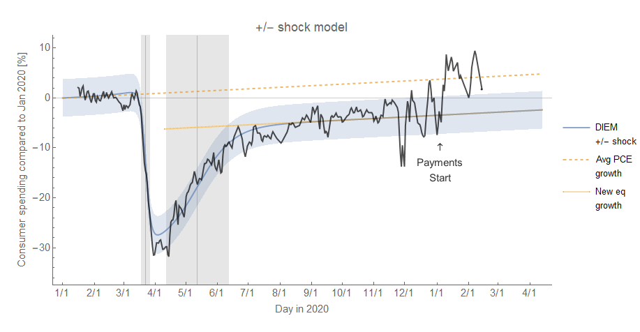
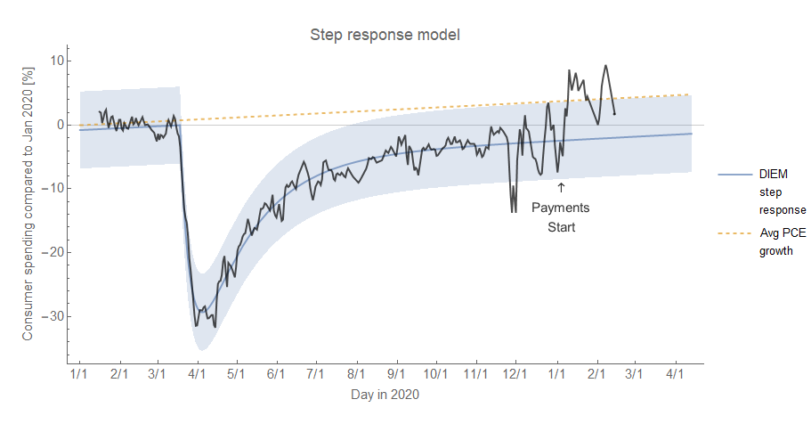
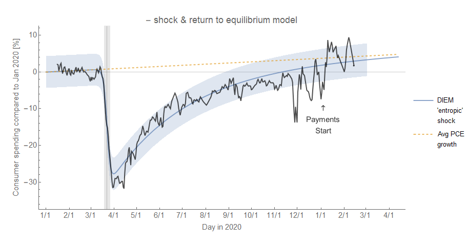
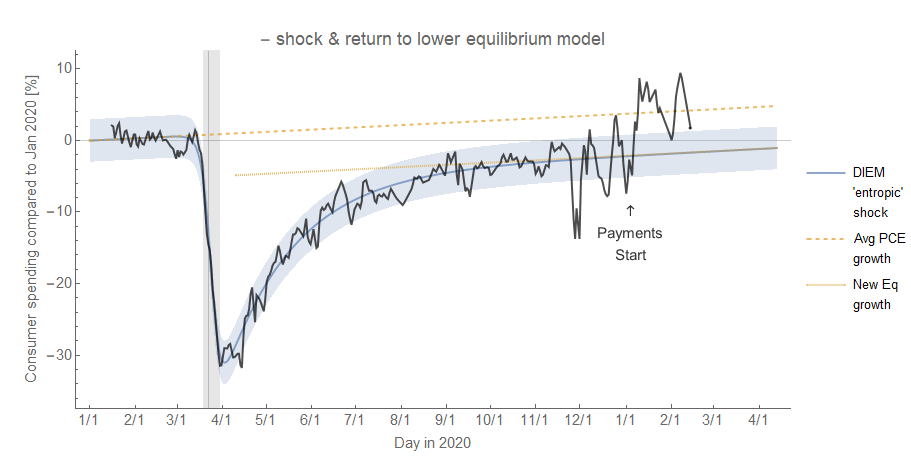
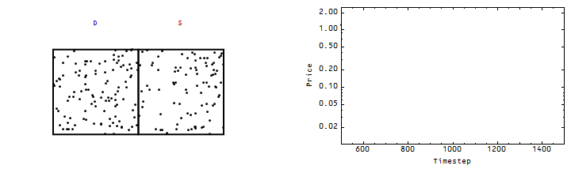

I haven't been blogging much the past two years — due to a) work taking nearly all of my energy, and b) the near daily update of data around COVID-19 being more conducive to Twitter than blogging. However, I thought it was time for a longer-term assessment of the economic time series in the context of [Dynamic Information Equilibrium Models](https://papers.ssrn.com/sol3/papers.cfm?abstract_id=3094757) (DIEMs).

First, let's look at the consumer spending data from [tracktherecovery.org](https://tracktherecovery.org/) (Raj Chetty and John Friedman's project using with proprietary credit card data and only bulk credit to the "OI team" of undergrad RAs) — beginning with a little history (and links to Twitter). I originally put together several models back in early [June of 2020](https://twitter.com/infotranecon/status/1271583724467924994) to describe the shock to consumer spending data. About two months later (end of [July 2020](https://twitter.com/infotranecon/status/1288963635402825728)) I added in long run growth because it would start to become an important factor as the recovery dragged on. [Towards the end of October](https://twitter.com/infotranecon/status/1319393510810742784), I decided to rank the performance of the four different models. Basically, all of them performed about equally — except for the "entropic shock" with a complete return to equilibrium. This means that there was some persistent gap in spending that wasn't made up until after the most recent round of stimulus checks in January of 2021.

Here are the four models (click to enlarge).

I illustrate both the "entropic" shock models in [this post on evaporating information](https://informationtransfereconomics.blogspot.com/2016/03/the-emh-and-evaporating-information.html). The basic idea is that there's a shock to the time series and it either evaporates entirely or leaves some residual:

While the full return to equilibrium model, if looked at in a vacuum, does look like it describes the entire series more accurately; however, the errors are correlated and it did poorly at forecasting up until a specific event (the January stimulus payments). We can chalk that up to luck.

The entropic shock with return to a different equilibrium is the most parsimonious model (fewer independent parameters, lower RMS error, so lower [AIC](https://en.wikipedia.org/wiki/Akaike_information_criterion)), but the two shock model is probably the best explanation — if we attribute the January 2021 deviation to stimulus payments we should include some identifiable effect from the April 2020 stimulus.

Speaking of that January 2021 stimulus, [I posited a couple weeks ago](https://twitter.com/infotranecon/status/1362595341376184321?s=20) that it looked like an evaporating shock itself. That seems less likely once we include more data:

In fact, a classic DIEM shock seems more appropriate:

In the aggregate [PCE](https://fred.stlouisfed.org/series/PCE) data, it's hard to tell if we can see the January 2021 shock at all:

It's only updated monthly, so doesn't have the temporal currency or resolution of the Opportunity Insights data. In this time series we can also see the effect of the [TCJA implemented at the end of 2017](https://informationtransfereconomics.blogspot.com/2019/05/tcja-and-pce-growth.html). The other impact of the TCJA seems to have been a negative shock to median sales prices of houses ([last update here](https://informationtransfereconomics.blogspot.com/2019/07/continuing-decline-in-median-house-price.html)). There has been a recent bump up that may reflect [lack of inventory](https://twitter.com/dynarski/status/1365739551554215947?s=20) since the COVID shock hit, but again that's another place where time will tell.

I never got around to turning the reasoning for the TCJA (and its changes to the mortgage interest deduction) to be the source of that shock into a blog post after [posting it on Twitter](https://twitter.com/infotranecon/status/1222314244697288704) at the end of January of 2020 — just before the COVID shock. The shock begins about a year before the Fed rate increase of December 2018, the other (at least theoretically) plausible culprit. I'm sure there are just-so models where people expected the future rate increase because of the higher deficit spending brought on by the TCJA, but I personally [prefer causality](https://informationtransfereconomics.blogspot.com/2014/12/what-does-et-pit1-mean.html) in my models.

On to another four letter acronym: [ICSA](https://fred.stlouisfed.org/series/ICSA) (Initial Claims Seasonally Adjusted). I pretty much accurately described this "entropic shock" path back in June of 2020 (see previous post [here](https://informationtransfereconomics.blogspot.com/2020/12/initial-claims-and-other-covid-19-shocks.html)), but now we have some additional evidence for some slight deviations in the model. First the big picture:

And now zooming in a bit, we can see two correlated deviations in the summer of 2020 and fall/winter of 2020 into 2021 pretty much match up with the surges in COVID-19 cases in the US (and the accompanying layoffs):

Although I talked about it [in the previous post](https://informationtransfereconomics.blogspot.com/2020/12/initial-claims-and-other-covid-19-shocks.html), I don't think I've shown my latest view of the unemployment rate based on [Jed Kolko's "core" unemployment rate](https://twitter.com/JedKolko/status/1357694325002358790) (U5 minus temporary layoffs) that I refined [in a Twitter thread](https://twitter.com/infotranecon/status/1358567552964726784) (U3 minus temporary layoffs, in order to compare to "headline" unemployment). New data is coming out next week, so now would be a good time to document my forecast.

Here's U3 and the U3 "core" rate with temporary layoffs removed:

As you can see, the relationship between "core" U3 and U3 has been relatively stable until the COVID-19 shock with its mass "temporary" (?) layoffs. The core rate continues to be well-described by the DIEM with its standard logistic (approximately Gaussian derivative) shocks, but the temporary layoffs required — like many of the time series here — an "entropic" shock in order to be able to describe headline (U3) inflation. I believe this forecast will be pretty accurate barring any additional shocks:

That's it for the updates. One of the major lessons for modeling economic time series in the COVID era has been accounting for these rapidly evaporating "entropic" shocks — everything from the [S&P 500](https://twitter.com/infotranecon/status/1333189970002026496) to the unemployment rate. Recession and demographic shocks are extremely slow moving by comparison.
