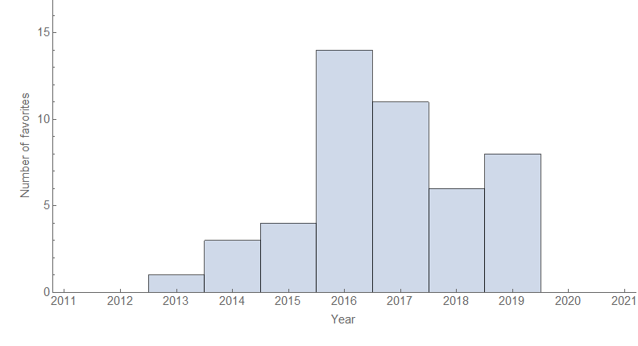
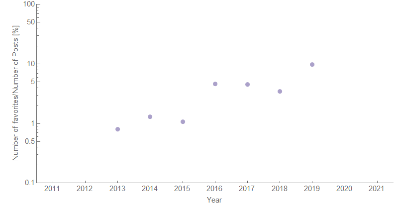

I spent the past week [on Twitter](https://twitter.com/infotranecon/status/1383528378473488387) putting up a list of my favorite posts on the blog as a kind of Irish wake for the form for the blog's 8th anniversary. As is typical on these anniversaries, a bit of statistical analysis or visualization — this time, the years of the selected favorites:

Looks like 2016-2017 was my peak by the number in my own opinion. It's not just bias by the quantity of posts, either. The most prolific year was 2015 with an average rate of a post per day. Favorites per total number has been increasing steadily — at least in terms of my own opinion, quality has been rising:

Here's the list (not in order) for posterity:

"[It's people. The economy is made out of people.](https://informationtransfereconomics.blogspot.com/2016/01/its-people-economy-is-made-out-of-people.html)"

"[Solow has science backward](https://informationtransfereconomics.blogspot.com/2017/09/solow-has-science-backward.html)"

"[Good ideas do not need lots of invalid arguments in order to gain public acceptance](https://informationtransfereconomics.blogspot.com/2017/04/good-ideas-do-not-need-lots-of-invalid.html)"

"[Maximum entropy better than game theory](https://informationtransfereconomics.blogspot.com/2015/09/maximum-entropy-better-than-game-theory.html)"

"[Lazy econ critique critiques](https://informationtransfereconomics.blogspot.com/2017/08/lazy-econ-critique-critiques.html)"

"[Can a macro model be good for policy, but not for forecasting?](https://informationtransfereconomics.blogspot.com/2017/10/can-macro-model-be-good-for-policy-but.html)"

"[Remarkable recovery regularity and other observations](https://informationtransfereconomics.blogspot.com/2014/07/remarkable-recovery-regularity-and.html)"

"[A Solow Paradox for the Industrial Revolution](https://informationtransfereconomics.blogspot.com/2019/08/a-solow-paradox-for-industrial.html)"

"[Macro criticism, but not that kind](https://informationtransfereconomics.blogspot.com/2018/05/macro-criticism-but-not-that-kind.html)"

"[Ceteris paribus and method of nascent science](http://informationtransfereconomics.blogspot.com/2016/07/ceteris-paribus-and-method-of-nascent.html)"

"[Things that changed in the 90s](https://informationtransfereconomics.blogspot.com/2019/04/things-that-changed-in-90s.html)"

"[The economic state space: a mini-seminar](https://informationtransfereconomics.blogspot.com/2016/09/the-economic-state-space-mini-seminar.html)"

"[Stocks and k-states](https://informationtransfereconomics.blogspot.com/2016/12/stocks-and-k-states.html)"

"[The ISLM model (reference post)](http://informationtransfereconomics.blogspot.com/2017/01/the-islm-model-reference-post.html)"

"[An information transfer traffic model](https://informationtransfereconomics.blogspot.com/2014/12/an-information-transfer-traffic-model.html)"

"[My introductory chapter on economics](https://informationtransfereconomics.blogspot.com/2017/09/my-introductory-chapter-on-economics.html)"

"[Keen, chaos, and equilibrium](https://informationtransfereconomics.blogspot.com/2016/10/keen-chaos-and-equilibrium.html)"

"[What mathematical theory is for](https://informationtransfereconomics.blogspot.com/2017/07/what-mathematical-theory-is-for.html)"

"[The Phillips curve and The Narrative](https://informationtransfereconomics.blogspot.com/2019/08/the-phillips-curve-and-narrative.html)"

"[UK productivity and data interpretation](https://informationtransfereconomics.blogspot.com/2018/05/uk-productivity-and-data-interpretation.html)"

"[Qualitative economics done right, part 1](http://informationtransfereconomics.blogspot.com/2017/02/qualitative-economics-done-right-part-1.html)"

"[Goldilocks complexity](http://informationtransfereconomics.blogspot.com/2016/03/goldilocks-complexity.html)"

"[Neo-Fisherism and causality](https://informationtransfereconomics.blogspot.com/2016/04/neo-fisherism-and-causality.html)"

"[Resolving the Cambridge capital controversy with MaxEnt](https://informationtransfereconomics.blogspot.com/2019/06/resolving-cambridge-capital-controversy.html)"

"[The irony of Paul Romer's mathiness](https://informationtransfereconomics.blogspot.com/2015/05/the-irony-of-paul-romers-mathiness.html)"

"[More like stock-flow inconsistent](https://informationtransfereconomics.blogspot.com/2016/03/more-like-stock-flow-in-consistent.html)"

"[Stock-flow consistency is tangential to stock-flow consistent model claims](https://informationtransfereconomics.blogspot.com/2016/12/stock-flow-consistency-is-tangential-to.html)"

"[Should the left engage with neoclassical economics?](https://informationtransfereconomics.blogspot.com/2017/04/should-left-engage-with-neoclassical.html)"

"[Milton Friedman's Thermostat, redux](https://informationtransfereconomics.blogspot.com/2019/08/milton-friedmans-thermostat-redux.html)"

"[Efficient markets and the Challenger disaster](https://informationtransfereconomics.blogspot.com/2016/08/efficient-markets-and-challenger.html)"

"[The irony of microfoundations fundamentalism](https://informationtransfereconomics.blogspot.com/2016/03/the-irony-of-microfoundations.html)"

"[What if money was made of vinegar?](https://informationtransfereconomics.blogspot.com/2014/06/what-if-money-was-made-of-vinegar.html)"

"[The 'quantity theory of labor' and dynamic equilibrium](https://informationtransfereconomics.blogspot.com/2017/03/the-quantity-theory-of-labor-and.html)"

"[No one saw this coming: Bezemer's misleading paper](https://informationtransfereconomics.blogspot.com/2018/05/no-one-saw-this-coming-bezemers.html)" ("[Letter to Dirk Bezemer](https://informationtransfereconomics.blogspot.com/2018/05/letter-to-dirk-bezemer.html)")

"[Keen](https://informationtransfereconomics.blogspot.com/2018/10/keen.html)"

"[DSGE, part 5 (summary)](https://informationtransfereconomics.blogspot.com/2016/08/dsge-part-5-summary.html)"

"[Yes, I've read Duncan Foley. \*Have you?\*](https://informationtransfereconomics.blogspot.com/2018/04/yes-ive-read-duncan-foley-have-you.html)"

"[Utility maximization and entropy maximization](https://informationtransfereconomics.blogspot.com/2015/10/utility-maximization-and-entropy.html)"

"[Is the market intelligent?](https://informationtransfereconomics.blogspot.com/2015/01/is-market-intelligent.html)"

"[DSGE Battle Royale: Christiano v. Stiglitz](https://informationtransfereconomics.blogspot.com/2018/07/dsge-battle-royale-christiano-v-stiglitz.html)"

"[The philosophical motivations](https://informationtransfereconomics.blogspot.com/2013/04/the-philosophical-motivations.html)"

"[Wage growth in NY and PA](https://informationtransfereconomics.blogspot.com/2019/10/wage-growth-in-ny-and-pa.html)" 

"[Exploration of an abstract space: prices, money, and ... ships at sea?](https://informationtransfereconomics.blogspot.com/2019/10/exploration-of-abstract-space-prices.html)"

"[Thought experiment](https://informationtransfereconomics.blogspot.com/2016/02/thought-experiment.html)"

"[Dynamic equilibrium: unemployment rate](https://informationtransfereconomics.blogspot.com/2017/01/dynamic-equilibrium-unemployment-rate.html)"

"[Labor market update: external validity edition](https://informationtransfereconomics.blogspot.com/2019/07/labor-market-update-external-validity.html)"

"[Efficient markets and the Challenger disaster](https://informationtransfereconomics.blogspot.com/2016/08/efficient-markets-and-challenger.html)"
