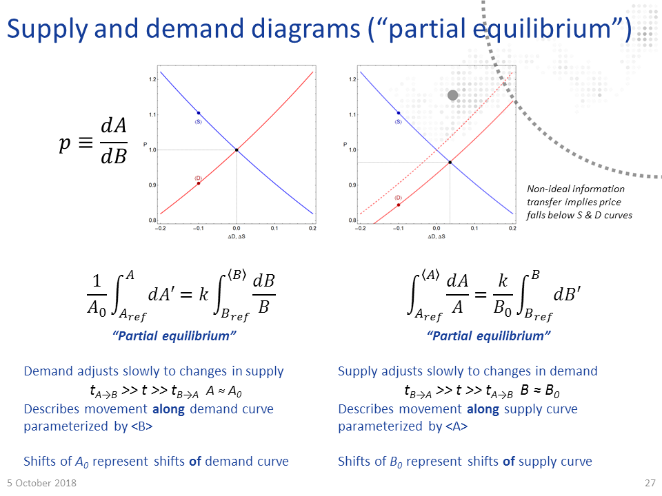

One of the benefits of the information equilibrium approach to economics is that it makes several of the implicit assumptions explicit. Over the past couple days, I was part of an exchange with Theodore on twitter that started [here](https://twitter.com/tedkalambo/status/1385656456767287301) where I learned something new about how people who have studied economics think about it — and those implicit assumptions. Per his blog, Theodore says he works in economic consulting so I imagine he has some advanced training in the field.

The good old supply and demand diagram used in Econ 101 has a lot of implicit assumptions going into it. I'd like to make a list of some of the bigger implicit assumptions in Econ 101 and how the information transfer framework makes them explicit.

**I. Macrofoundations of micro**

Theodore doesn't think the supply and demand curves in the information transfer framework \[1\] are the same thing as supply and demand curves in Econ 101. Part of this is probably a physicist's tendency to see any isomorphic system in terms of _[effect](https://en.wikipedia.org/wiki/Effective_theory)_ as the same thing. [Harmonic oscillators](https://en.wikipedia.org/wiki/Harmonic_oscillator) are basically the same thing even if the underlying models — from a pendulum, to a spring, to [a quantum field](http://users.physik.fu-berlin.de/~kleinert/b6/psfiles/Chapter-15-spontsbo.pdf) \[pdf\] — result from different degrees of freedom.

One particular difference Theodore sees is that in the derivation from the information equilibrium condition $I(D) = I(S)$, the supply curve has parameters that derive from the demand side. [He asks](https://twitter.com/tedkalambo/status/1386094682195873795):

> _For any given price you can draw a traditional S curve, independent of \[the\] D curve. Is it possible to draw I(S) curve independent of I(D)?_

Now Theodore is in good company. A [University of London 'Econ 101' tutorial](https://www.soas.ac.uk/cedep-demos/000_P570_IEEP_K3736-Demo/unit1/page_25.htm) that he linked me to also says that they are independent:

> _It is important to bear in mind that the supply curve and the demand curve are both independent of each other. The shape and position of the demand curve is not affected by the shape and position of the supply curve, and vice versa._

I was unable to find a similar statement in any other Econ 101 source, but I don't think the tutorial statement is terribly controversial. But what does 'independent' mean here?

In the strictest sense, the supply curve in the information transfer framework is independent of demand independent variables because you effectively integrate out demand degrees of freedom to produce it, leaving only supply and price. Assuming constant $S \simeq S_{0}$ when integrating the information equilibrium condition:

$$\begin{eqnarray}\int_{D_{ref}}^{\langle D \rangle} \frac{dD'}{D'} &amp; = &amp; k \int_{S_{ref}}^{\langle S \rangle} \frac{dS'}{S'}\\ &amp; = &amp; \frac{k}{S_{0}} \int_{S_{ref}}^{\langle S \rangle} dS'\\ &amp; = &amp; \frac{k}{S_{0}} \left( \langle S \rangle - S_{ref}\right)\\ \log \left( \frac{\langle D \rangle}{D_{ref}}\right) &amp; = &amp; \frac{k}{S_{0}} \Delta S \end{eqnarray}$$

If we use the information equilibrium condition $P = k \langle D \rangle / S_{0}$, then we have an equation free of any demand independent variables \[2\]:

$$\text{(1)}\qquad \Delta S = \frac{S_{0}}{k} \log \left(\frac{P S_{0}}{k D_{ref}}\right) $$

There's still that 'reference value' of demand $D_{ref}$, though. That's what I believe Theodore is objecting to. What's that about?

It's one of those implicit assumptions in Econ 101 made explicit. It represents the background market required for the idea of a price to make sense. In fact, we show this more explicitly by recognizing the the argument of the log in Eq. (1) is dimensionless. We can define a quantity with units of price (per the information equilibrium condition) $P_{ref} = k D_{ref} / S_{0}$ such that:

$$ \text{(2)}\qquad \Delta S = \frac{S_{0}}{k} \log \left(\frac{P}{P_{ref}}\right) $$

This constant sets the _scale_ of the price. What units are prices measured in? Is it 50 € or 50 ¥? In this construction, the price is set around a market equilibrium price in that reference background. The supply curve is the behavior of the system for small perturbations around that market equilibrium when demand reacts faster than supply such that the information content of the supply _distribution_ stays approximately constant at each value of price (just increasing the quantity supplied) where the scale of prices doesn't change (for example, due to inflation).

This is why I tried to ask about what the price $P$ meant in Theodore's explanations. How can a price of a good in the supply curve mean anything independently of demand? You can see the implicit assumptions of a medium of exchange, a labor market, production capital, and raw materials in [his attempt to show](https://twitter.com/tedkalambo/status/1386129729850380288) that the supply curve is independent of demand:

> _The firm chooses to produce \[quantity\] Q to maximize profits = P⋅Q − C(Q) where C(Q) is the cost of producing Q. \[T\]he supply curve is each Q that maximizes profits for each P. The equilibrium \[market\] price that firms will actually end up taking is where the \[supply\] and \[demand\] curves intersect._

There's a whole economy implicit in the definition profits $ = P Q - C(Q)$. What are the units of $P$? What sets its scale? \[4\] Additionally, the profit maximization implicitly depends on the demand for your good.

I will say that Theodore's (and the rest of Econ 101's) explanation of a supply curve is much more concrete in the sense that it's easy for any person who has put together a lemonade stand to understand. You have costs (lemons, sugar) and so you'll want to sell the lemonade for more than the cost of the lemons based on how many glasses you think you might sell. But one thing it's not is independent of a market with demand and a medium of exchange.

Some of the assumptions going into the Theodore's supply curve aren't even necessary. The information transfer framework has a useful antecedent in Gary Becker's paper _Irrational Behavior in Economic Theory_ \[Journal of Political Economy 70 (1962): 1--13\] that uses effectively random agents (i.e. maximum entropy) to reproduce supply and demand. I usually just stick with the explanation of the demand curve because it's far more intuitive, but there's also the supply side. That was concisely summarized by [Cosma Shalizi](http://bactra.org/weblog/1155.html):

> _... the insight is that a wider range of productive techniques, and of **scales** of production, become profitable at higher prices. This matters, says Becker, because producers cannot keep running losses forever. If they're not running at a loss, though, they can stay in business. So, again without any story about preferences or maximization, as prices rise more firms could produce for the market and stay in it, and as prices fall more firms will be driven out, reducing supply. Again, nothing about individual preferences enters into the argument. Production processes which are **physically** perfectly feasible but un-profitable get suppressed, because capitalism has institutions to make them go away._

Effectively, as we move from a close-in [production possibilities frontier](https://worthwhile.typepad.com/worthwhile_canadian_initi/2015/12/ppfs-and-supply-curves.html) (lower prices) to a far-out one (higher prices), the state space is simply larger \[5\]. This increasing size of the state space with price is what is captured in Eqs. (1) and (2), but it critically depends on setting a scale of the production possibilities frontier via the background macroeconomic equilibrium — we are considering perturbations around it. 

David Glasner \[6\] has written about these 'macrofoundations' of microeconomics, e.g. [here](https://uneasymoney.com/2016/06/16/whats-wrong-with-econ-101/) in relation to Econ 101. A lot of microeconomics makes assumptions that are likely only valid near a _macroeconomic_ equilibrium. This is something that I hope the information transfer framework makes more explicit.

**II. The rates of change of supply and demand**

There is an assumption about the rates of change of the supply and demand distributions made leading to Eq. (1) above. That assumption about whether supply or demand is adjusting faster \[2\] when you are looking at supply and demand curves is another place where the information transfer framework makes an implicit Econ 101 assumption explicit — and does so in a way that I think would be incredibly beneficial to the discourse. In particular, beneficial to the [discussion of labor markets](https://informationtransfereconomics.blogspot.com/2017/04/its-production-input-no-its-market-good.html). As I talk about at the link in more detail, the idea that you could have e.g. a surge of immigration and somehow classify it entirely as a supply shock to labor, reducing wages, is nonsensical in the information transfer framework. Workers are working precisely so they can pay for things they need, which means we cannot assume either supply or demand is changing faster; both are changing together. Immediately we are thrown out of the supply and demand diagram logic and instead are talking about general equilibrium.

**III. Large numbers of inscrutable agents**

Of course there is the even more fundamental assumption that an economy is made up of a huge number of agents and transactions. This explicitly enters into the information transfer framework twice: once to say distributions of supply and demand are close to the distributions of events drawn from those distributions (Borel law of large numbers), and once to go from discrete events to the continuous differential equation.

This means supply and demand cannot be used to understand markets in unique objects (e.g. art), or where there are few participants (e.g. labor market for CEOs of major companies). But it also means you cannot apply facts you discern in the aggregate to individual agents — for example see [here](https://informationtransfereconomics.blogspot.com/2017/08/lazy-econ-critique-critiques.html). An individual did not necessarily consume fewer blueberries because of a blueberry tax, but instead had their own reasons (e.g. they had medical bills to pay, so could afford fewer blueberries) that only when aggregated across millions of people produced the ensemble average effect. This is a subtle point, but comes into play more when behavioral effects are considered. Just because a behavioral explanation aggregates to a successful description of a macro system, it does not mean the individual psychological explanation going into that behavioral effect is accurate.

Again, this is made explicit in the information transfer framework. Agents are assumed to be inscrutable — making decisions for reasons we cannot possibly know. The assumption is only that agents fully explore the state space, or at least that the subset of the state space that is fully explored is relatively stable with only sparse shocks (see the next item). This is the [maximum entropy](https://en.wikipedia.org/wiki/Principle_of_maximum_entropy) / [ergodic](https://en.wikipedia.org/wiki/Ergodic_hypothesis) assumption.

**IV. Equilibrium**

Another place where implicit assumptions are made explicit is equilibrium. The assumption of being at or near equilibrium such that $I(D) \simeq I(S)$ is even in the name: information equilibrium. The more general approach is the information _transfer_ framework where $I(D) \geq I(S)$ and e.g prices fall below ideal (information equilibrium) prices. I've even distinguished these in notation, writing $D \rightleftarrows S$ for an information equilibrium relationship and $D \rightarrow S$ for an information transfer one.

Much like the concept of macrofoundations above, the idea behind supply and demand diagrams is that they are for understanding how the system responds near equilibrium. If you're away from information equilibrium, then you can't really interpret market moves as the interplay of supply and demand (e.g. [for prediction markets](https://informationtransfereconomics.blogspot.com/2015/01/is-market-intelligent.html)). Here's David Glasner from his [macrofoundations and Econ 101 post](https://uneasymoney.com/2016/06/16/whats-wrong-with-econ-101/):

> _If the analysis did not start from equilibrium, then the effect of the parameter change on the variable could not be isolated, because the variable would be changing for reasons having nothing to do with the parameter change, making it impossible to isolate the pure effect of the parameter change on the variable of interest. ..._ _Not only must the exercise start from an equilibrium state, the equilibrium must be at least locally stable, so that the posited small parameter change doesn’t cause the system to gravitate towards another equilibrium — the usual assumption of a unique equilibrium being an assumption to ensure tractability rather than a deduction from any plausible assumptions – or simply veer off on some explosive or indeterminate path._

In the dynamic information equilibrium model (DIEM), there is an explicit assumption that equilibrium is only disrupted by _sparse_ shocks. If shocks aren't sparse, there's no real way to determine the dynamic equilibrium rate $\alpha$. This assumption of sparse shocks is similar to the assumptions that go into understanding [the intertemporal budget constraint](https://informationtransfereconomics.blogspot.com/2015/10/when-is-intertemporal-budget-constraint.html) (which also needs to have an explicit assumption that consumption _**isn't**_ sparse).

**Summary**

Econ 101 assumes a lot of things — from the existence of a market and a medium of exchange, to being in an approximately stable macroeconomy that's near equilibrium, to the rates of change of supply and demand in response to each other, to simply the existence of a large number of agents.

This is usually fine — introductory physics classes often assume you're in a gravitational field, near thermodynamic equilibrium, or even a small cosmological constant such that condensed states of matter exist. Econ 101 is trying to teach students about the world in which they live, not an abstract one where an economy might not exist.

The problem comes when you forget these assumptions or try to pretend they don't exist. A lot of 'Economism' (per [James Kwak's book](https://www.penguinrandomhouse.com/books/536159/economism-by-james-kwak/)) or '101ism' (see [Noah Smith](http://noahpinionblog.blogspot.com/2016/01/101ism.html)) comes from not recognizing the conclusions people drawn from Econ 101 are dependent on many background assumptions that may or may not be valid in any particular case.

Additionally, when you forget the assumptions you lose understanding of model scope (see [here](https://informationtransfereconomics.blogspot.com/2015/10/we-built-this-theory-on-scope-conditions.html), [here](https://informationtransfereconomics.blogspot.com/2016/06/macroeconomists-are-weird-about-theory.html), or [here](https://informationtransfereconomics.blogspot.com/2016/01/more-on-scope.html)). You start applying a model where it doesn't apply. You start thinking that people who don't think it applies are dumb. You start thinking Econ 101 is the only possible description of supply and demand. _It's basic Econ 101! Demand curves slope down \[7\]! That's not a supply curve!_

...

**Footnotes:**

\[1\] The derivation of the supply and demand diagram from information equilibrium is actually older than this blog — I had written it up as a draft paper after working on the idea for about two years after learning about the information transfer framework of [Fielitz and Borchardt](https://arxiv.org/abs/0905.0610). I posted the derivation [on the blog](https://informationtransfereconomics.blogspot.com/2013/04/supply-and-demand-from-information.html) the first day eight years ago.

\[2\] In fact, a demand curve doesn't even _exist_ in this formulation because we assumed the time scale $T_{D}$ of changes in demand is much shorter than the time scale $T_{S}$ of changes in supply (i.e. supply is constant, and demand reacts faster) — $T_{S} \gg T_{D}$. In order to get a demand curve, you have to assume _the exact opposite relationship_ $T_{S} \ll T_{D}$. The two conditions cannot be simultaneously true \[3\]. The supply and demand diagram is a useful tool for understanding the logic of particular changes in the system inputs, but the lines don't really exist — they represent counterfactual universes outside of the equilibrium.

\[3\] This does not mean there's no equilibrium intersection point — it just means the equilibrium intersection point is the solution of the more general equation valid for $T_{S} \sim T_{D}$. And what's great about the information equilibrium framework is that the solution, in terms of a supply and demand diagram, is in fact a point because $P = f(S, D)$ — one price for one value of the supply distribution and one value of the demand distribution.

\[4\] This is another area where economists treat economics like mathematics instead of as a science. There are no scales, and if you forget them sometimes you'll take [nonsense limits](https://informationtransfereconomics.blogspot.com/2015/11/on-limits.html) that are fine for a real analysis class but useless in the real world where infinity does not exist.

\[5\] For some fun discussion of another reason economists give for the supply curve sloping up — a 'bowed-out' production possibilities frontier — see my post [here](https://informationtransfereconomics.blogspot.com/2016/02/production-possibilities-and-slope-of.html). Note that I effectively reproduce that using Gary Becker's 'irrational' model by looking at the size of the state space as you move further out. Most of the volume of a high dimensional space is located near its (hyper)surface. This means that [selecting a random path through it](https://informationtransfereconomics.blogspot.com/2016/02/production-possibilities-and-brownian.html), assuming you can explore most of the state space, will land near that hypersurface.

\[6\] David Glasner is also the economist [who realized the connections](https://informationtransfereconomics.blogspot.com/2015/10/gary-beckers-emergent-rational-agents.html) between information equilibrium and Gary Becker's paper.

\[7\] Personally like [Noah Smith's rejoinder](http://noahpinionblog.blogspot.com/2016/01/101ism.html) about this aspect of 101ism — econ 101 does say they slope down, but not necessarily with a slope $| \epsilon | \sim 1$. They could be almost completely flat. There's nothing in econ 101 to say otherwise. PS — had a conversation about demand curves with [our friend Theodore as well](https://twitter.com/tedkalambo/status/1354149788514709509) earlier this year.
