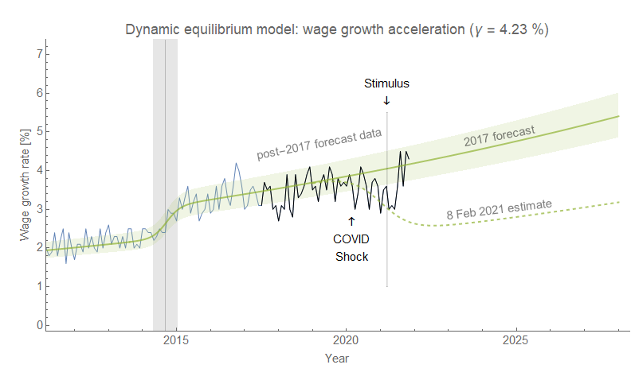
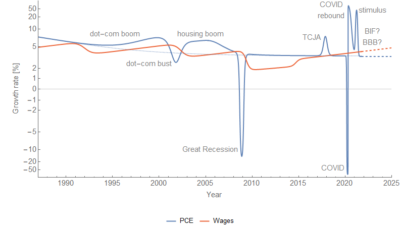
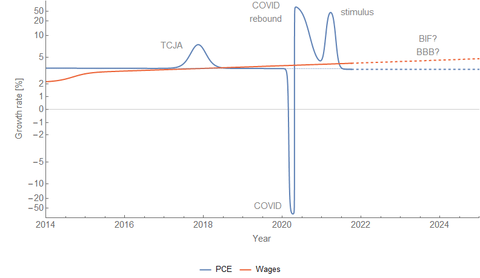

From my "[Limits to wage growth](https://informationtransfereconomics.blogspot.com/2018/10/limits-to-wage-growth.html)" post from roughly three years ago:

> _If we project wage growth and NGDP growth using the models, we find that they cross-over in the 2019-2020 time frame. Actually, the exact cross-over is 2019.8 (October 2019) which not only eerily puts it in October (when a lot of market crashes happen in the US) but also is close to the 2019.7 value estimated for yield curve inversion based on extrapolating the path of interest rates. ..._
>
> _This does not mean the limits to wage growth hypothesis is correct — to test that hypothesis, we'll have to see the path of wage growth and NGDP growth through the next recession. This hypothesis predicts a recession in the next couple years (roughly 2020)._

We did get an NBER declared recession in 2020, but since I have ethical standards ([unlike some people](https://informationtransfereconomics.blogspot.com/2018/10/keen.html)) I will not claim this as a successful model prediction as the causal factor is pretty obviously COVID-19. So when is the next recession going to happen? 2027.

Let me back up a bit and review the 'limits to wage growth' hypothesis. It says that when nominal wage growth reaches nominal GDP (NGDP) growth, a recession follows pretty quickly after. There is a Marxist view that when wage growth starts to eat into firms' profits, investment declines, which triggers a recession. That's a plausible mechanism! However, I will be agnostic about the underlying cause and treat it purely as an empirical observation. Here's an updated version of the graph from the original post (click to enlarge). We see that recessions (beige shaded regions) occur roughly where wage growth (green) approaches NGDP growth (blue) — indicated by the vertical lines and arrows.

Overall, the trend of NGDP growth gives a pretty good guide to where these recessions occur with only the dot-com bubble extending the lifetime of the 90s growth in wages. In the previous graph, I also added some heuristic paths prior to the Atlanta Fed time series as a kind of plausibility argument of how this would have worked in the 60s, 70s, and 80s. If we zoom in on the recent data (click to enlarge) we can see how the COVID recession decreased wage growth:

This is the most recent estimate of the size of the shock to wage growth with data through June 2021 (the [previous estimate](https://twitter.com/infotranecon/status/1415390878173073410) was somewhat larger). If we show this alongside trend NGDP growth (about 3.8%, a.k.a. the [dynamic equilibrium](https://informationtransfereconomics.blogspot.com/2018/01/24-growth-forever.html)) we see the new post-COVID path intersects it around 2027 (click to enlarge):

Now this depends on a lack of asset boom/bust cycles in trend NGDP growth — which can push the date out by years. For example, by trend alone we should have expected a recession in 1997/8; the dot-com boom pushed the recession out to 2001 when NGDP crashed down below wage growth. However, this will be obvious in the NGDP data over the next 6 years — it's not an escape clause for the hypothesis.

**Epilogue**

One reason I thought about looking back at this hypothesis was [a blog post](https://uneasymoney.com/2021/07/28/why-price-stickiness-matters-or-doesnt/) from David Glasner, writing about an argument about the price stickiness mechanism in (new) Keynesian models \[1\]. I found myself reading lines like "wages and prices are stuck at a level too high to allow full employment" — something I would have seen as plausible several years ago when I first started learning about macroeconomics — and shouting (to myself, as I was on an airplane) "This has no basis in empirical reality!"

Wage growth declines in the aftermath of a recession and then continues with its prior log growth rate of 0.04/y. Unemployment rises during a recession and then continues with its prior rate of decline −0.09/y \[2\]. [These two measures are tightly linked](https://informationtransfereconomics.blogspot.com/2018/10/building-models.html). [Inflation falls briefly](https://informationtransfereconomics.blogspot.com/2019/03/the-beginnings-of-information.html) about 3.5 years after a decline in labor force participation — and then continues to grow at 1.7% (core PCE) to 2.5% (CPI, all items).

These statements are entirely about **_rates_**, not **_levels_**. And if the hypothesis above is correct, the causality is backwards. It's not the failing economy reducing the level of wages that can be supported at full employment — the recession is **_caused by_** wage growth exceeding NGDP growth, which causes unemployment to rise, which then causes wage growth to decline about 6 months later.

Additionally, since both NGDP and wages here are _**nominal**_ monetary policy won't have any impact on this mechanism. And empirically, it doesn't. While the **_social_** effect of the Fed may stave off the panic in a falling market and rising unemployment, once the bottom is reached and the shock is over the economy (over the entire period for which we have data) just heads back to its equilibrium −0.09/y log decline in unemployment and +0.04/y log increase in wage growth.

Of course this would mean the core of Keynesian thinking about how the economy works — in terms of wages, prices, and employment — is flawed. Everything that follows from _The General Theory_ from post-Keynesian schools to the neoclassical synthesis to new Keynesian DSGE models to monetarist ideology is fruit of a poisonous tree.

Keynes [famously said we shouldn't fill in the values](https://equitablegrowth.org/must-read-john-maynard-keynes-1938-on-tinbergen-to-harrod/):

> _In chemistry and physics and other natural sciences the object of experiment is to fill in the actual values of the various quantities and factors appearing in an equation or a formula; and the work when done is once and for all. In economics that is not the case, and to convert a model into a quantitative formula is to destroy its usefulness as an instrument of thought._ 

No wonder his ideas have no basis in empirical reality!

...

**Update 19 November 2021**

The stimulus of 2021 seems to have pushed up both GDP growth and wage growth. In fact, wage growth appears to have returned to its prior equilibrium:

If this trend continues and the BIF (and/or BBB, if passed) doesn't bring GDP growth above its historical 3.8% average outside of shocks, then that brings the recession date back to ... around now. Looking at PCE (consumption) instead of GDP (as the former is updated more frequently than the latter, but both show almost the exact same structure), we are back to being above that long run growth limit (click to enlarge):

Zooming in on the more recent years (click to enlarge):

PS: New arctan axes just dropped.

...

Footnotes:

\[1\] Also, [wages / prices aren't individually sticky](https://informationtransfereconomics.blogspot.com/2019/05/prices-are-sticky-except-when-they.html). The distribution of changes might be sticky ([emergent macro nominal rigidity](https://informationtransfereconomics.blogspot.com/2015/04/micro-stickiness-versus-macro-stickiness.html)), but prices or wages that change by 20% aren't in any sense "sticky".

\[2\] Something [Hall and Kudlyak (Nov 2020)](https://www.nber.org/papers/w28111) picked up on somewhat after [I wrote about it](https://papers.ssrn.com/sol3/papers.cfm?abstract_id=3094757) (and even [used the same example](https://twitter.com/infotranecon/status/1411384311253585921)).
