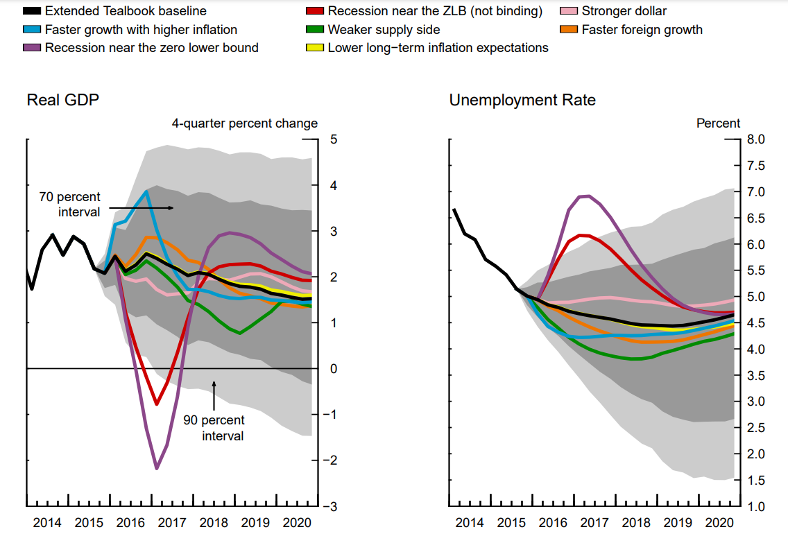
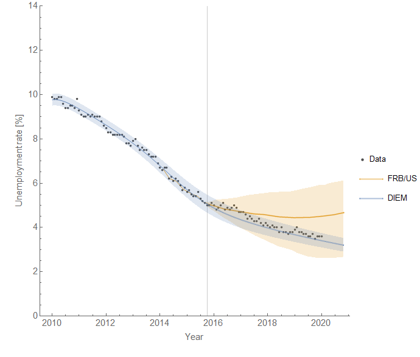
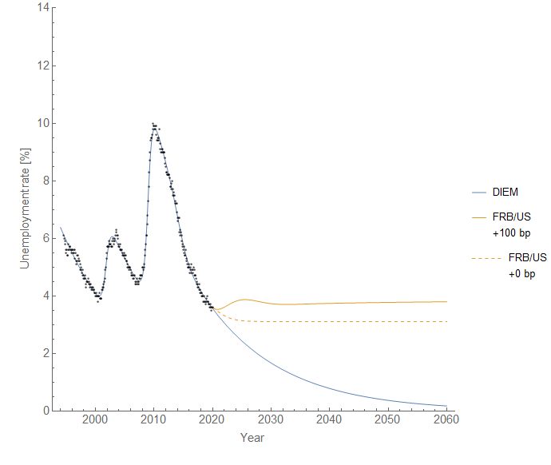
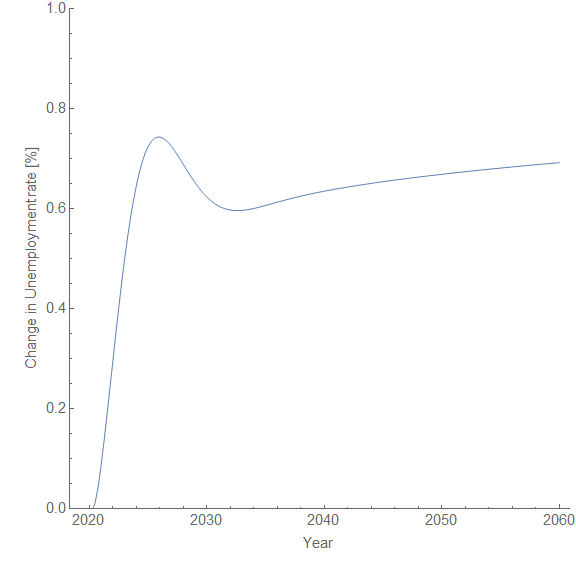
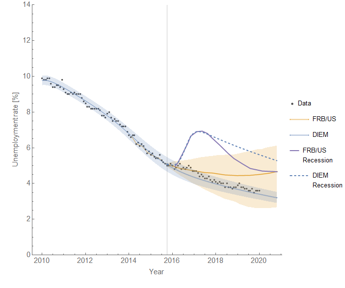
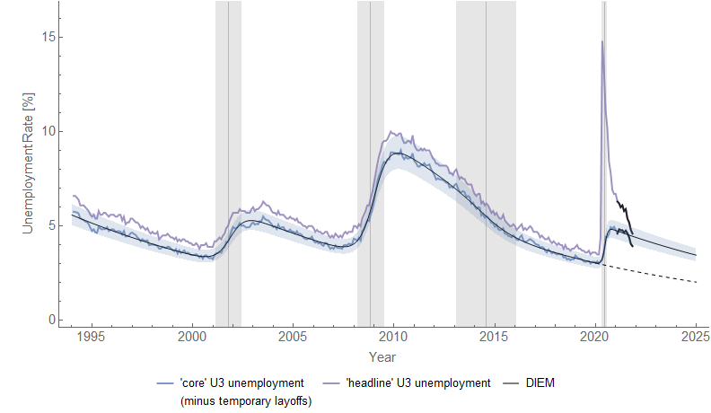
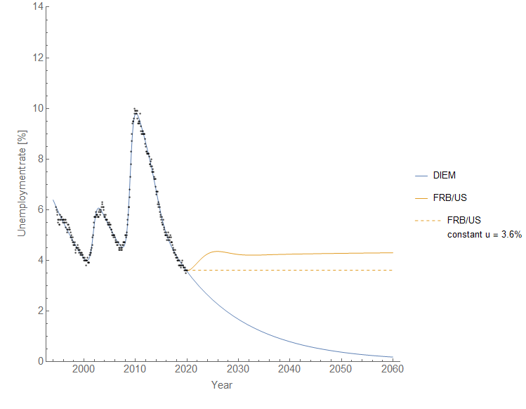
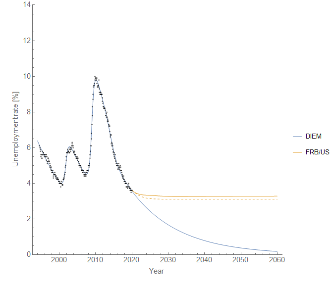

Per a question in my Twitter DMs, I thought I'd do a comparison between [the Dynamic Information Equilibrium Model (DIEM)](https://papers.ssrn.com/sol3/papers.cfm?abstract_id=3094757) and the FRB/US model of the unemployment rate. I've not done this comparison that I can recall. I've previously looked at point forecast comparisons between the different Fed models (e.g. [here](https://informationtransfereconomics.blogspot.com/2018/10/comparing-to-fed-forecasts-from-2014.html) for 2014). [In another post](https://informationtransfereconomics.blogspot.com/2018/09/forecasting-great-recession.html), I took the DIEM model through the Great Recession following along with the Fed _Greenbook_ forecasts. [And in an even older post](https://informationtransfereconomics.blogspot.com/2014/09/jason-versus-fed.html) (prior to the development of the DIEM), I looked at inflation forecasts from the FRB/US model.

The latest and most relevant Fed Tealbook forecast from the FRB/US model that seems to be available is [here](https://www.federalreserve.gov/monetarypolicy/files/FOMC20151216tealbooka20151209.pdf) \[pdf\] — it's from December 2015. I've excerpted the unemployment rate forecast (along with several counterfactuals) in the following graphic:

Now something that should be pointed out is that the FRB/US model does a lot more than the unemployment rate — GDP, interest rates, inflation, etc. While there are separate models in the information equilibrium framework covering a lot of those measures, the combination of the empirically valid relationships into a single model is still incomplete (see [here](https://informationtransfereconomics.blogspot.com/2019/03/the-beginnings-of-information.html)). However, in the DIEM the unemployment rate is essentially unaffected by other variables in equilibrium (declining at the equilibrium rate of _d/dt_ log _u_ ≃ −0.09/y \[0\]). Therefore, whatever the other variables in an eventual information equilibrium macro model, comparing the unemployment rate forecasts alone should be valid — especially since we are going to look at the period 2016 to 2020 (prior to the COVID shock).

Setting the forecast date to be the end of Q3 of 2015 just prior to the meeting, we can see the central forecast for the DIEM does worse at first but is better over the longer run (click to enlarge):

The big difference lies not just in the long run but in the error bands, with the DIEM being much narrower. These are apples-to-apples error bands as we can see the baseline FRB/US forecast in the graph at the top of the post is conditional on a lack of a recessionary shock (those are the red and purple lines above) \[1\].

Additional differences come in what we **_don't_** see. Looking at [the latest 2018 update to the FRB/US model](https://www.federalreserve.gov/econres/notes/feds-notes/overview-of-the-changes-to-the-frb-us-model-2018-20181207.htm), we get information about the impulse responses to a 100 bp increase in the Fed funds rate. Now the Fed usually doesn't do 100 bp changes (typically 25 bp), so this is a large shock. But it also creates a forecast path that looks nothing like anything we have seen in the historical data \[3\]:

And while yes this 0.7 pp increase in the unemployment rate is following a 100 bp increase in Fed funds rate when we usually see only 25 bp increases \[4\], this would, per the [Sahm Rule](https://en.wikipedia.org/wiki/Sahm_Rule), indicate a recession — and therefore almost certainly further increases beyond the initial 0.7 pp.

Now it is true we don't see the unemployment rate falling continuously, asymptotically approaching zero, as would be indicated in the DIEM. However, we also haven't had a period of 40 years uninterrupted by a recession required for it to happen.

The FRB/US model has hundreds of parameters for hundreds of variables — however, it doesn't even qualitatively capture the behavior of the empirical data for the unemployment rate. This is likely due to what Noah Smith called "[big unchallenged assumptions](https://noahpinionblog.blogspot.com/2015/08/the-macromicro-validity-tradeoff.html)" — in order to get an unemployment rate path to look more like the data, trade-offs would have to be made on other variables that make them look far worse. You could probably come up with something that looks a lot like the FRB/US model with a giant system of linear equations with several lags. Simultaneously fitting all of variables you chose to model can create results that look not entirely implausible when you look at all the model outputs as a group, but individually do not qualitatively describe what we see. The reason? You chose (and probably constrained) several variables to have relationships that are empirically invalid — therefore any fit is going to have variables that come out looking wrong.

I imagine the impact of an increase in the Fed funds rate on the unemployment rate is one of those chosen relationships. Looking through the historical data, there is no particular evidence that raising rates _causes_ unemployment to rise nor vice versa. In fact, it seems rising unemployment causes the Fed to start lowering rates \[5\]! But forcing such a relationship, after estimating all the model parameters, likely contributes to not just forecasting error, but making the unemployment rate do strange things.

...

**Footnotes**

\[0\] See also Hall and Kudlyak (2020) which arrives at the same rate of decline.

\[1\] Here's what a recession shock of the same onset would look like in the DIEM (click to enlarge):

I should add there is a bit of nuance here as this is under the assumption of an historical level of temporary layoffs in a recession. The COVID recession had the largest surge of temporary layoffs in the entire time series data set — and that [created different dynamics](https://informationtransfereconomics.blogspot.com/2021/02/ongoing-evolution-of-time-series-after.html) \[2\] (click to enlarge):

\[2\] The latest data appears to be showing [a positive shock due to the stimulus](https://twitter.com/infotranecon/status/1456649235466653702).

\[3\] I based the counterfactual "no rate increase" on the typical flattening we see in other FRB/US forecasts. It's really not a big difference to just use the last 2020 data point and say the future is constant as the counterfactual (click to enlarge):

\[4\] Here's an estimate from a 25 bp increase in the Fed funds rate where I just took the shock and multiplied it by 0.25 (click to enlarge):

\[5\] More [here](https://informationtransfereconomics.blogspot.com/2019/04/interest-rates-and-inflation.html).
