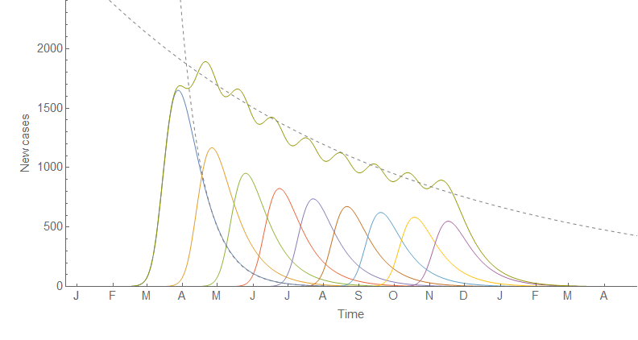
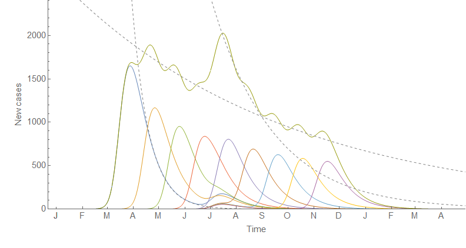
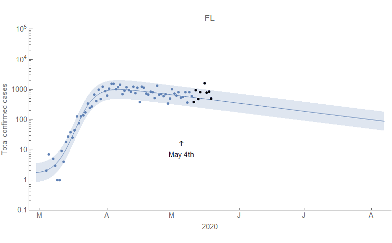
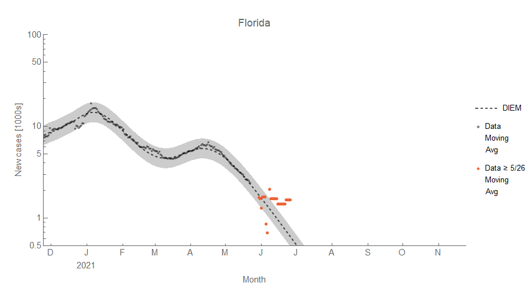

What with the US just sort of giving up on doing anything about COVID-19 and just letting it spread it's become just too depressing to continue to track the models day after day. On the radio yesterday I heard that King county (which includes Seattle area, where I live) isn't going to be focusing on tracking cases anymore — so I imagine the quality of the data is going to drop precipitously in the coming months unless there's a new more deadly variant. Therefore I'm going to stop working on them, and this is going to be an outbrief of the successes and failures of using the [Dynamic Information Equilibrium Model (DIEM) for COVID-19](#).

**\*  \*  \***

We'll start with the big failure at the end — the faster than expected rate of decline (the dynamic equilibrium) in several places after the omicron surge. The examples here are New York and Texas. Red points are after the model parameters were frozen, gray points before.

You can see the latest BA.2 surge in March and April of 2022. These of course result in over-predictions of the cumulative cases:

The (purportedly) constant rate of decline was one of the major components of the model which means there is something serious that the model is not helping us understand. There are several possibilities that don't mean the model is useless: 1) the sparse surge assumption is violated, 2) we're seeing a more detailed aspect of the model, 3) ubiquitous vaccination/exposure, 4) omicron is different, or 5) aggregating constituencies introduces more complex behavior.

**1\.** The first possibility I discussed in an update to [the original blog post on using the DIEM for COVID-19](https://informationtransfereconomics.blogspot.com/2020/07/dynamic-information-equilibrium-and.html). I also discussed it in [this Twitter thread](https://twitter.com/infotranecon/status/1361044544620351489). The basic idea was that surges were happening too close together to get a good measurement of the dynamic equilibrium rate of decline. Sweden was the prototypical case in the summer of 2020 and it started to become visible in the US in early 2021. The faster rate of decline was like seeing the actual rate for the first time without a another surge happening. We can see a new estimate of the rate of decline from all the data makes NY work just fine:

Early on, this can be a compelling rationale. However, the issue with this is that we can't just keep using that excuse — _ok, now we have a good estimate! No wait, now we do._ Additionally it didn't change in other countries (see 4) which had just as much sparseness (or rather lack thereof). 

**2\.** The constant rate of decline is actually an approximation in the DIEM. [In my original paper](https://papers.ssrn.com/sol3/papers.cfm?abstract_id=3094757), the dynamic equilibrium is related to the information transfer index _k_ which can drift slowly over time as the virus spreads:

Again, the question comes up as to why it changed in US states but not in the EU (see 4) — so this also isn't very compelling.

**3\.** Ubiquitous vaccination or exposure is how outbreaks are limited in epidemiological models such as the [SIR models](https://en.wikipedia.org/wiki/Compartmental_models_in_epidemiology#The_SIR_model) where the S stands for susceptible — i.e. the unvaccinated or those who never had the virus. Again, while the US pretty much let the virus spread unchecked such that it's likely that almost everyone got it providing some protection from getting it again, it doesn't explain why we don't see the faster rate of decline from omicron in e.g. Europe or even in smaller constituencies of the US e.g. King county, WA (see 4).

**4\.** Moving on to the fourth possibility — omicron is different — we can probably discount it to some degree because in several places, the constant dynamic equilibrium prediction worked just fine. For example the EU:

Although the surge size was underestimated, we can see not only does the omicron surge return to the same rate of decline but so does the BA.2 variant surge (indicated by diagonal lines in the graph). We also see it in the EU member France:

While the decline in the omicron surge was interrupted by the BA.2 variant surge, we can see the that the model (which cannot predict new surges, only detect them) was doing fine until that point. So saying "omicron was different" is not a good answer — it would be ad hoc to say it is different for one place and not another. In fact, it wasn't even different in parts of the US — King County in Washington State (which contains Seattle) also appeared to follow the predicted rate of decline until the BA.2 surge:

**5\.** The last possibility I'm listing is one that [I came up with as an alternative](https://twitter.com/infotranecon/status/1358637200091410433) to 1) back in early 2021: we're seeing the aggregate of several surges which can have different behavior than a single surge. Part of this is borne out in the data — the surges for smaller constituencies (cities, counties) generally have faster rates of recovery than larger ones (states, countries). The dynamic equilibrium we see at the aggregate level is a combination of these faster surges. In this graph the slow rate is made up of several smaller surges with a faster rate (exponential rates shown with dashed lines) combined with a network structure i.e. some power law in the size of the surges due to starting in big cities and diffusing to smaller ones.

We see the faster rates at the lower level and a slower rate at the aggregate level. If there is some temporal alignment of those local surges — a holiday, a big event, or (in the omicron case) introduction of a faster spreading variant of the virus — it can align some of those "sub-surges" and briefly show us the intrinsic faster rate at the lower level in the aggregate data:

This is probably the best explanation — the US is a lot more spread out and rural than the EU, and so has a lot more subcomponents from a modeling standpoint. This does require more effort to model than just information theory and _virus + healthy person → sick person_, which means that at best the DIEM is a leading order approximation. This is more satisfying in the sense that _the DIEM is supposed to be a leading order approximation_ — epidemiology and economics are complex subjects and we should be surprised that the DIEM worked as well as it has for COVID-19 and the unemployment rate.

**\*  \*  \***

There was one model failure that was just weird: the UK.

In July of 2021 the rate of decline was so fast but ended so quickly that I put in by hand the one and only negative shock — then immediately after that, the case counts just went sideways. The more recent data has given us back the surge structure apparent in the rest of the world where the case counts are high enough, but the second half of 2021 in the UK is just inexplicable in the model with any kind of confidence.

**\*  \*  \***

So what is the model good for? Well, first off it's incredibly simple — surges followed by a constant (exponential) rate of decline. And that constant rate of decline seems to be a reasonable first order approximation; it's a starting point. We can see it held ("fixed _α_" on the graph) in Florida from mid-2021 until recently with the faster rate of decline noted above:

It was also good at detecting surges getting started. The [original example](https://informationtransfereconomics.blogspot.com/2020/07/dynamic-information-equilibrium-and.html) was Florida in May of 2020:

And again in June of 2021:

Note that despite getting the slope wrong, you can still see the new surge getting started in late February as a change from the straight line decline (on a log graph) after the omicron surge in this example from New York:

Looking at the log graph for a deviation from exponential (i.e. straight line) decline as a sign of a new surge became more common (at least on Twitter). Those of us monitoring our log plots saw surges getting started while the media seemed to only react when it sees an actual rise in cases — typically 2-3 weeks later. It's the closest I've felt to having an actual crystal ball \[1\].

So in that sense, the DIEM has been useful in understanding the COVID-19 pandemic. It's a simple first order approximation that can help detect when surges are getting started.

...

**Footnotes:**

\[1\] Side note: because of the typical duration of surges (3-4 weeks), the point when the media became focused on a surge tended to be the start of the inflection point signaling the beginning of the surge recovery.
