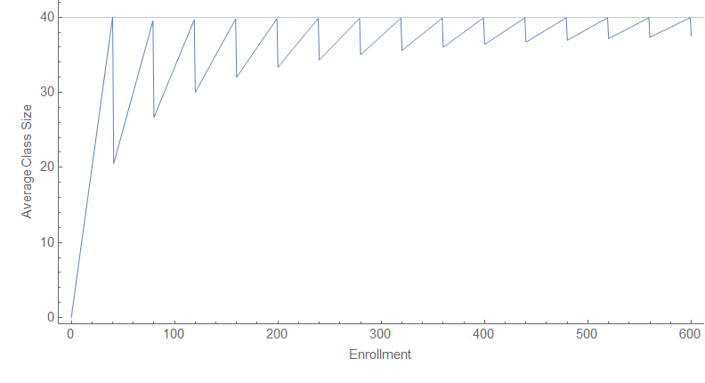
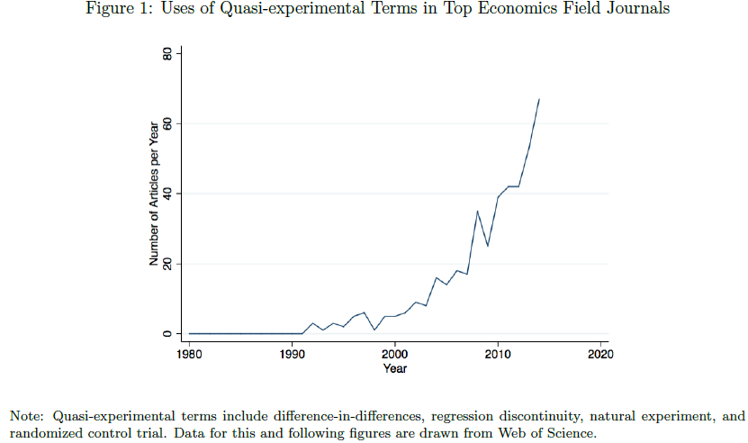
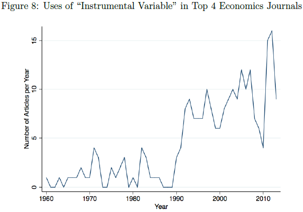

Noah Smith made a stir with his claim that historians make theories without empirical backing — something I think is a bit of a category error. I mean even if historian's "theories" truly are "it happened in the past, so this can happen again", that the study of history gives us a sense of the available state space of human civilization, then that observation is such a small piece of the available state space as to carry zero probability on its own. You'd have to resort to some kind of historical anthropic principle that the kind of states humans have seen in the past are the more likely ones when you have a range of theoretical outcomes comparable to the string theory landscape \[1\]. But that claim is so dependent on its assumption it could not rise to the idea of a theory in empirical science.

Regardless of the original point, some of the pushback came in the form of pot/kettle tu quoque "economics isn't empirical either", to which on at least one occasion Noah countered by citing Angrist and Pischke (2010) on the so-called credibility revolution.

Does it counter, though? Let's dig in.

**Introduction**

I do like the admission of inherent bias in the opening paragraph — the authors cite some critiques of econometric practice and wonder if their own grad school work was going to be taken seriously. However, they never point out that this journal article is something of an advertisement for the authors' book "Mostly Harmless Econometrics: An Empiricist's Companion" (they do note that it's available)

The main thrust of the article is that the authors claim the quality of empirical research design has improved over time with the use of randomization and natural experiments alongside increased scrutiny of confounding variables. They identify these improvements and give examples of where they are used. Almost no effort is made to quantify this improvement or show that the examples are representative (many are Angrist's own papers) — I'll get into that more later. First, let's look at research design.

**Research design**

The first research design is the randomization experiment. It's basically an approach wholesale borrowed from medicine (which is why the terms like treatment group show up). Randomized experiments have their own ethical issues documented by others that I won't go into here. The authors acknowledge this, so let's restrict our discussion to randomization experiments that pass ethical muster. Randomization relies on major assumptions about the regularity of every other variable — in a human system this is enormous so explicit or implicit theory is often used to justify isolation for the relevant variables. I talk more about theoretically isolating variables in the context of Dani Rodrik's book [here](https://informationtransfereconomics.blogspot.com/2015/09/whats-wrong-with-dani-rodriks-view-of.html) — suffice to say this is where a lot of non-empirical rationalization can enter the purportedly empirical randomization experiment.

The second is natural experiments. Again these rely on major assumptions about the regularity of every other variable, usually from theory. The authors discuss Card (1990) which is the good way to do this — showing there was no observable effect on wages from a labor surge in Miami.

However, contra Angrist and Pischke's thesis, Card draws conclusions based on the implicit theory that a surge of labor should normally cause wages to fall so there must be some just-so story about Miami being specifically able to absorb the immigration — the conclusion was not the one you would derive from the empirical evidence. It's true that Card was working in an environment where supply and demand in the labor market was the dominant first order paradigm so he likely had to make some concession to it. This is why this paper is best seen as "no observable effect on wages", but not really a credibility revolution because it doesn't take the empirical data seriously enough to say maybe the theory is wrong. As a side note, [it's easily fixed with a better framework](https://informationtransfereconomics.blogspot.com/2017/04/its-production-input-no-its-market-good.html) for understanding supply and demand.

The authors go on to cite Jacob (2004) which draws the conclusion in the abstract that public housing had no effect on educational outcomes because demolishing public housing projects in Chicago has no effect on educational outcomes purportedly because the people relocate to similar areas. However, this conclusion 1) misrepresents the effect actually seen in the paper (no observable effect on outcomes for children < 14 years, but older students were more likely to drop out), and 2) misses out on the fact that the effort may be insufficient in the first place. It is possible the lack of funding for as well as the subsequent decay and demolition of public housing creates a scenario where the limited effort expended is insufficient to create a positive effect in the first place — therefore it does not mean public housing is ineffective on educational outcomes as a policy. The dose of medicine may be too small but this natural experiment assumes the dose was sufficient in order to draw its conclusion.

There is also the lack of analysis of the macro scale where demolition of public housing projects is one among a myriad of public policy choices that disproportionately negatively impact Black people — that the demolition is just one thing in the way among many such that negative educational outcomes may be due to e.g. a series of similar upsets (public housing demolished, parent loses a job, parents are denied a mortgage because of racism) where not every kid experiences the same subset. The aggregate effect is negative educational outcomes overall, so you need a lot more data to tease out the effect of any single factor. There's a desert with poisonous snakes, no water, no shade, choking sand, and freezing nights — solving one of those problems and seeing people still die does not mean solving one problem was not effective.

The authors proceed in the introduction to look at the historical development of exploiting various "natural experiments" such as the variation across states. However I've pointed out the potential issues [here](https://informationtransfereconomics.blogspot.com/2019/10/wage-growth-in-ny-and-pa.html) with regard to a particular study of the minimum wage using the NY/PA border as the natural experiment. The so-called credibility revolution often involves making these assumptions ("obviously, straight lines on maps obviously have no effects") without investigating a bit more (like I did at the link using Google maps as a true empiricist).

**Credibility and non-empirical reasoning**

Empirical credibility is like the layers of an onion. Using natural experiments and randomized quasi-experiments peels back one layer of non-empirical reasoning, but the next layer appears to be the armchair theory assumptions used to justify the interpretations of those "experiments". Per the link above about the issues with isolating variables, it is possible to do this using armchair theory if you have an empirically successful theoretical framework that already tells you how to isolate those variables — but that's not the case in economics.

The biggest things in the empirical sciences that prevent this infinite regress/chicken and egg problem are successful predictions. If you regularly and accurately predict something, that goes a long way towards justifying the models and methods used because it relies on the simple physical principle that we cannot get information from the future (from all us physicists out there: you're welcome). But at a very basic level, what will turn around the credibility of economics is the production of _useful_ results. Not useful from, say, a political standpoint where results back whatever policy prescription you were going to advocate anyway — useful to people's lives. [I've called this the method of nascent science](https://informationtransfereconomics.blogspot.com/2016/07/ceteris-paribus-and-method-of-nascent.html).

This does not necessarily include those studies out there that say natural experiment X says policy Y (with implicit assumptions Z) had no effect in the aggregate data. Raising the minimum wage seems to have no observable effect in the aggregate data, but raising the minimum wage is useful to the people who get jobs working at minimum wage at the individual level. Providing health care randomly in Oregon may not have resulted in obvious beneficial outcomes at the aggregate level, but people who have access to health care are better off at the individual level. In general, giving people more money is helpful at the individual level. If there's no observable aggregate effect in either direction (or even a 1-sigma effect in either direction), that's not evidence we shouldn't do things that obviously help the people that get the aid.

The article discusses instrumental variables, but says that economists went from not explaining why instrumental variables were correct at all to creating just-so stories for them or just being clever (even dare I say it, contrarian) about confounding variables. I mean calling it a "credibility revolution" when other economists finally think a bit harder and start to point out serious flaws in research design when there was no reason these flaws couldn't have been pointed out before the 1980s is a bit of an overstatement. I mean from the looks of it, it could be equally plausible that economists only started to read each other's empirical papers in the 80s \[2\].

You can see the lack of empirical credibility in the way one of these comments in the article is phrased.

> _For example, a common finding in the literature on education production is that children in smaller classes tend to do worse on standardized tests, even after controlling for demographic variables. This apparently perverse finding seems likely to be at least partly due to the fact that struggling children are often grouped into smaller classes._

It's not that they proved this empirically. There's no citation. It just "seems likely" to be "at least partly" the reason. Credibility revolution! Later they mention "State-by-cohort variation in school resources also appears unrelated to omitted factors such as family background" in a study from Card and Krueger. No citation. No empirical backing. Just "appears unrelated". Credibility revolution! It should be noted that this subject is one of the author's (Angrist) common research topics and has a paper that says smaller class sizes are better discussed below — Angrist could easily be biased in these rationalizations in defense of their own work. Credibility revolution!

There's another one of these "nah, it'll be fine" assurances that I'm not entirely sure is even correct:

_> ... we would like students to have similar family backgrounds when they attend schools with grade enrollments of 35–39 and 41–45 \[on either side of the 40 students per class cutoff\]. One test of this assumption... is to estimate effects in an increasingly narrow range around the kink points; as the interval shrinks, the jump in class size stays the same or perhaps even grows, but the estimates should be subject to less and less omitted variables bias._  

I wracked my brain for some time trying to think of a reason omitted variable bias would be reduced when comparing sets of schools with enrollments of 38-39 vs 41-42 as opposed to comparing sets of schools enrollments of 35-39 vs 41-45. They're still sets of different schools. By definition your omitted variables do not know about the 40 students per class cutoff, so should not have any particular behavior around this point. It just seems like your error bars get bigger due to using a subsample. Plus, the point where you have the most variation in your experimental design is in the change of class sizes from an average of ~ 40 to an average of ~ 20 in a school with an enrollment going from 40 to 41 meaning that individual students are having the most impact precisely at the point where you are trying to extract the biggest signal of your effect. See figure below. Omitted variable bias is increased at that point due to the additional weight of individual students in the sample! It could be things you wouldn't even think of because they apply to a single student — like an origami hobby or being struck by lightning.

The authors then (to their credit) cite Urqiola and Verhoogen (2009) showing the exact same method fails in a different case. However, they basically handwave away that it could apply to the former result based on what could only be called armchair sociology about the differences between Israel (the first paper from one of the authors of the "credibility revolution" article \[Angrist\]) and Chile (the 2009 paper).

After going through the various microeconomic studies, they go through macro, growth econ, and industrial organization where they tell us 1) the empirical turn hasn't really taken hold (the credibility revolution coming soon), and 2) if you lower your standards significantly you might be able to say a few recent papers have the right "spirit".

**Conclusion**

Angrist and Pischke (2010) is basically "here are some examples of economists doing randomized trials, identifying natural experiments, and pointing out confounding variables" but doesn't make a case where this is a causal factor behind improving empirical accuracy, building predictive models, or producing results that are replicable or generalizable. They don't make the case that the examples are representative. I mean it's a good thing that pointing out obvious flaws in research design is en vogue in econometrics, and increased use of data is generally good when the data is good. However I still read NBER working papers all the time that fail to identify confounding variables and instead read like a just-so story for why the instrumental variable or natural experiment is valid using non-empirical reasoning. Amateur sociology still abounds from journal articles to job market papers. The authors essentially try to convince us of a credibility revolution and the rise of empirical economics by pointing to examples — which is ironic because that is not exactly good research design. The only evidence they present is the increasing use of the "right words", but as we can see from the examples above you can use the right words and still have issues.

In the end, it doesn't seem anyone is pointing out the obvious confounding variable here — the widespread use of computers and access to the internet increased both the amount of data, the size of regressions, and the speed with which they could be processed \[3\] — could lead to a big increase in [the number of empirical papers](https://noahpinionblog.blogspot.com/2015/06/a-paradigm-shift-in-empirical-economics.html) (figures borrowed from link below) without an increase in the rate of credibility among those results \[4\]. And don't get me started about the lack of a nexus between "empirical" and "credible" in the case of proprietary data or the [funding sources](https://www.theguardian.com/news/2022/jul/12/uber-paid-academics-six-figure-sums-for-research-to-feed-to-the-media) of the people performing or promoting a study.

So is this evidence of a credibility revolution? Not really.

But per the original question, is this a counter to people saying that economics isn't empirically testable science? It depends.

I mean it's not an empirically testable science in the sense of physics or chemistry where you can run laboratory experiments that isolate individual effects. You can make predictions about measured quantities in economics that can be empirically validated, but that isn't what is being discussed here and for the most part does not seem to be done in any robust and accountable way. Some parts of econ (micro/econometrics) have some papers that have the appearance of empirical work, but 1) not all fields, and 2) there's still a lot of non-empirical rationalization going into e.g. justification of the instrumental variables.

I would say that economics is an _evidentiary_ science — it utilizes empirical data and (hopefully) robust research design in some subfields, but the connective tissue of the discipline as a whole remains as always "thinking like an economist" which is a lot of narrative rationalization that can run the gamut from logical argument to armchair sociology to just-so stories used to justify the entire theory or simply an instrumental variable. Data does not decide all questions; data informs the narrative rationalization — the theory of the case built around the evidence.

A lot of the usefulness of looking at data in e.g. natural experiments is where they show no effect — or no possibility of a detectable effect. This can help us cut out the theories that are wrong or useless. Unfortunately, this has not led to a widespread reconsideration of e.g. the supply and demand framework being used in labor markets on topics from the minimum wage to immigration. If economics was truly an empirical science, the economic theory taught in Econ 101 would be dropped from the curriculum.

...

\[1\] I have more of a "history is part of the humanities" view, that the lessons are essentially more evidentially grounded lessons of fictional stories, fables, myths and legends — you learn about what it is to be a human and exist in human society, but it's not a theory of how humans and institutions behave (that's political science or psychology). A major useful aspect of history in our modern world is to counter nationalist myth-making that is destructive to democracy.

A metaphor I think is useful to extend is that if "the past is a foreign country", then historians write our travel guides. A travel guide is not a "theory" of another country but an aid to understanding other humans.

\[2\] A less snarky version of this is that the field finally developed a critical mass of economists who both had the training to use computers and could access digital data to perform regressions in a few minutes instead of hours or days — and therefore could have a lot more practice with empirical data and regressions — such that obvious bullshit no longer made the cut. Credibility revolution!

\[3\] The authors do actually try to dismiss this as a confounding variable, but end up just pointing out flawed studies existed in the 70s and 80s without showing that those flawed results depended on mainframe computers (or even used them). But I will add that programming a mainframe computer (batch processes done overnight with lots of time spent verifying the code lest an exception causes you to lose yet another day and possibly funding dollars spent on another run) does not yet get to the understanding generated by immediate feedback from running a regression on a personal computer.

\[4\] _p_\-hacking and publication bias are pretty good examples of the possibility of a _reverse_ effect on credibility from increased data and the ability to process it. A lot of these so called empirical papers could not have their results reproduced in e.g. [this study](https://www.federalreserve.gov/econresdata/feds/2015/files/2015083pap.pdf).
