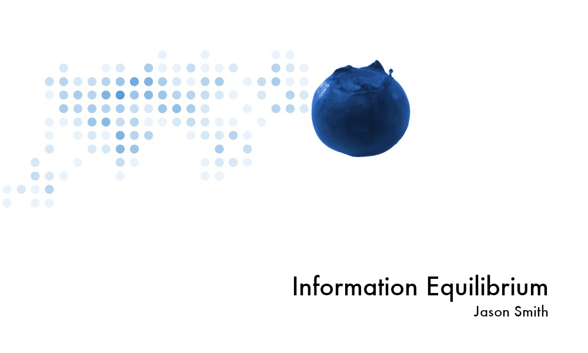

This post acts as a collection of links to find me in various places for various content. This econ blog has been moved (along with the archives) over to my substack _Information Equilibrium_. It's free to sign up (and definitely more likely to get to you than twitter ever was).

[https://infoeqm.substack.com/](https://infoeqm.substack.com/)

I also have an account on mastodon:

[@infotranecon@econtwitter.net](https://econtwitter.net/@infotranecon)

I started a bluesky:

[@newqueuelure](https://bsky.app/profile/newqueuelure.bsky.social)

**Deactivated my twitter!**

I continue to post on twitter [@infotranecon](https://twitter.com/infotranecon) (for econ and politics) and [@newqueuelure](https://twitter.com/newqueuelure) (for sci fi and game stuff)
